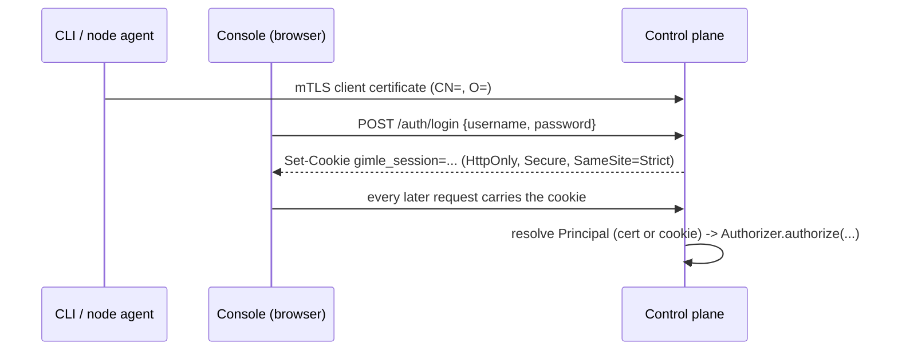

# Authentication and authorization

[Transport security](./transport-security.md) answers *is this connection encrypted, and is the
certificate on the other end trust-chain-valid* — it does not answer *who is this, and what are
they allowed to do*. Before this, `ApiServer` only ever checked that *a* verified
client certificate was present; any node or operator certificate could reach every route. This layer
adds real identity (a `Principal`, resolved from either an mTLS certificate or a console session
cookie) and real authorization (`Role`/`RoleBinding`, resolved by `Authorizer`) in front of every
handler.

## Identity: reused, not reinvented

No new authentication mechanism for the CLI or node agents — a certificate's `CN=` becomes the
principal's name, exactly as already established ([Transport security](./transport-security.md)'s
node/operator CSR flow). What's new is **group membership**, stamped into a certificate's `O=` RDN
*server-side*, at issuance:

| `CsrPurpose` | Server-stamped `O=` |
|---|---|
| `NODE_CLIENT` | `gimle:nodes` |
| `OPERATOR_CLIENT` | `gimle:operators` |
| `TENANT_CLIENT` | `gimle:tenant:<id>` |
| `WORKER_CLIENT` | `gimle:workers`, plus `gimle:tenant:<id>` for a tenanted worker |

This is deliberate, not incidental: a CSR's own requested Subject is never trusted for `O=` — a
`NODE_CLIENT` CSR that self-declares `O=gimle:operators` is still signed with `O=gimle:nodes`, and a
`WORKER_CLIENT` CSR that self-declares `O=gimle:nodes` is still signed with `O=gimle:workers`. Only
the requester's `CN=` (a label, not a privilege) survives from the CSR itself — and for a worker
even that is checked, since the CN must be prefixed by the requesting node's own id. Rotation is
unaffected: it already requires the renewal CSR's Subject to exactly match the presented
certificate's own, so a certificate's group survives rotation for free. Reading a certificate back
into a `Principal` is one implementation, `CertificateIdentity` in `gimle-core`, on public JDK APIs
only, so a worker JVM — which carries no `gimle-pki`/Bouncy Castle at all — derives exactly the
identity the control plane stamped.

## Authorization: `Role`, `RoleBinding`, `Authorizer`

A `Permission` grants a `Verb` (`READ`, `WRITE`, `DELETE`, or `APPROVE` — the one action that isn't
well described as any of the other three) on a `ResourceKind`, either cluster-wide or scoped to one
tenant. A `Role` is a named set of permissions; a `RoleBinding` grants a `Role` to a subject —
`user:<name>` or `group:<name>`, additive across every binding that matches a given principal, never
subtractive.

Any of a permission's three positions — resource kind, verb, tenant scope — may be the wildcard
`*` instead of a name. `*:read` is read on every resource kind, `deployment:*` every verb on
deployments, `*:*:acme` everything within one tenant. The wildcard is **stored as a wildcard and
widened at authorize time**, never expanded into an enumerated permission set when the role is
written: a role granting `*` resource kinds automatically covers a `ResourceKind` the platform gains
later, with the stored role untouched. That is what closes the gap between the fixed built-in
templates below and hand-enumerating every resource-by-verb-by-tenant combination — an operator
needing "read everything except secrets" composes a `*:read` grant plus narrower ones rather than
re-editing a role every time the enum grows. `*` in the tenant position is the explicit spelling of
the cluster-wide grant an omitted scope has always meant, so the three positions read alike.

The qualifier position deliberately takes no wildcard: "every custom kind's specs" is already what
an absent qualifier means, and "every kind including its status writes" is not expressible on
purpose — a status grant is exactly the authority a spec grant must never imply. A bare `*` there is
rejected rather than stored as a grant that would match nothing. For the same reason a wildcard
resource grant reaches every kind's spec operations but still never a `{kind}/status` write.

One resource kind, `CUSTOM_RESOURCE`, additionally takes an optional **qualifier** on the
permission, giving per-kind granularity over [cluster-defined custom kinds](./custom-kinds.md)
without a `ResourceKind` value per kind: an absent qualifier covers every kind's specs (never
status), `custom.Greeting` covers one kind's specs, and `custom.Greeting/status` covers only that
kind's operator-reported status sub-document — spec-write never implies status-write or the
reverse, which is what lets an operator's workload principal report status without ever being able
to alter desired state.

`Authorizer` resolves a request in two steps:

1. **Node self-service, checked first.** A `group:gimle:nodes` principal always reaches its own
   `/nodes/{id}/*` and `/logs/nodes/{id}` — no `RoleBinding` needs to exist for it. It can also
   always *read* the cluster-wide `/networkpolicies` and `/services` sets, unscoped by tenant or
   target — `NetworkPolicyRelay` ships every policy down to its supervised workers regardless of
   which tenants this node currently hosts instances for, and a Bifrost-enabled agent needs to know
   about every `Service` it might front a local proxy for, so this can't be a per-tenant grant the
   way `isTenantAssignedToNode` below is. Write/delete on either stays denied — a node never
   declares a `Service` or `NetworkPolicy` itself. Nothing else: a node has no access to
   deployments, tenants, config, or another node's endpoints. This is a real tightening versus the
   pre-RBAC baseline, where any valid certificate reached every route.
2. **Otherwise, collect every matching `RoleBinding`** (direct `user:` match, or `group:` match
   against any of the principal's groups), union their roles' permissions, and check for a match.

A third, narrower shape of node authorization lives alongside `Authorizer#authorize` rather than
inside it: `Authorizer#isTenantAssignedToNode(nodeId, tenantId)` answers "does this node currently
hold at least one active instance assignment for this tenant" — read-only by construction, resolved
by walking every `InstanceAssignment` and joining survivors back to their own `DeploymentSpec`'s
`tenantId`, since there is no direct "assignments for this node" store query. Originally private to
`gimle-fafnir`'s `FafnirServer` (gating a `gimle:nodes` node's read access to a tenant's secrets),
it moved onto `Authorizer` once `gimle-controlplane`'s own `/endpoints/*` route needed the identical
check for the same principal shape — see [Control plane](./control-plane.md) and
[Node topology](./node-topology.md#relaying-a-hosted-modules-control-plane-reads). Both call sites
take this path *instead of* the ordinary `RoleBinding` walk for a `gimle:nodes` caller, never in
addition to it: a node certificate has no `Role`/`RoleBinding` of its own to check against.

**`cluster-admin`** is built in — every permission, unscoped — and implicitly bound to
`group:gimle:operators` (a constant check in `Authorizer`, not a stored `RoleBinding`). This is what
keeps the behavior change backward-compatible for operators specifically: today, any operator
certificate already has unconditional full access, so defaulting the operator group to
`cluster-admin` changes nothing until an operator narrows another operator's access with a custom
`Role`/`RoleBinding`.

**Per-tenant role templates** are built in the same way `cluster-admin` is — synthesized from the
role name by `BuiltinRoles.tenantRole(...)`, never stored, never editable via `/roles`. Binding a
subject to `tenant-view:<tenantId>` grants read-only visibility into that tenant (secrets
deliberately excluded, the same posture Kubernetes' own `view` role takes); `tenant-edit:<tenantId>`
adds create/update/delete of the tenant's workloads, config, and secrets; `tenant-admin:<tenantId>`
additionally manages the tenant's own guardrails (NetworkPolicies, LimitRanges). Every permission a
template synthesizes is scoped to exactly the named tenant, so a binding to one can never leak
authority into another tenant, let alone cluster-wide:

```bash
gimle set rolebinding acme-dev --subject user:dev@acme --role tenant-edit:acme
```

**Collection listings are filtered, not all-or-nothing.** Every `GET /<collection>` endpoint over a
tenant-scopable kind (`/deployments`, `/jobs`, `/cronjobs`, `/daemonsets`, `/statefulsets`,
`/services`, `/networkpolicies`, `/tenants`, `/limitranges`, the `/metrics` rollup) admits a caller
holding only tenant-scoped `READ` grants and returns exactly the items whose own tenant those
grants cover — an unscoped grant sees everything, an untenanted item is visible only to unscoped
readers, and a caller with no read grant for the kind at all gets the same 403 a single-resource
read would. This is what makes the per-tenant templates usable end to end: `gimle get deployments`
under a `tenant-view:acme` binding lists acme's deployments rather than failing outright for lack
of a cluster-wide grant.

**`GET /authz/can-i?resource=<ResourceKind>&verb=<Verb>[&tenant=...][&target=...]`** is the
self-subject access review: it answers whether the *calling* principal would be authorized for that
action, without performing it, computed by the identical `Authorizer.authorize(...)` walk every real
request goes through — so the answer can never drift from what enforcement would actually decide.
Any authenticated caller may ask about itself (and only itself — there is no principal parameter),
it is never audited (a hypothetical is a read-shaped question), and in plaintext mode it honestly
answers `true` for everything, since nothing is actually gated in that mode.

**`GET /authz/vocabulary`** serves the permission vocabulary itself: every `ResourceKind` and every
`Verb` this build enforces, in the enums' own declaration order. It exists so a permission editor
offers exactly the kinds the `Authorizer` on the other end accepts, instead of carrying its own
hand-maintained copy that falls behind the moment the platform grows a kind — which is what left
several resource kinds grantable only from the CLI. Read-only, and gated exactly like its
`/authz/can-i` neighbour: under mTLS a caller must authenticate, but no permission is required
beyond that and nothing is audited. There is nothing here to withhold — the answer is a
compile-time constant of the build, identical for every principal, carrying no cluster state and no
hint of who may do what; gating it would only break the picker for the very operator being asked to
choose from it. The console's Roles editor reads it on mount and falls back to its own bundled copy
of the enum if the call fails, so the screen stays usable either way.

**Workload identity** is the ServiceAccount analogue: each node's agent mints a short-lived token
per assigned, tenanted deployment (`POST /workload-tokens` — under mTLS a `gimle:nodes` principal
may mint only for its own node and only for a deployment the store currently assigns there; an
operator may mint for any node) and attaches it as a `Bearer` credential when relaying a hosted
module's control-plane reads. The token is store-backed rather than signed: only its SHA-256
replicates through Raft (`WorkloadTokenRecord`, keyed `deploymentName#nodeId`), so it verifies on
whichever replica a request lands on — replicas share no signing key, they share the store — and
removing the record revokes it instantly. A live token resolves the principal
`svc:<tenantId>:<deploymentName>` in group `gimle:workloads`, checked *before* any peer
certificate (the one caller sending both is a relaying agent, and the module must act as its own
narrower principal, never ride the agent's node identity; an invalid bearer resolves nothing rather
than falling back). No implicit grants: an unbound workload principal is denied everything until an
operator binds it a role — `gimle set rolebinding wb1 --subject user:svc:acme:orders --role
tenant-view:acme` is the typical shape. Untenanted deployments have no workload identity (nothing
to scope to) and keep the agent-side relay whitelist instead.

**Tenant client certificates** carry a tenant-membership claim in certificate form:
`gimle cert request --purpose tenant --tenant <id>` submits a CSR over the requester's own mTLS
identity, and a caller holding `CERTIFICATE_REQUEST:APPROVE` under that tenant's scope (a cluster
operator, or the tenant's own `tenant-admin:` holder) gets it signed synchronously with the
server-stamped `O=gimle:tenant:<id>` — like `gimle:operators`/`gimle:nodes`, the group is never
taken from the CSR's own subject, which is exactly what makes it a trustworthy claim. Its consumer
today is `gimle-bifrost`'s TLS-terminating identity-verifying mode (see
[Service fabric](./service-fabric.md)), which reads the group off a verified client certificate to
enforce a `NetworkPolicySpec`'s allow list against opaque proxied traffic. **Worker certificates**
carry the same claim for callers *inside* the fabric: every worker JVM presents a `WORKER_CLIENT`
certificate (`O=gimle:workers` plus `O=gimle:tenant:<id>`) its node agent obtained for it, minted
only for a tenant the scheduler actually placed on that node, and a receiving `FabricServer` reads
the caller's tenant off that verified certificate rather than off the tenant the frame claims for
itself — see [Transport security](./transport-security.md#per-worker-certificates) and
[Service fabric](./service-fabric.md).

**Certificate revocation** is the portable answer to a compromised leaf, with no CRL/OCSP
infrastructure: `gimle cert revoke <serialHex>` (`PUT /certificates/revoked/{serial}`, guarded by
`CERTIFICATE_REQUEST` writes) puts the serial — the `openssl x509 -serial` hex form — on a
Raft-replicated denylist that `resolvePrincipal` checks before any authorization runs, so the
revoked certificate resolves no principal at all from its very next request. Keyed by serial, not
subject, so a legitimately re-issued certificate for the same identity is untouched; deliberately
reversible (`gimle cert unrevoke`), and `gimle cert revocations` lists the current set.

The check is not the control plane's alone: `FafnirServer`/`AndvariServer` independently re-run the
identical serial-against-denylist check in their own `resolvePrincipal`, the same defense-in-depth
posture both already apply to RBAC (never trusting "arrived already-forwarded" as proof by itself).
This matters specifically because those two processes are more sensitive than the control plane,
not less — Fafnir holds the master key ring and every secret value, Andvari the module artifact
catalog — so a certificate an operator has explicitly revoked (the standard incident-response step
for a compromised credential) is checked against the CA trust chain alone (unexpired, correctly
signed) nowhere in the cluster; a revoked-but-not-yet-expired certificate satisfies that chain check
everywhere, which is exactly why the independent re-check exists. The gate covers a forwarded
principal too, not only a peer's own direct identity: a revoked control-plane leaf can no longer
vouch for a claim forwarded through `ApiServer`'s proxy hop either.

`Roles`/`RoleBindings`/`Accounts` are ordinary Raft-replicated resources — new
`StateMutation`/`StateStore` entries alongside `Tenant`/`DeploymentSpec`, with one deliberate
exception: deleting a `Role` cascades to every `RoleBinding` naming it, atomically, as part of the
same `StateMutation`. `RoleBinding.roleName` is a plain string resolved by name at authorize-time,
not an immutable ID, so a binding left behind after its Role is deleted would otherwise sit inert
only until someone later creates a *new*, unrelated `Role` under that same name — at which point it
would silently reactivate with whatever permissions the new Role grants. `gimle delete role <name>`
reports exactly which bindings it cascaded, and each one gets its own audit event alongside the
Role deletion's own.

### The reserved `gimle-system` tenant

`Tenant.RESERVED_SYSTEM_TENANT_ID` (`gimle-system`) is the `kube-system` equivalent — where the
platform's own self-hosted extensions run — and it is guarded by the one veto in this codebase
that an ordinary `RoleBinding` cannot grant its way around. Everywhere else, RBAC is purely
additive: any single matching `Permission` authorizes a request, full stop. `gimle-system` is
different on purpose — a caller needs the bootstrap-level `group:gimle:operators` credential
itself, not merely a grant broad enough to otherwise cover `TENANT`/`DEPLOYMENT`/`JOB`/
`DAEMONSET`/`STATEFULSET` writes, even an unscoped `cluster-admin`-style one a human operator might
legitimately hand out for day-to-day cluster administration. `ApiServer` enforces this as a second
check that runs only after the ordinary `requireAuthorized` check already passed: `PUT`/`DELETE
/tenants/gimle-system`, and a `PUT` on any workload manifest (`Deployment`, `Job`, `CronJob`,
`DaemonSet`, `StatefulSet`) naming `tenantId: gimle-system`, are rejected with `403` for any caller
not carrying the operators group — the same generic `403` an ordinary permission denial already
returns, so a caller with no access at all still can't distinguish "reserved" from "denied" by
probing the name.

Plaintext transport is no exception, and this is the one place plaintext is *not* wide open. A
request that presents no credential resolves to an explicit anonymous principal — a real identity
belonging to no group at all — rather than to no identity, so it fails the operators-group check
like any other non-operator caller and is refused. The alternative reading, "nothing authenticated
this caller, so treat it as the most privileged one," would leave the reserved tenant writable by
anyone able to reach the port, on exactly the deployments where nothing verifies who is calling.
What is checked is the credential, not the transport that carried it — the same rule Kubernetes
applies, where `kube-apiserver` over plain HTTP still honours a bearer token and only a
credential-less request becomes `system:anonymous`. A caller holding a real operator session is an
operator whatever connection it arrived on; resolving it as anonymous would discard a credential it
genuinely holds, and would contradict the very same request's own principal resolution, which
honours exactly those credentials. The practical consequence is that anything targeting
`gimle-system` — `hilmir enable gateway`, a `DaemonSet` manifest naming it — needs a real operator
credential: an mTLS operator certificate, or a session for an account in the operators group. What
there is no shortcut for is presenting nothing at all.

The tenant itself is seeded once, idempotently, straight into the store at control-plane startup
(never through the guarded `/tenants/*` path, so the guard needs no "let the bootstrap request
through" carve-out) with a generous default `ResourceQuota` — a platform-owned tenant is not sized
deployment-by-deployment the way a real workload tenant is. A restart re-checks for an existing row
before proposing anything, so an operator's own later quota adjustment survives every subsequent
restart.

### `CONFIG` vs. `SECRET`: one storage type, two permissions

A tenant's `ConfigEntry` set (`/config/{tenantId}[/{key}]`) is a single storage type whose entries
carry their own `encrypted` flag, but the two are guarded by distinct `ResourceKind`s: a plaintext
entry (`encrypted=false`) requires `CONFIG`, an encrypted one requires `SECRET`. This lets a role
hold read/write access to a tenant's ordinary configuration without also being able to touch its
secrets, or vice versa — a real gap otherwise, since nothing about "can read this tenant's config"
implies "should be able to decrypt its API keys."

Enforcement follows the entry, not the URL: a `PUT` picks `CONFIG` or `SECRET` off the request
body's own `encrypted` field before authorizing (the one write in `ApiServer` that reads its body
ahead of the authorization check, for exactly this reason); a `DELETE` looks the entry up first to
learn its `encrypted` flag, 404s if it doesn't exist, then authorizes against whichever kind it
actually is; the list endpoint (`GET /config/{tenantId}`) checks both `CONFIG:READ` and
`SECRET:READ` for the caller and returns each entry only if the caller holds the permission that
entry's own `encrypted` flag requires — a caller holding only one of the two still gets a 200 with
a correctly filtered, not empty-or-403, response.

`SECRET` is purely additive at the `ResourceKind` enum level, so `cluster-admin` picks it up
automatically (it iterates every `ResourceKind` at class-load time). It is **not** retroactive: any
already-persisted custom `Role` that was granted `CONFIG` before this split does not gain `SECRET`
access automatically — that's the correct tightening, not an oversight, but worth calling out
explicitly since it changes behavior for encrypted entries under a pre-existing `CONFIG`-only role.

**Fafnir's own versioned `/secrets/*` surface** (see [Multi-tenancy](./multi-tenancy.md#secrets))
is a second door onto `SECRET`-guarded data, not a bypass of this model: `ApiServer` still performs
its own `requireAuthorized(SECRET, ...)` check before proxying, exactly as it does for `/config/*`,
but Fafnir additionally runs its own **independent** `Authorizer.authorize(...)` against RBAC data
it reads itself over its own `StoreClient` connection — the same `Role`/`RoleBinding` objects, read
a second time by a second process, rather than trusted from the proxy's decision. A buggy or
compromised control-plane replica that forwarded an unauthorized `/secrets/*` request is still
denied at Fafnir, which never treats "this arrived from the control plane" as itself proof of
authorization.

## Two identity paths, one authorization engine



The CLI and node agents keep using mTLS exclusively — nothing about that flow changes. The console
gets a second path because interactive browser mTLS is poor UX: `POST /auth/login` verifies a
username/password against a Raft-replicated `Account` (PBKDF2WithHmacSHA256 password hash, the
JDK's own `SecretKeyFactory`, no external crypto dependency — the iteration count travels with each
stored hash as `iterations || salt || hash`, so raising `PasswordHashes.ITERATIONS` later, to track a
rising OWASP floor, never breaks a hash minted under a lower historical count) and issues a
**stateless, HMAC-SHA256
signed session token** — `username || expiresAt || HMAC(key, ...)`, verifiable by any control-plane
node without a shared session table, the same reasoning bootstrap tokens are deliberately not
Raft-replicated either. The token itself carries only `username`/`expiresAt`, never groups — a
session-derived `Principal`'s groups are read fresh from that account's own `Account.groups` on
every request, not baked into the token, so a `group:<name>` `RoleBinding` matches a console-login
principal exactly the way it already matches a certificate one, and a group change (or a password
reset that doesn't touch groups — `PUT /accounts/{username}` treats `groups` as optional,
preserving the existing set when omitted) takes effect on that principal's very next request, no
re-login required.

`Authorizer` never knows or cares which path resolved a given `Principal` — a certificate and a
session cookie both just produce `(name, groups)`.

### Cookie attributes, and why

- **`HttpOnly`** — never readable by the console's own JavaScript, so an XSS in the SPA can't
  exfiltrate it.
- **`SameSite=Strict`** — a CSRF mitigation: since auth here is cookie-, not header-based, the
  cookie is never attached to a request that didn't originate from the console's own origin.
- **`Secure`** — only set in TLS mode.
- No server-side revocation list: `/auth/logout` only tells the browser to drop the cookie
  (`Max-Age=0`). A stolen token remains valid until its TTL (12h) expires — an accepted trade-off
  for a stateless token, not an oversight.

## Bootstrap (day 0)

The same ceremony that already creates the cluster CA and the first operator certificate
(`mvn gimle:tls-init` / `PkiBootstrapMain`) now also writes a `bootstrap-account.yaml`
(username + PBKDF2 hash) — `gimle-pki` runs standalone, before any control-plane process (and
therefore no `StateStore`/Raft) exists, so it can't propose an `Account` directly. `ApiServer` reads
that file once at startup, only while its store has zero accounts, and proposes it as a real
`Account`. The plaintext password is delivered exactly once, the same "capture this now" posture as
an unrecoverable CA key — and never into anything that keeps it:

- **Interactive run** — `PkiBootstrapMain` prints it only when its own standard output really is a
  terminal (`Console#isTerminal`). A developer running `mvn gimle:tls-init` in a shell still just
  reads it off the screen.
- **Non-interactive run** — a build, a pipeline, or any run whose output is redirected or captured
  has no terminal, and printing there would write the cluster's first administrator credential
  straight into a build log. Such a run must name `--password-file <path>` (`mvn gimle:tls-init
  -Dgimle.tlsInit.passwordFile=…`); the password is written there alone, restricted to its owner
  the same way `ca.key` is, and only the file's *path* is printed. Read it, then delete the file.
- **Neither** — the run is refused before it generates anything at all, naming the flag to use. A
  non-interactive bootstrap never silently degrades into either printing the password or discarding
  it.

`mvn gimle:bootstrap` and `hilmir pki init` both capture their subprocess's output, so both always
pass a password file of their own (`bootstrap-password.txt`, beside the rest of the TLS material)
and report its path.

**This bootstrap account starts with zero permissions.** Logging into the console with it proves who
you are but authorizes nothing, until the already-`cluster-admin`-via-certificate initial operator
runs, over the CLI:

```
gimle set rolebinding admin-binding --subject user:admin --role cluster-admin
```

One explicit, auditable grant — not folded into the same automatic bootstrap that already hands out
CA trust, so the two escalations (mTLS trust vs. console access) stay visibly separate.

## CLI surface

```text
gimle get roles [name]
gimle set role <name> --permission <resource>:<verb>[:<tenant>] [--permission ...]
                       (any of the three positions may be "*" — quote it, most shells expand it)
gimle delete role <name>
gimle get rolebindings [id]
gimle set rolebinding <id> --subject user:<name>|group:<name> --role <name>
gimle delete rolebinding <id>
gimle get accounts [username]
gimle set account <username> --password <value>
gimle delete account <username>
```

See the [CLI reference](../reference/cli-reference.md) for the full verb list alongside every other
resource. `set account` sends the raw password once, over the same authenticated mTLS connection
every other write already uses — hashing happens server-side, and no response ever includes a
`passwordHash` field.

## Activation: tied to `gimle.transport.protocol=tls`, not a separate flag

No new cluster-wide switch: authorization requires a `Principal`, and a `Principal` requires either
a verified certificate or a verified session cookie, neither of which exist in plaintext mode. So
RBAC in plaintext mode is exactly as it was — fully open, no grants consulted — the same "local,
trusted process" carve-out already described for the web console and multi-machine node topology
below. The single exception is the reserved `gimle-system` tenant above: an unauthenticated request
is the anonymous principal there, in no group, and a veto that no grant can buy must not be
purchasable by presenting nothing at all.

## Web console

The console's own login page ([Web console](./web-console.md)) is what makes this land for browser
users specifically — a `/login` route, a root-level redirect guard (unauthenticated →
`/login`, authenticated elsewhere), and a "log out" control in the sidebar. A **401** response from
any endpoint clears local session state and redirects to `/login`; a **403** does not redirect (the
user is legitimately logged in, just lacks that permission) — it surfaces as an in-place
"you don't have permission" state on whichever screen triggered it. This 401-vs-403 split is exactly
what `requireAuthorized` introduces at the API layer, in place of the single-status-code
`requireClientCertificate` it replaced.

The two also differ in *where* the operator is told. A 403 is explained in place, because that is
where they still are. A 401 is explained once, on `/login` — "your session timed out, sign in again
to pick up where you left off" — and nowhere else: the redirect is never accompanied by an error of
its own, and the raw status line is never shown. `/login` says that only for a session that
actually lapsed under a signed-in operator, so a first visit, a rejected password, and a deliberate
sign-out all land on the same screen without being mislabelled as an expiry.

**Managing `Role`/`RoleBinding`/`Account` objects** is available both from the CLI and from the
console's own Access Control screen — see [Web console](./web-console.md).

## Audit logging

Every `WRITE`/`DELETE`/`APPROVE` decision `requireAuthorized` makes — allowed or denied — lands in a
durable, queryable, cluster-wide audit trail (`AuditEvent`), reusing `gimle-mimir`'s existing
Raft-replicated storage rather than a second one: the same mechanism `InstanceEvent` already proved
for a per-instance lifecycle timeline, generalized to a cluster-wide trail with a single retention
cap instead of a per-key one. `READ` verbs and a bare `401` (no principal resolved at all) are not
captured by default — matching Kubernetes' own default audit policy, where a page-load's worth of
`GET`s would dwarf the mutating-action volume actually worth recording, and there being no principal
to attribute an unauthenticated attempt to. Node join and operator join have no pre-existing
principal to run `requireAuthorized` against at all (a one-time bootstrap token, or no credential
yet); both are still recorded, via an explicit `recordAuditEvent` call keyed to a synthetic
`bootstrap-token`/`anonymous` principal — "who was granted trust, and when" needs a trace even when
there's no ordinary RBAC decision to hang it off of.

Every `AuditEvent` carries two separate verdicts, not one: `allowed` is whether RBAC/authorization
itself said yes, and `outcome` (`APPLIED`/`REJECTED`) is whether the write actually took effect.
They can and do diverge — an authorized caller's write can still fail admission (a tenant-quota
violation, a name/kind mismatch, a manifest-specific guard that only runs after authorization), and
that must record `REJECTED`, never default to `APPLIED` just because RBAC allowed the attempt to
proceed. A route whose only possible refusal *is* the RBAC check itself (most `GET`/`DELETE`
handlers) records its outcome the moment `requireAuthorized` returns. A route with real admission
after authorization — every workload `PUT`, and `PUT /tenants/{id}` (`rejectSecondTenantUnderPlaintext`
in particular, which is itself an admission-time check, not an RBAC one) — instead uses
`requireAuthorizedForWrite`, which records nothing for an authorized caller and hands back the
principal to audit with once the real outcome is known. Getting this ordering backwards is a real
defect, not a hypothetical one: a refused second-tenant creation under plaintext mode was once
recorded as `allowed:true`/`outcome:APPLIED` — byte-for-byte indistinguishable from a genuine
success — because the audit event was written before the admission check that went on to refuse it
ever ran.

Eviction past the retention cap is itself observable, not silent: `StateStore` logs a throttled
warning once the cap is first reached (then every 1000th eviction after that) and tracks a running
total. `GET /audit`'s response is an envelope, not a bare array —
`{events, matchedCount, nextCursor?, cursorExpired, retainedCount, evictedTotal,
oldestRetainedAtEpochMilli?, truncated}`. The last four describe the whole trail's retention state
independent of whatever filter/limit a given query applied, so an operator reviewing the trail
during an incident can tell "this is the complete record" from "this cluster crossed the retention
cap" without cross-referencing a log line; the first three describe this query instead — how many
retained events matched the filters at all, how to ask for the next page, and whether the page
asked for had already been evicted.

`-Dgimle.controlplane.audit.readResourceKinds` (comma-separated `ResourceKind` names, e.g.
`CONFIG,SECRET`) opts specific resource kinds into READ-decision auditing too, both allowed and
denied — for the rare deployment that genuinely needs it. Unset (the default) reproduces the exact
pre-existing behavior: `requireAuthorized`'s own audit gate only fires unconditionally for
`WRITE`/`DELETE`, plus `READ` when the request's resource kind is in this set. A bare `401` is still
never captured either way, opt-in or not — there's still no principal to attribute it to. Note that
opting a hot, frequently-read resource kind (e.g. `CONFIG`) into this accelerates rotation against
the flat, cluster-wide 50,000-event retention cap below.

Fafnir's own `/secrets/*` surface is the prior art this opt-in generalizes, and needs no
configuration at all: `FafnirServer.authorizeSecrets` proposes an `AuditEvent` through its own
`StoreClient` alongside the existing `com.gimle.fafnir.audit` SLF4J logger line (kept for an
operator tailing that process's own log directly) unconditionally for every verb, `READ` included —
covering the `GROUP_NODES` self-service read branch too, which bypasses `Authorizer.authorize`
entirely but still computes an `allowed` boolean worth recording. `SECRET` reads have always been
audited; the opt-in above is what lets an operator bring another resource kind's reads up to that
same bar on the control plane's own general RBAC surface.

Andvari audits the same way for the one thing it stores: every `ARTIFACT` push and delete produces
both a `com.gimle.andvari.audit` SLF4J line and a durable `AuditEvent`, and both name the affected
`moduleId:version` coordinate (`targetId`) plus the artifact's tenant, so "who deleted what" is
answerable without correlating timestamps against a separate version listing. Pulls stay
unaudited — they are the high-volume path, and a pull discloses only what a deployment manifest
already references. Both halves fire in plaintext mode too, attributed to the synthetic `anonymous`
principal: there is no caller identity to authorize there, but a jar still arrived or disappeared,
and a trail that goes silent in exactly the mode a single-machine cluster runs in is not a trail.
Note that a push routed through the control plane's `/artifacts/*` proxy produces *two* records —
the proxy's own `ARTIFACT` decision, which carries no coordinate, and Andvari's, which does.

Reading the trail is itself access-controlled, the same "who can grant access is itself an
access-controlled action" framing `ROLE`/`ROLE_BINDING`/`ACCOUNT` already established —
`ResourceKind.AUDIT`, `Verb.READ`. `GET /audit[?principal=&resource=&tenant=&since=&limit=&cursor=]`
and `gimle audit list [--principal <name>] [--resource <kind>] [--tenant <id>] [--since
<epochMillis>] [--limit N] [--cursor <token>] [--all]` cover every filter independently and
combinably; `gimle audit list` prints a note when the response envelope's `truncated` flag is set.

`limit` is a page size and `cursor` continues from a previous response's `nextCursor`; omitting both
returns every matching event, as it always did. Because the trail is a ring buffer, the cursor
anchors on an **event's own identity**, never an offset — an offset would shift by one for every
decision recorded while an operator pages (skipping rows) and shift back for every event evicted
from the oldest end (repeating them). A cursor additionally pins the filter set it was minted under
and is refused with `400` if presented with different filters, which is what makes an anchor missing
from the result unambiguous: with the filters known identical, it can only have been evicted. That
case answers `cursorExpired: true` with an empty page — eviction is strictly oldest-first, so
everything older than the anchor went with it and the page really is empty — rather than silently
returning a plausible-looking wrong page. `cursorExpired` (this walk was overtaken) and `truncated`
(the whole trail has crossed its cap) are deliberately separate signals; the console and CLI surface
them separately too.

## Explicitly out of scope

- **External IdP/OIDC/SAML/SSO** — `Account` password auth is the entire console login story for
  now; nothing here precludes adding federation later (the session-issuing step is where it would
  plug in), but building it ahead of any actual need would be speculative.
- **Per-resource-instance ACLs** — `tenantScope` is the only scoping dimension. "Operator X may
  edit *this one* deployment but not others of the same tenant" is a meaningfully heavier model, not
  built here.
- **Password policy, account lockout, MFA** — PBKDF2 with a random per-account salt is real
  cryptography, not a placeholder, but policy enforcement on top of it is a separate, later concern.
