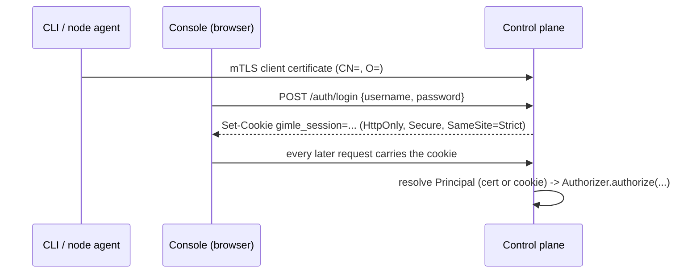

# Authentication and authorization

[Transport security](./transport-security.md) answers *is this connection encrypted, and is the
certificate on the other end trust-chain-valid* — it does not answer *who is this, and what are
they allowed to do*. Before this, `ApiServer` only ever checked that *a* verified
client certificate was present; any node or operator certificate could reach every route. This layer
adds real identity (a `Principal`, resolved from either an mTLS certificate or a console session
cookie) and real authorization (`Role`/`RoleBinding`, resolved by `Authorizer`) in front of every
handler.

## Identity: reused, not reinvented

No new authentication mechanism for the CLI or node agents — a certificate's `CN=` becomes the
principal's name, exactly as already established ([Transport security](./transport-security.md)'s
node/operator CSR flow). What's new is **group membership**, stamped into a certificate's `O=` RDN
*server-side*, at issuance:

| `CsrPurpose` | Server-stamped `O=` |
|---|---|
| `NODE_CLIENT` | `gimle:nodes` |
| `OPERATOR_CLIENT` | `gimle:operators` |

This is deliberate, not incidental: a CSR's own requested Subject is never trusted for `O=` — a
`NODE_CLIENT` CSR that self-declares `O=gimle:operators` is still signed with `O=gimle:nodes`. Only
the requester's `CN=` (a label, not a privilege) survives from the CSR itself. Rotation is
unaffected: it already requires the renewal CSR's Subject to exactly match the presented
certificate's own, so a certificate's group survives rotation for free.

## Authorization: `Role`, `RoleBinding`, `Authorizer`

A `Permission` grants a `Verb` (`READ`, `WRITE`, `DELETE`, or `APPROVE` — the one action that isn't
well described as any of the other three) on a `ResourceKind`, either cluster-wide or scoped to one
tenant. A `Role` is a named set of permissions; a `RoleBinding` grants a `Role` to a subject —
`user:<name>` or `group:<name>`, additive across every binding that matches a given principal, never
subtractive.

`Authorizer` resolves a request in two steps:

1. **Node self-service, checked first.** A `group:gimle:nodes` principal always reaches its own
   `/nodes/{id}/*` and `/logs/nodes/{id}` — no `RoleBinding` needs to exist for it. Nothing else: a
   node has no access to deployments, tenants, config, or another node's endpoints. This is a real
   tightening versus the pre-RBAC baseline, where any valid certificate reached every route.
2. **Otherwise, collect every matching `RoleBinding`** (direct `user:` match, or `group:` match
   against any of the principal's groups), union their roles' permissions, and check for a match.

A third, narrower shape of node authorization lives alongside `Authorizer#authorize` rather than
inside it: `Authorizer#isTenantAssignedToNode(nodeId, tenantId)` answers "does this node currently
hold at least one active instance assignment for this tenant" — read-only by construction, resolved
by walking every `InstanceAssignment` and joining survivors back to their own `DeploymentSpec`'s
`tenantId`, since there is no direct "assignments for this node" store query. Originally private to
`gimle-fafnir`'s `FafnirServer` (gating a `gimle:nodes` node's read access to a tenant's secrets),
it moved onto `Authorizer` once `gimle-controlplane`'s own `/endpoints/*` route needed the identical
check for the same principal shape — see [Control plane](./control-plane.md) and
[Node topology](./node-topology.md#relaying-a-hosted-modules-control-plane-reads). Both call sites
take this path *instead of* the ordinary `RoleBinding` walk for a `gimle:nodes` caller, never in
addition to it: a node certificate has no `Role`/`RoleBinding` of its own to check against.

**`cluster-admin`** is built in — every permission, unscoped — and implicitly bound to
`group:gimle:operators` (a constant check in `Authorizer`, not a stored `RoleBinding`). This is what
keeps the behavior change backward-compatible for operators specifically: today, any operator
certificate already has unconditional full access, so defaulting the operator group to
`cluster-admin` changes nothing until an operator narrows another operator's access with a custom
`Role`/`RoleBinding`.

`Roles`/`RoleBindings`/`Accounts` are ordinary Raft-replicated resources — new
`StateMutation`/`StateStore` entries alongside `Tenant`/`DeploymentSpec`, nothing special-cased.

### The reserved `gimle-system` tenant

`Tenant.RESERVED_SYSTEM_TENANT_ID` (`gimle-system`) is the `kube-system` equivalent — where the
platform's own self-hosted extensions run — and it is guarded by the one veto in this codebase
that an ordinary `RoleBinding` cannot grant its way around. Everywhere else, RBAC is purely
additive: any single matching `Permission` authorizes a request, full stop. `gimle-system` is
different on purpose — a caller needs the bootstrap-level `group:gimle:operators` credential
itself, not merely a grant broad enough to otherwise cover `TENANT`/`DEPLOYMENT`/`JOB`/
`DAEMONSET`/`STATEFULSET` writes, even an unscoped `cluster-admin`-style one a human operator might
legitimately hand out for day-to-day cluster administration. `ApiServer` enforces this as a second
check that runs only after the ordinary `requireAuthorized` check already passed: `PUT`/`DELETE
/tenants/gimle-system`, and a `PUT` on any workload manifest (`Deployment`, `Job`, `CronJob`,
`DaemonSet`, `StatefulSet`) naming `tenantId: gimle-system`, are rejected with `403` for any caller
not carrying the operators group — the same generic `403` an ordinary permission denial already
returns, so a caller with no access at all still can't distinguish "reserved" from "denied" by
probing the name.

The tenant itself is seeded once, idempotently, straight into the store at control-plane startup
(never through the guarded `/tenants/*` path, so the guard needs no "let the bootstrap request
through" carve-out) with a generous default `ResourceQuota` — a platform-owned tenant is not sized
deployment-by-deployment the way a real workload tenant is. A restart re-checks for an existing row
before proposing anything, so an operator's own later quota adjustment survives every subsequent
restart.

### `CONFIG` vs. `SECRET`: one storage type, two permissions

A tenant's `ConfigEntry` set (`/config/{tenantId}[/{key}]`) is a single storage type whose entries
carry their own `encrypted` flag, but the two are guarded by distinct `ResourceKind`s: a plaintext
entry (`encrypted=false`) requires `CONFIG`, an encrypted one requires `SECRET`. This lets a role
hold read/write access to a tenant's ordinary configuration without also being able to touch its
secrets, or vice versa — a real gap otherwise, since nothing about "can read this tenant's config"
implies "should be able to decrypt its API keys."

Enforcement follows the entry, not the URL: a `PUT` picks `CONFIG` or `SECRET` off the request
body's own `encrypted` field before authorizing (the one write in `ApiServer` that reads its body
ahead of the authorization check, for exactly this reason); a `DELETE` looks the entry up first to
learn its `encrypted` flag, 404s if it doesn't exist, then authorizes against whichever kind it
actually is; the list endpoint (`GET /config/{tenantId}`) checks both `CONFIG:READ` and
`SECRET:READ` for the caller and returns each entry only if the caller holds the permission that
entry's own `encrypted` flag requires — a caller holding only one of the two still gets a 200 with
a correctly filtered, not empty-or-403, response.

`SECRET` is purely additive at the `ResourceKind` enum level, so `cluster-admin` picks it up
automatically (it iterates every `ResourceKind` at class-load time). It is **not** retroactive: any
already-persisted custom `Role` that was granted `CONFIG` before this split does not gain `SECRET`
access automatically — that's the correct tightening, not an oversight, but worth calling out
explicitly since it changes behavior for encrypted entries under a pre-existing `CONFIG`-only role.

**Fafnir's own versioned `/secrets/*` surface** (see [Multi-tenancy](./multi-tenancy.md#secrets))
is a second door onto `SECRET`-guarded data, not a bypass of this model: `ApiServer` still performs
its own `requireAuthorized(SECRET, ...)` check before proxying, exactly as it does for `/config/*`,
but Fafnir additionally runs its own **independent** `Authorizer.authorize(...)` against RBAC data
it reads itself over its own `StoreClient` connection — the same `Role`/`RoleBinding` objects, read
a second time by a second process, rather than trusted from the proxy's decision. A buggy or
compromised control-plane replica that forwarded an unauthorized `/secrets/*` request is still
denied at Fafnir, which never treats "this arrived from the control plane" as itself proof of
authorization.

## Two identity paths, one authorization engine



The CLI and node agents keep using mTLS exclusively — nothing about that flow changes. The console
gets a second path because interactive browser mTLS is poor UX: `POST /auth/login` verifies a
username/password against a Raft-replicated `Account` (PBKDF2WithHmacSHA256 password hash, the
JDK's own `SecretKeyFactory`, no external crypto dependency) and issues a **stateless, HMAC-SHA256
signed session token** — `username || expiresAt || HMAC(key, ...)`, verifiable by any control-plane
node without a shared session table, the same reasoning bootstrap tokens are deliberately not
Raft-replicated either. A session-derived `Principal` always has empty groups; it authorizes purely
through direct `user:<username>` bindings.

`Authorizer` never knows or cares which path resolved a given `Principal` — a certificate and a
session cookie both just produce `(name, groups)`.

### Cookie attributes, and why

- **`HttpOnly`** — never readable by the console's own JavaScript, so an XSS in the SPA can't
  exfiltrate it.
- **`SameSite=Strict`** — a CSRF mitigation: since auth here is cookie-, not header-based, the
  cookie is never attached to a request that didn't originate from the console's own origin.
- **`Secure`** — only set in TLS mode.
- No server-side revocation list: `/auth/logout` only tells the browser to drop the cookie
  (`Max-Age=0`). A stolen token remains valid until its TTL (12h) expires — an accepted trade-off
  for a stateless token, not an oversight.

## Bootstrap (day 0)

The same ceremony that already creates the cluster CA and the first operator certificate
(`mvn gimle:tls-init` / `PkiBootstrapMain`) now also writes a `bootstrap-account.yaml`
(username + PBKDF2 hash) — `gimle-pki` runs standalone, before any control-plane process (and
therefore no `StateStore`/Raft) exists, so it can't propose an `Account` directly. `ApiServer` reads
that file once at startup, only while its store has zero accounts, and proposes it as a real
`Account`. The printed password is shown exactly once, the same "capture this now" posture as an
unrecoverable CA key.

**This bootstrap account starts with zero permissions.** Logging into the console with it proves who
you are but authorizes nothing, until the already-`cluster-admin`-via-certificate initial operator
runs, over the CLI:

```
gimle set rolebinding admin-binding --subject user:admin --role cluster-admin
```

One explicit, auditable grant — not folded into the same automatic bootstrap that already hands out
CA trust, so the two escalations (mTLS trust vs. console access) stay visibly separate.

## CLI surface

```text
gimle get roles [name]
gimle set role <name> --permission <resource>:<verb>[:<tenant>] [--permission ...]
gimle delete role <name>
gimle get rolebindings [id]
gimle set rolebinding <id> --subject user:<name>|group:<name> --role <name>
gimle delete rolebinding <id>
gimle get accounts [username]
gimle set account <username> --password <value>
gimle delete account <username>
```

See the [CLI reference](../reference/cli-reference.md) for the full verb list alongside every other
resource. `set account` sends the raw password once, over the same authenticated mTLS connection
every other write already uses — hashing happens server-side, and no response ever includes a
`passwordHash` field.

## Activation: tied to `gimle.transport.protocol=tls`, not a separate flag

No new cluster-wide switch: authorization requires a `Principal`, and a `Principal` requires either
a verified certificate or a verified session cookie, neither of which exist in plaintext mode. So
plaintext mode is exactly as it was — fully open, no identity, no enforcement — the same "local,
trusted process" carve-out already described for the web console and multi-machine node topology
below.

## Web console

The console's own login page ([Web console](./web-console.md)) is what makes this land for browser
users specifically — a `/login` route, a root-level redirect guard (unauthenticated →
`/login`, authenticated elsewhere), and a "log out" control in the sidebar. A **401** response from
any endpoint clears local session state and redirects to `/login`; a **403** does not redirect (the
user is legitimately logged in, just lacks that permission) — it surfaces as an in-place
"you don't have permission" state on whichever screen triggered it. This 401-vs-403 split is exactly
what `requireAuthorized` introduces at the API layer, in place of the single-status-code
`requireClientCertificate` it replaced.

**Managing `Role`/`RoleBinding`/`Account` objects** is available both from the CLI and from the
console's own Access Control screen — see [Web console](./web-console.md).

## Audit logging

Every `WRITE`/`DELETE` decision `requireAuthorized` makes — allowed or denied — lands in a durable,
queryable, cluster-wide audit trail (`AuditEvent`), reusing `gimle-mimir`'s existing Raft-replicated
storage rather than a second one: the same mechanism `InstanceEvent` already proved for a per-
instance lifecycle timeline, generalized to a cluster-wide trail with a single retention cap instead
of a per-key one. `READ` verbs and a bare `401` (no principal resolved at all) are not captured by
default — matching Kubernetes' own default audit policy, where a page-load's worth of `GET`s would
dwarf the mutating-action volume actually worth recording, and there being no principal to attribute
an unauthenticated attempt to.

`-Dgimle.controlplane.audit.readResourceKinds` (comma-separated `ResourceKind` names, e.g.
`CONFIG,SECRET`) opts specific resource kinds into READ-decision auditing too, both allowed and
denied — for the rare deployment that genuinely needs it. Unset (the default) reproduces the exact
pre-existing behavior: `requireAuthorized`'s own audit gate only fires unconditionally for
`WRITE`/`DELETE`, plus `READ` when the request's resource kind is in this set. A bare `401` is still
never captured either way, opt-in or not — there's still no principal to attribute it to. Note that
opting a hot, frequently-read resource kind (e.g. `CONFIG`) into this accelerates rotation against
the flat, cluster-wide 50,000-event retention cap below.

Fafnir's own `/secrets/*` surface is the prior art this opt-in generalizes, and needs no
configuration at all: `FafnirServer.authorizeSecrets` proposes an `AuditEvent` through its own
`StoreClient` alongside the existing `com.gimle.fafnir.audit` SLF4J logger line (kept for an
operator tailing that process's own log directly) unconditionally for every verb, `READ` included —
covering the `GROUP_NODES` self-service read branch too, which bypasses `Authorizer.authorize`
entirely but still computes an `allowed` boolean worth recording. `SECRET` reads have always been
audited; the opt-in above is what lets an operator bring another resource kind's reads up to that
same bar on the control plane's own general RBAC surface.

Reading the trail is itself access-controlled, the same "who can grant access is itself an
access-controlled action" framing `ROLE`/`ROLE_BINDING`/`ACCOUNT` already established —
`ResourceKind.AUDIT`, `Verb.READ`. `GET /audit[?principal=&resource=&tenant=&since=&limit=]` and
`gimle audit list [--principal <name>] [--resource <kind>] [--tenant <id>] [--since <epochMillis>]
[--limit N]` cover every filter independently and combinably.

## Explicitly out of scope

- **External IdP/OIDC/SAML/SSO** — `Account` password auth is the entire console login story for
  now; nothing here precludes adding federation later (the session-issuing step is where it would
  plug in), but building it ahead of any actual need would be speculative.
- **Per-resource-instance ACLs** — `tenantScope` is the only scoping dimension. "Operator X may
  edit *this one* deployment but not others of the same tenant" is a meaningfully heavier model, not
  built here.
- **Password policy, account lockout, MFA** — PBKDF2 with a random per-account salt is real
  cryptography, not a placeholder, but policy enforcement on top of it is a separate, later concern.
