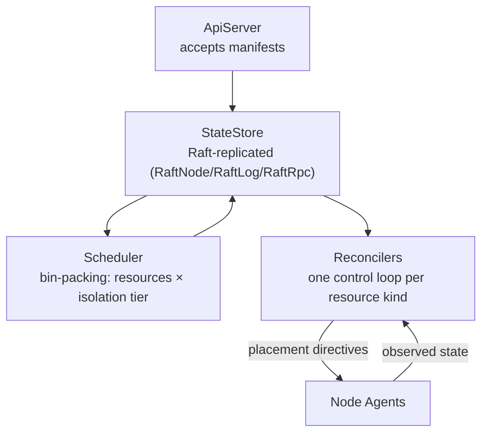

# Control plane

`gimle-controlplane` is the declarative-state side of Gimlé: it never runs a module and never
touches the service fabric's data plane — it decides *what should be running where*, and leaves
*making it so* to node agents and workers.

## API server and state store

`ApiServer` accepts manifests describing desired state (`DeploymentManifestParser` /
`DeploymentSpec`) and persists them to `StateStore`, which is Raft-replicated for control-plane HA
(`RaftNode`, `RaftLog`, `RaftRpc`, `RaftTransport`, `AppendEntries`/`RequestVote`/`InstallSnapshot`
— a real Raft implementation, not a simplified stand-in). Single control-plane node today; the Raft
machinery is what makes multi-node a configuration change rather than a rewrite later.

## Scheduler

Places module instances given resource requests, isolation tier, anti-affinity
(`PlacementConstraints` — replicas of one module must not share a worker JVM, or one crash takes
out every replica), and current machine load (`InstanceAssignment`, `TenantUsage`). Tier selection
makes this a two-dimensional bin-packing problem (resources × tier), not a single-dimension one.

## Reconcilers

One control loop per resource kind, each comparing desired state to observed state and emitting
actions:

- `DeploymentReconciler`
- `ReplicaCountReconciler`
- `AutoscaleReconciler` (driven by `AutoscalePolicy`)
- `HealthReconciler`
- `QuotaReconciler`

:::note[Level-triggered, not edge-triggered]

Every reconciler here must converge from **any** starting state, including after missing every
event that led to it — not just react correctly to the transition it was designed around. This is
the single most important correctness property in the control plane, and the hardest one to test:
a reconciler test suite has to start from arbitrary states, not just walk the happy path.

:::

## What the control plane deliberately doesn't do

Membership and failure detection between machines is a SWIM-style gossip protocol running
peer-to-peer between node agents — implemented in `gimle-fabric`, not here, and deliberately off
the control plane's critical path for detecting a dead node. That's also why
`gimle-controlplane` has no compile-time dependency on `gimle-fabric` or `gimle-os` at all (see
[Project structure](../contributing/project-structure.md)): resource enforcement and gossip
membership are the agent/fabric's job, not the control plane's.
