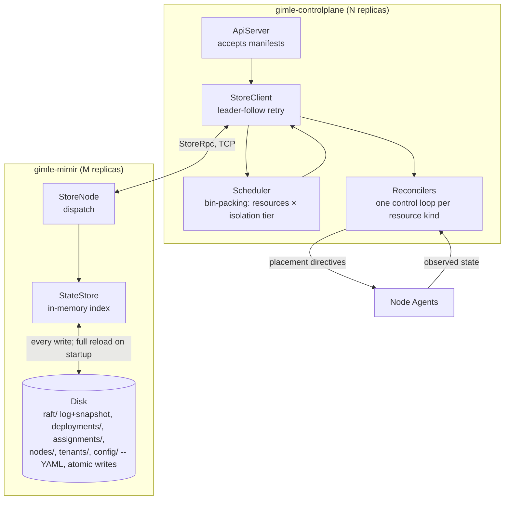

# Control plane

Gimlé's control plane is the declarative-state side of the system — it never runs a module and
never touches the service fabric's data plane, it decides *what should be running where* and
leaves *making it so* to node agents and workers — split across two process kinds, mirroring how
Kubernetes separates `kube-apiserver` from `etcd`:

- **`gimle-mimir`** — the Raft-replicated state store, as its own process.
- **`gimle-controlplane`** — the HTTP API server, scheduler, and reconcilers, talking to a
  `gimle-mimir` cluster over the network rather than embedding one.

## API server and store client

`ApiServer` accepts manifests describing desired state (`DeploymentManifestParser` /
`DeploymentSpec`) and, in place of a direct `StateStore` reference, holds a `StoreClient` that
talks to a `gimle-mimir` store cluster over the network (`StoreRpc`/`StoreCodec`, a hand-rolled
binary protocol modeled on the control plane's own Raft peer RPC). The store itself is
Raft-replicated for HA (`RaftNode`, `RaftLog`, `RaftRpc`, `RaftTransport`,
`AppendEntries`/`RequestVote`/`InstallSnapshot` — a real Raft implementation, not a simplified
stand-in), now running as `gimle-mimir`'s own process. This plays the same architectural role etcd
plays for Kubernetes, but it isn't etcd or any other external database: it's a custom, pure-Java
implementation, consistent with Gimlé having no non-Java runtime dependencies anywhere — just a
second Gimlé process kind, `StoreMain`, standable up independently of `ApiServer`'s own replica
count via `mvn gimle:store`.

Writes (`propose`, a node heartbeat, a reconciler-leader lease acquisition) must reach the store
cluster's current Raft leader; `StoreClient` follows a `NotLeader` response's hint and retries once
before giving up, entirely inside the client — an `ApiServer` replica never redirects an HTTP
caller to a peer the way it once did, because there is no longer a fixed 1:1 relationship between
an `ApiServer` replica and any particular store node to redirect to. Reads tolerate the same
staleness they always did: any store endpoint may answer, with no linearizability guarantee.

## Persistence and restart recovery

`StateStore` is, in its own javadoc's words, "an embedded, single-node, file-backed state store: a
directory of small YAML files, one per resource" — deployments, instance assignments, node
registrations/heartbeats, tenants, quotas, and tenant-scoped config each get their own file. Every
write goes through `AtomicFiles.writeAtomically` (write to a temp file, then atomic rename), so a
crash mid-write never leaves a torn file a reader could observe. `RaftLog` persists the actual
consensus log the same way — one immutable file per log entry, plus a compaction snapshot and the
current term/vote, in a `raft/` directory alongside `StateStore`'s own resource directories. Both
now live under `gimle-mimir/target/gimle-mimir-state` in local dev (`mvn gimle:store`'s own
default), separate from `gimle-controlplane/target/gimle-state`, which now holds only the API
server's own secrets — nothing about `ApiServer`'s own restart or redeployment touches Raft state
at all anymore, one of the actual points of the split.

Both `StateStore` and `RaftLog` reload from disk on construction: `StateStore.loadAll()` rebuilds
its entire in-memory index from the YAML files present, and `RaftLog` replays its persisted
term/vote, snapshot metadata, and every log entry. **A restarted `gimle-mimir` process picks up
exactly where it left off** — exercised directly (`StateStoreTest`'s
`removed_deployment_is_gone_after_reload`, among others).

Multi-node clustering itself is real and tested, not just scaffolded. `gimle-mimir`'s own
`RaftClusterTest` covers leader election converging to exactly one leader, a write becoming
visible on every replica, killing the leader triggers re-election and the new leader keeps serving
writes, a network-partitioned minority being unable to elect a leader or commit writes (split-brain
safety), and a far-behind follower catching up via `InstallSnapshot` rather than replaying the
entire log. `gimle-mimir`'s `StoreClientClusterTest` and `gimle-controlplane`'s `ApiServerRaftTest`
cover the decoupled N:M topology specifically: a real M-node store cluster behind N real
`ApiServer` replicas, proving a write through *any* replica succeeds regardless of which store
node currently holds Raft leadership, including across a forced leader failover. The local-dev
walkthrough (`gimle-console/LOCAL_DEV.md`) only ever runs one store node and one control-plane
replica in practice, but the clustering mechanics underneath it are exercised by tests, not just
present in the source tree.

## Scheduler

Places module instances given resource requests, isolation tier, anti-affinity
(`PlacementConstraints` — replicas of one module must not share a worker JVM, or one crash takes
out every replica), and current machine load (`InstanceAssignment`, `TenantUsage`). Tier selection
makes this a two-dimensional bin-packing problem (resources × tier), not a single-dimension one.

## Reconcilers

One control loop per resource kind, each comparing desired state to observed state and emitting
actions:

- `DeploymentReconciler`
- `ReplicaCountReconciler`
- `AutoscaleReconciler` (driven by `AutoscalePolicy`)
- `HealthReconciler`
- `QuotaReconciler`

:::note[Level-triggered, not edge-triggered]

Every reconciler here must converge from **any** starting state, including after missing every
event that led to it — not just react correctly to the transition it was designed around. This is
the single most important correctness property in the control plane, and the hardest one to test:
a reconciler test suite has to start from arbitrary states, not just walk the happy path.

:::

Reconcilers only ever tick on whichever `ApiServer` replica currently holds a `reconciler-leader`
lease — a lease-based election (`StoreClient#tryAcquireOrRenewLease`, backed by a non-replicated,
leader-local primitive on the store, the same shape Kubernetes' own
`coordination.k8s.io/v1 Lease` serves for `kube-controller-manager`/`kube-scheduler`), not Raft
leadership: once `ApiServer` is decoupled from the store's own Raft membership, nothing about being
"an `ApiServer` replica" implies leadership of anything on its own, so this election exists
specifically to keep "exactly one active controller" true the way colocating reconcilers with a
Raft node used to provide for free.

## What the control plane deliberately doesn't do

Membership and failure detection between machines is a SWIM-style gossip protocol running
peer-to-peer between node agents — implemented in `gimle-fabric`, not here, and deliberately off
the control plane's critical path for detecting a dead node. That's also why
`gimle-controlplane` has no compile-time dependency on `gimle-fabric` or `gimle-os` at all (see
[Project structure](../contributing/project-structure.md)): resource enforcement and gossip
membership are the agent/fabric's job, not the control plane's.
