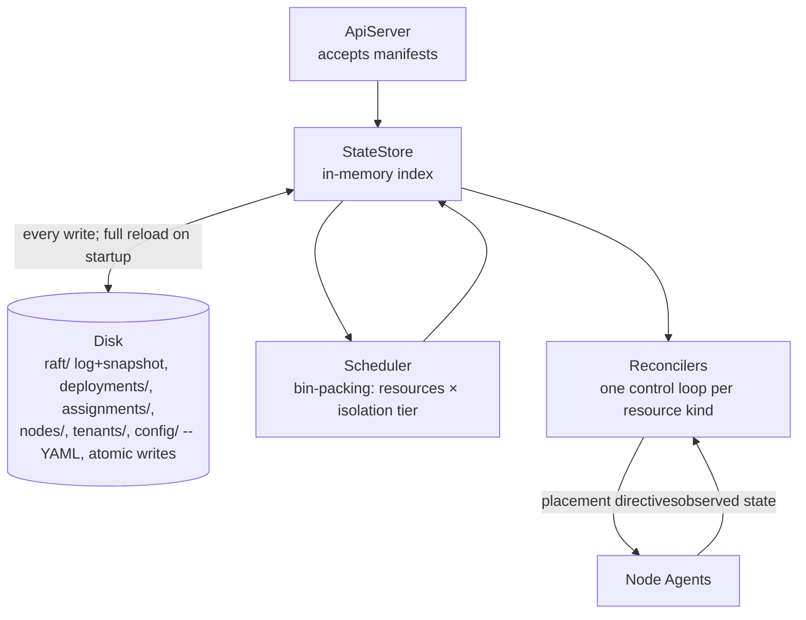

# Control plane

`gimle-controlplane` is the declarative-state side of Gimlé: it never runs a module and never
touches the service fabric's data plane — it decides *what should be running where*, and leaves
*making it so* to node agents and workers.

## API server and state store

`ApiServer` accepts manifests describing desired state (`DeploymentManifestParser` /
`DeploymentSpec`) and persists them to `StateStore`, which is Raft-replicated for control-plane HA
(`RaftNode`, `RaftLog`, `RaftRpc`, `RaftTransport`, `AppendEntries`/`RequestVote`/`InstallSnapshot`
— a real Raft implementation, not a simplified stand-in). This plays the same architectural role
etcd plays for Kubernetes, but it isn't etcd or any other external database: it's a custom,
embedded, pure-Java implementation, consistent with Gimlé having no non-Java runtime dependencies
anywhere — nothing to stand up or operate separately from the control-plane process itself.

## Persistence and restart recovery

`StateStore` is, in its own javadoc's words, "an embedded, single-node, file-backed state store: a
directory of small YAML files, one per resource" — deployments, instance assignments, node
registrations/heartbeats, tenants, quotas, and tenant-scoped config each get their own file. Every
write goes through `AtomicFiles.writeAtomically` (write to a temp file, then atomic rename), so a
crash mid-write never leaves a torn file a reader could observe. `RaftLog` persists the actual
consensus log the same way — one immutable file per log entry, plus a compaction snapshot and the
current term/vote, in a `raft/` directory alongside `StateStore`'s own resource directories.

Both reload from disk on construction: `StateStore.loadAll()` rebuilds its entire in-memory index
from the YAML files present, and `RaftLog` replays its persisted term/vote, snapshot metadata, and
every log entry. **A restarted control-plane process picks up exactly where it left off** — this
is exercised directly (`StateStoreTest`'s `removed_deployment_is_gone_after_reload`, among others)
and matches the documented local-dev behavior: state survives across restarts under
`gimle-controlplane/target/gimle-state` until that directory is explicitly deleted or `mvn clean`
is run.

Multi-node clustering itself is real and tested, not just scaffolded — `RaftClusterTest` covers
leader election converging to exactly one leader, a write becoming visible on every replica,
**killing the leader triggers re-election and the new leader keeps serving writes**, a
network-partitioned minority being unable to elect a leader or commit writes (split-brain safety),
a write to a follower being redirected to the real leader, and a far-behind follower catching up
via `InstallSnapshot` rather than replaying the entire log. The local-dev walkthrough
(`gimle-console/LOCAL_DEV.md`) only ever runs a single control-plane node in practice, but the
clustering mechanics underneath it are exercised by tests, not just present in the source tree.

## Scheduler

Places module instances given resource requests, isolation tier, anti-affinity
(`PlacementConstraints` — replicas of one module must not share a worker JVM, or one crash takes
out every replica), and current machine load (`InstanceAssignment`, `TenantUsage`). Tier selection
makes this a two-dimensional bin-packing problem (resources × tier), not a single-dimension one.

## Reconcilers

One control loop per resource kind, each comparing desired state to observed state and emitting
actions:

- `DeploymentReconciler`
- `ReplicaCountReconciler`
- `AutoscaleReconciler` (driven by `AutoscalePolicy`)
- `HealthReconciler`
- `QuotaReconciler`

:::note[Level-triggered, not edge-triggered]

Every reconciler here must converge from **any** starting state, including after missing every
event that led to it — not just react correctly to the transition it was designed around. This is
the single most important correctness property in the control plane, and the hardest one to test:
a reconciler test suite has to start from arbitrary states, not just walk the happy path.

:::

## What the control plane deliberately doesn't do

Membership and failure detection between machines is a SWIM-style gossip protocol running
peer-to-peer between node agents — implemented in `gimle-fabric`, not here, and deliberately off
the control plane's critical path for detecting a dead node. That's also why
`gimle-controlplane` has no compile-time dependency on `gimle-fabric` or `gimle-os` at all (see
[Project structure](../contributing/project-structure.md)): resource enforcement and gossip
membership are the agent/fabric's job, not the control plane's.
