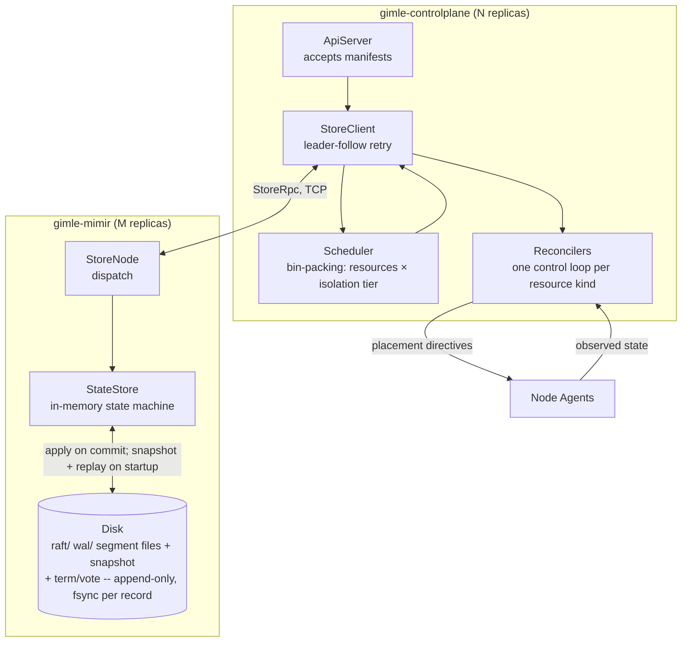

import ZoomableDiagram from '@site/src/components/ZoomableDiagram';

# Control plane

Gimlé's control plane is the declarative-state side of the system — it never runs a module and
never touches the service fabric's data plane, it decides *what should be running where* and
leaves *making it so* to node agents and workers — split across two process kinds, mirroring how
Kubernetes separates `kube-apiserver` from `etcd`:

- **`gimle-mimir`** — the Raft-replicated state store, as its own process.
- **`gimle-controlplane`** — the HTTP API server, scheduler, and reconcilers, talking to a
  `gimle-mimir` cluster over the network rather than embedding one.

New to distributed systems? [Consensus and replication](../concepts/consensus-and-replication.md)
explains leader election and log replication from first principles before diving into `RaftNode`
itself — the mechanism `gimle-mimir` implements underneath everything on this page.



## API server and store client

`ApiServer` accepts manifests describing desired state (`DeploymentManifestParser` /
`DeploymentSpec`) and, in place of a direct `StateStore` reference, holds a `StoreClient` that
talks to a `gimle-mimir` store cluster over the network (`StoreRpc`/`StoreCodec`, a hand-rolled
binary protocol modeled on the control plane's own Raft peer RPC). The store itself is
Raft-replicated for HA (`RaftNode`, `RaftLog`, `RaftRpc`, `RaftTransport`,
`AppendEntries`/`RequestVote`/`InstallSnapshot` — a real Raft implementation, not a simplified
stand-in), now running as `gimle-mimir`'s own process. This plays the same architectural role etcd
plays for Kubernetes, but it isn't etcd or any other external database: it's a custom, pure-Java
implementation, consistent with Gimlé having no non-Java runtime dependencies anywhere — just a
second Gimlé process kind, `StoreMain`, standable up independently of `ApiServer`'s own replica
count via `mvn gimle:store`.

Writes (`propose`, a node heartbeat, a reconciler-leader lease acquisition) must reach the store
cluster's current Raft leader; `StoreClient` follows a `NotLeader` response's hint and retries once
before giving up, entirely inside the client — an `ApiServer` replica never redirects an HTTP
caller to a peer the way it once did, because there is no longer a fixed 1:1 relationship between
an `ApiServer` replica and any particular store node to redirect to. Reads tolerate the same
staleness they always did: any store endpoint may answer, with no linearizability guarantee.

`GET /endpoints/{name}` is a small, read-only view over the same assignment/heartbeat state
`GET /deployments/{name}` already exposes, purpose-built for [vessel workloads](../reference/manifest-schema.md#vessel-workloads-vessel):
for each live instance, its `nodeId`, the host that node registered at startup (`NodeRegistration.apiAddress`,
the same address `AgentLogServer` proxying already resolves through), and — joined from that node's
latest heartbeat, the same `InstanceAssignment`-plus-`NodeHeartbeat` join `findObservation` already
performs for every other status endpoint — a vessel instance's own declared ports (`env`-var name to
allocated/fixed number). No gateway, no proxying, no load balancing: purely "list where things are,"
for an external client (an LB, `curl`, a service mesh's own discovery hook) to dial itself. `name` is
looked up against each supported workload kind in turn — `Deployment`, `Job` (`JobRun#attempt` plays
`InstanceAssignment#instanceIndex`'s own role), `DaemonSet` (a fixed `instanceIndex` of `0` — the
node itself is the index), `StatefulSet` — the first kind whose spec store actually has that name
wins. `CronJob` is deliberately excluded: it has no live instance of its own, only the `Job`s it
spawns, so there is nothing for this route to ever join against for a CronJob's own name. Tenant-scoped
read authorization behaves exactly like every other single-resource `GET` route (the matching
`ResourceKind` for whichever kind resolved, `Verb.READ`, scoped to that workload's own `tenantId`);
a workload with no vessel-hosted instances simply returns entries with no `ports` field.

A `gimle:nodes` caller takes a different, narrower authorization path than the ordinary RBAC walk
above: it may read `/endpoints/{name}` only if `Authorizer#isTenantAssignedToNode` says the calling
node currently holds an active instance assignment for that workload's own `tenantId` — the identical
node-tenant-scoping check Fafnir's `/secrets/*` surface already established (see
[Authentication and authorization](./authn-authz.md)), now lifted onto `Authorizer` itself so both
call sites share one implementation. This is what lets a hosted module ask its own node agent to
relay a `GET /endpoints/{name}` call on its behalf (the worker-agent control channel's
`RelayControlPlaneRead`/`RelayControlPlaneResult` pair — see [Node topology](./node-topology.md#relaying-a-hosted-modules-control-plane-reads))
without that agent's own certificate needing an ordinary `RoleBinding` granted to it.

## Persistence and restart recovery

The persistence architecture is etcd's, hand-rolled in Java: **the Raft log is the durable source
of truth, and the state machine holds nothing on disk of its own.** `StateStore` is purely
in-memory — concurrent maps, one per resource kind — and only ever changes by a committed log
entry being applied to it (or a snapshot being installed into it). The log itself (`RaftLog`,
backed by `WriteAheadLog`) is a set of append-only segment files under `raft/wal/`: every appended
record — a log entry, or an explicit truncation marker for a discarded conflicting/timed-out
suffix — is CRC-guarded, fsynced before the caller is answered, and never rewritten in place. The
current term/vote pair and the compaction snapshot are the two things still written as whole files
(via `AtomicFiles.writeAtomically`'s temp-file-plus-atomic-rename idiom), since each must be
replaced atomically as a unit. Everything lives under `gimle-mimir/target/gimle-mimir-state` in
local dev (`mvn gimle:store`'s own default), separate from
`gimle-controlplane/target/gimle-state`, which now holds only the API server's own secrets —
nothing about `ApiServer`'s own restart or redeployment touches Raft state at all anymore, one of
the actual points of the split.

Restart recovery is snapshot plus replay, the same path a live far-behind follower takes: on
construction a `RaftNode` restores the persisted compaction snapshot into `StateStore`, replays
the WAL to rebuild the in-memory log (discarding a crash-torn final record, refusing to load on
any other damage), and lets ordinary commit advancement re-apply whatever committed entries sit
above the snapshot floor. A freshly elected leader appends a no-op entry at its own term — the
standard Raft move that lets it commit its predecessors' entries — which is exactly what forces
that catch-up to happen immediately on a quiet cluster rather than waiting for the next client
write. **A restarted `gimle-mimir` process picks up exactly where it left off** — exercised
directly (`RaftLogTest`'s reopen tests and `RaftNodeRecoveryTest`'s full restart-with-an-empty-
state-machine round trips).

Writes group-commit: a burst of independent mutations — a reconciler tick placing several
replicas or daemonset nodes, sweeping stale assignments, or settling a surge — rides one Raft log
entry as a `StateMutation.Batch` (via `MutationSink.proposeAll`), paying one consensus round and
one WAL fsync for the whole burst instead of one per mutation. A batch applies in order and is
never nested; a single mutation is still proposed bare. The same mechanism makes every
reconciler's multi-mutation transitions atomic — a Job's terminal run-removal-plus-phase pair, a
retry placement plus its failed attempt's removal, a CronJob's last-schedule advance plus the
firing it accounts for, a health reschedule plus its backoff bookkeeping — closing crash windows
the old one-entry-at-a-time orderings could only comment around.

Multi-node clustering itself is real and tested, not just scaffolded. `gimle-mimir`'s own
`RaftClusterTest` covers leader election converging to exactly one leader, a write becoming
visible on every replica, killing the leader triggers re-election and the new leader keeps serving
writes, a network-partitioned minority being unable to elect a leader or commit writes (split-brain
safety), and a far-behind follower catching up via `InstallSnapshot` rather than replaying the
entire log. `gimle-mimir`'s `StoreClientClusterTest` and `gimle-controlplane`'s `ApiServerRaftTest`
cover the decoupled N:M topology specifically: a real M-node store cluster behind N real
`ApiServer` replicas, proving a write through *any* replica succeeds regardless of which store
node currently holds Raft leadership, including across a forced leader failover. The local-dev
walkthrough (`gimle-console/LOCAL_DEV.md`) only ever runs one store node and one control-plane
replica in practice, but the clustering mechanics underneath it are exercised by tests, not just
present in the source tree.

### Dynamic membership

`gimle-mimir`'s Raft membership is dynamically reconfigurable at runtime, etcd-style: `StoreMain`'s
own `--peers` flag is bootstrap configuration for a brand-new cluster only, not a fixed
configuration for its lifetime. `StoreClient#addServer` (backed by `StoreRpc.AddServer`,
leader-only, same `NotLeader`-redirect-and-retry posture as every other write here) adds one server
at a time; `RaftNode` applies the resulting membership-change log entry the instant it's appended
— leader or follower — rather than waiting for it to commit, and refuses to start a second change
while an earlier one it proposed is still uncommitted. This is deliberately **not** full joint
consensus: only one configuration is ever in flight, replacing the old one outright, rather than a
`C_old,new` overlap window with a dual-majority commit rule — a materially smaller, lower-risk
surface for the small, operator-driven clusters this control plane targets. Removing a server, and
a CLI surface for both operations, are tracked as a near-term follow-up rather than blocking this
capability's initial landing.

## Scheduler

Places module instances given resource requests, isolation tier, anti-affinity
(`PlacementConstraints` — replicas of one module must not share a worker JVM, or one crash takes
out every replica), and current machine load (`InstanceAssignment`, `TenantUsage`). Tier selection
makes this a two-dimensional bin-packing problem (resources × tier), not a single-dimension one.

`PlacementConstraints.requiredNodeLabels` (a manifest's `placement.requiredLabels`) is matched by
exact set membership against each node's own operator-assigned labels — a flat, expression-free
label set on both sides, no key/value structure. A node's labels are set once at agent startup via
the `gimle.node.labels` system property (comma-separated, e.g. `-Dgimle.node.labels=gpu,ssd`) and
reported at registration alongside its isolation-tier support.

A node whose last heartbeat is older than the node-dark timeout (15s) is not a placement candidate
at all, regardless of what that last heartbeat said. This matters more than it first looks: a node
that has stopped answering still reports whatever capacity it had when it was alive, and once its
assignments are released it holds none — so a load-aware scheduler would otherwise see the emptiest
machine in the cluster and place there by preference. Excluding it is what lets machine-level
self-healing actually complete: the reconciler that releases a dead node's assignments and the one
that re-places them use the same timeout, so a released instance moves to a node that is genuinely
answering rather than bouncing back onto the dead one.

An operator can also cordon a node (`gimle cordon <nodeId>` / `gimle uncordon <nodeId>`, or
`POST /nodes/{id}/cordon`/`/uncordon`) to exclude it from future placement — evaluated as the
scheduler's first filter stage, right after isolation-tier support and before anti-affinity, node
taints, and required labels. Cordoning is deliberately just a binary "don't schedule here" flag: it
never evicts an instance already running on the node. Preemption remains out of scope.

Node taints (`gimle taint <nodeId> <tenantId>` / `gimle untaint <nodeId> <tenantId>`, or
`POST /nodes/{id}/taint`/`/untaint`) are the Kubernetes taint/toleration analogue: an operator
reserves a node for one tenant, and every other tenant's replica — including an untenanted one — is
excluded from it, unconditionally across every isolation tier. A node with no taints is open to any
tenant, the common case. Unlike an ad hoc co-residency check computed from current assignments, a
taint is a single per-node property read directly from the store, so it doesn't degrade as more
tenants or workload kinds share the cluster, and it never evicts an instance already running there
— only keeps a non-tolerating tenant's new placements off it.

### Why a placement failed

Each filter stage raises its own distinct failure naming the specific thing that blocked the
replica, because the remedies do not overlap — "add capacity", "add a node supporting this tier"
and "remove a taint/cordon/label constraint" are three different actions:

```
deployment orders instance 3 cannot be placed: it requests memory=100Mi cpu=100m, and none of
the 2 candidate node(s) with TIER_1 support has room -- memory is short by 90Mi (the most any
candidate has free is 10Mi, on node-a); free capacity per candidate node: node-a memory=10Mi
cpu=1000m; node-b memory=8Mi cpu=1000m
```

A capacity failure names the dimension that actually fell short, the shortfall, and every
candidate's free capacity (capped at five nodes, with the remainder counted). Both dimensions can
individually fit somewhere and still leave a replica unplaceable when no *single* node has both
free at once; that is reported as itself rather than as a shortfall on either one. An unsupported
tier lists what each registered node does support and says outright that adding capacity cannot
help; a cordon, taint, or required-label exclusion names the blocking nodes and the constraint. A
message never claims a cause the scheduler did not observe — a taint-blocked placement onto an
empty node is never reported as a capacity shortfall.

Sticky (`StatefulSet`) placement has only one node it may ever land on, so its failure names the
one property of that node to fix: not registered, cordoned, missing tier support, tainted, missing
a required label, or short by a stated amount on a stated dimension.

The scheduler's own anti-affinity is node-granularity only — it keeps two replicas of one module
off the *same node*, not necessarily the same worker JVM. Whether two *different* modules placed
on the same node end up sharing one worker JVM (Tier 1 density) is an agent-local decision the
scheduler has no visibility into; see [Tiered isolation](./tiered-isolation.md)'s own section on
this. The agent's own density logic separately guarantees two replicas of the *same* module never
land in the same worker even when anti-affinity is off, since that would corrupt the worker
runtime's per-module bookkeeping — a narrower, worker-level guarantee the node-level scheduler
constraint doesn't provide by itself.

## Reconcilers

New to distributed systems? [Level-triggered reconciliation](../concepts/level-triggered-reconciliation.md)
explains why this matters from first principles, with a real reconstruct-mid-flight test as proof.

One control loop per resource kind, each comparing desired state to observed state and emitting
actions. This is **level-triggered, not edge-triggered**: the loop below always reasons from
"what is desired vs. what is observed right now," never "what event just arrived" — so it
converges even after missing every event in between (source:
`diagrams/control-plane-reconcile-loop.d2`):

<ZoomableDiagram
  src="/diagrams/control-plane-reconcile-loop.svg"
  alt="Reconcile loop: ApiServer writes desired state to gimle-mimir, a Reconciler reads desired state and node agents' observed state, compares them, and on drift emits a placement directive back to the node agents — the next tick re-verifies regardless of what triggered it"
  width={640}
/>

- `DeploymentReconciler`
- `ReplicaCountReconciler`
- `AutoscaleReconciler` (driven by `AutoscalePolicy`)
- `HealthReconciler`
- `QuotaReconciler`
- `JobReconciler` (see [Manifest schema § Job manifest](../reference/manifest-schema.md#job-manifest))
- `CronJobReconciler` (see [Manifest schema § CronJob manifest](../reference/manifest-schema.md#cronjob-manifest))
- `DaemonSetReconciler` (see [Manifest schema § DaemonSet manifest](../reference/manifest-schema.md#daemonset-manifest))
- `StatefulSetReconciler` (see [Manifest schema § StatefulSet manifest](../reference/manifest-schema.md#statefulset-manifest))

Every distinct `kind:` a manifest can declare gets its own reconciler this way, following the same
desired-vs-observed convergence loop shape described above.

`AutoscaleReconciler` folds up to four independently-optional signals into one scaling decision:
CPU utilization (always evaluated), plus request rate, error rate, and queue depth, each evaluated
only when its own `AutoscalePolicy` target is configured — an existing CPU-only policy scales
exactly as it always has. `AutoscalePolicy.CombinationMode` picks how those signals combine, from
the same ready-instance observations `HealthReconciler` already reads:

- `WORST_SIGNAL` (the default) — each configured signal proposes its own ideal replica count
  independently, and the highest one wins ("worst signal wins," the same approach Kubernetes' own
  HPA takes across multiple metrics, rather than blending differently-shaped signals into one
  score).
- `WEIGHTED` — instead of taking the max of independently-ceiled candidates, each configured
  signal's own observed/target ratio is weighted (`cpuWeight`/`requestRateWeight`/
  `errorRateWeight`/`queueDepthWeight`, each defaulting to `1.0` when its signal is configured but
  its own weight is not) and averaged into a single blended ratio, which then goes through the
  same replica-count rounding exactly once, rather than once per signal. An unweighted `WEIGHTED`
  policy (no explicit weights at all) is a plain average across whichever signals are configured —
  a genuinely distinct combination from `WORST_SIGNAL`'s max, not an alias that happens to agree
  when weights are omitted.

Either mode feeds into the existing `[minReplicas, maxReplicas]` clamp and one-replica-per-tick
damping unchanged. That damping bounds how far one tick may move, not how often the direction may
reverse, so a separate pair of stabilization windows does the latter:
`AutoscalePolicy.scaleUpCooldown`/`scaleDownCooldown` (defaults: none for up, five minutes for
down — see [Manifest schema §
autoscale](../reference/manifest-schema.md#deployment-manifest-autoscale)) suppress a move until
that direction's window has elapsed since this deployment's last recorded scale event. That
timestamp is written to `gimle-mimir` in the same batch as the replica-count change it accounts
for, never held on the reconciler object — a window that lived in memory would reopen on every
control-plane restart and mean nothing to the replica that takes over after a failover, which is
exactly the level-triggered property every reconciler here has to preserve. A deployment that has
never scaled has no window to wait out, and clamping an out-of-range stored count back into the
policy's own bounds is a correction rather than a scaling decision, so it is never suppressed. Error rate is evaluated as a percentage of that instance's own request volume
(errors/sec ÷ requests/sec), not a raw errors/sec count. Every pre-existing policy (constructed
without a `CombinationMode` or weights at all) defaults to `WORST_SIGNAL` with no weights, so this
is purely additive — the combination mode and all four weights are also tunable from the console's
own deployment create screen, not raw YAML only (see [Web console](./web-console.md)).

`DeploymentReconciler`'s rolling-update logic, and `DaemonSetReconciler`'s node-keyed duplicate of
it, migrate up to a `DisruptionBudget`'s `maxUnavailable` indices/nodes concurrently (default `1`,
absent a manifest `disruption:` block) rather than the single-index-at-a-time behavior both had
before this field existed — see [Manifest schema § Deployment manifest:
disruption](../reference/manifest-schema.md#deployment-manifest-disruption). Each already-in-flight
index/node is checked for readiness every tick; a freed slot is topped up with a new migration the
moment budget allows, including within the same tick a prior one clears, so the effective
`maxUnavailable` count stays continuously in flight rather than draining a whole batch before the
next one starts. "Ready" itself requires more than the single latest heartbeat: `DeploymentReconciler`
and `StatefulSetReconciler` (via their shared-shape `isReady`) only clear an in-flight migration once
the replacement has been observed continuously ready for a stabilization window, persisted so the
timer survives a reconciler-leader failover — a replacement that flaps between ready and not-ready
during startup can never free its slot on a single lucky reading, which would otherwise let the next
migration start before the current one has genuinely stabilized.

`maxSurge` (provisioning a replacement before removing the original) is implemented for
`DeploymentReconciler` only — `DaemonSetReconciler` still rejects a nonzero value outright, since a
DaemonSet's one-instance-per-node placement has no "extra" instance to provision. A surge instance is
placed at a synthetic index `>= replicas`, a range the ordinary `0..replicas-1` placement loop never
otherwise uses, tracked as a (surgeIndex → targetIndex) pair independently of the `maxUnavailable`
in-flight set — the two budgets run as separate passes over the same mismatched-index list each
tick, each excluding indices the other has already claimed, so the same index is never migrated both
ways at once. A replica-count drop while a surge's target index is still in flight abandons that
promotion rather than completing it into an index that no longer exists.

**Promotion retargets the surge instance onto the target index in place, without a restart.** Once
the surge instance reports ready, `DeploymentReconciler` doesn't tear the target index down and
schedule a fresh replacement — it overwrites the target's assignment with the surge instance's own
already-known `nodeId`/`moduleId`/`artifactPath`, tagged with `InstanceAssignment
.renamedFromInstanceIndex()`, and removes the now-redundant surge slot in the same tick. `AgentMain`
recognizes that hint on its next poll: if the instance it's already supervising under the old
(surge) key is still healthy and running exactly what the target now expects, it re-keys its own
bookkeeping (`supervised`, per-instance log shippers) and sends the worker a `RenameInstance`
control message — a new agent↔worker frame that updates only `InstanceIdentityRegistry`'s log/health
identity tagging, never `ResolveModule`/`StartModule`/`StopModule` — rather than killing the worker
JVM and spawning a new one. The whole point: a migrated replica under `maxSurge` pays for exactly one
worker JVM startup (the surge instance's own), not two. This is a pure optimization with a safe
fallback baked in at every step — if the rename source isn't found supervised (a genuine race, or the
agent restarted and lost in-memory state), `AgentMain` falls straight through to the ordinary
start/stop path, exactly as if promotion had torn the target down and re-scheduled it fresh.

:::note[Level-triggered, not edge-triggered]

Every reconciler here must converge from **any** starting state, including after missing every
event that led to it — not just react correctly to the transition it was designed around. This is
the single most important correctness property in the control plane, and the hardest one to test:
a reconciler test suite has to start from arbitrary states, not just walk the happy path.

:::

Reconcilers only ever tick on whichever `ApiServer` replica currently holds a `reconciler-leader`
lease — a lease-based election (`StoreClient#tryAcquireOrRenewLease`, backed by a non-replicated,
leader-local primitive on the store, the same shape Kubernetes' own
`coordination.k8s.io/v1 Lease` serves for `kube-controller-manager`/`kube-scheduler`), not Raft
leadership: once `ApiServer` is decoupled from the store's own Raft membership, nothing about being
"an `ApiServer` replica" implies leadership of anything on its own, so this election exists
specifically to keep "exactly one active controller" true the way colocating reconcilers with a
Raft node used to provide for free.

Losing that lease reconstructs `HealthReconciler`/`ReplicaCountReconciler` from scratch on whichever
replica wins it next — a fresh Java object with no memory of what the previous holder was doing.
Their restart-budget/grace-period bookkeeping (per-instance attempt counts, backoff windows,
missing-since timers) is therefore persisted through the store as a `ReconcilerInstanceState`
(`gimle-mimir`), not held only in a local map: the new leader picks the in-progress backoff back up
instead of silently re-granting a full restart budget to an already-flapping instance.

## Instance event log

Every lifecycle transition a worker drives (`INSTALLED`/`RESOLVED`/`STARTING`/`ACTIVE`/`STOPPING`/
`UNINSTALLED`/a failed transition with its cause) is durably recorded per-instance, not just relayed
as a fire-and-forget `ModuleStateChanged` notification the way it always has been. The worker builds
an `InstanceEvent`, its agent forwards it to the control plane
(`POST /nodes/{id}/events`), and it lands in `gimle-mimir`'s state store as an
`AppendInstanceEvent` mutation — the store's first many-per-key resource kind (every other resource
holds one current value per key; an instance's timeline is a bounded, ordered history instead,
capped at 50 events per instance with oldest-first pruning applied deterministically inside
`applyTo` so every Raft replica prunes identically). `GET /events?deployment=&instance=` and
`gimle-cli events <deploymentName> <instanceIndex>` read it back newest-first.

This is deliberately distinct from general [audit logging](./authn-authz.md#audit-logging) (who
changed what, cluster-wide) — both are real, both live in `gimle-mimir`, but as two different
mechanisms: this one is per-instance timeline data scoped and capped per instance, `AuditEvent` is a
cluster-wide trail with a single retention cap and no natural per-key scope. A `TRANSITION_FAILED`
event's `causeSummary` is deliberately just an exception's class name plus message, not a full stack
trace, to keep each event's footprint small.

## What the control plane deliberately doesn't do

Membership and failure detection between machines is a SWIM-style gossip protocol running
peer-to-peer between node agents — implemented in `gimle-fabric`, not here, and deliberately off
the control plane's critical path for detecting a dead node. That's also why
`gimle-controlplane` has no compile-time dependency on `gimle-fabric` or `gimle-os` at all (see
[Project structure](../contributing/project-structure.md)): resource enforcement and gossip
membership are the agent/fabric's job, not the control plane's.
