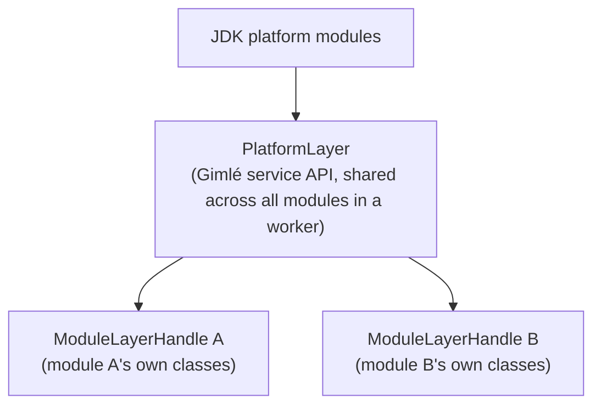

# Module system

The module system (`gimle-module`) is what makes Tier 1's density win possible: every deployed
instance gets its own `ModuleLayer` and classloader, without needing a dedicated JVM per module.

## Layer construction and parenting

`ModuleLayerFactory` builds each instance's `ModuleLayerHandle`, parented on a shared
`PlatformLayer` that holds the JDK and Gimlé's own service API — never on another module's layer.
Hoisting a common library into the platform layer (rather than duplicating it into every module's
own layer) is the actual density lever, and it's a deliberate, measured decision per library, not
a default. `ModuleResolver` checks required-module version ranges before a layer is ever
constructed; `ModuleDescriptorParser`/`ModuleArtifactReader` read the module's `gimle-module.yaml`
and JAR to get there. `ModuleContext`/`SimpleModuleContext` is what a running instance actually
sees: its own service registry lookups, resource handles, and lifecycle-hook callback surface,
scoped to that one instance.

## Lifecycle

See [Module lifecycle](../reference/module-lifecycle.md) for the full
`INSTALLED → RESOLVED → STARTING → ACTIVE → STOPPING → UNINSTALLED` state machine
(`ModuleController`/`ModuleRegistry`/`ModuleState`/`LifecycleEvent`) and hook points
(`ModuleLifecycleHooks`, `LivenessProbe`/`ReadinessProbe`).

## Classloader leak detection

OSGi's most notorious failure mode is a disposed bundle whose classloader is retained by a stray
reference somewhere, leaking metaspace on every redeploy. Gimlé treats detecting this as a
first-class feature, not an afterthought:

- After a module is undeployed, `LeakTracker` holds a `PhantomReference` to its layer's classloader.
- If that reference survives a configurable window, a `ModuleLeakDetected` event is raised, naming
  the retaining path via a heap walk.
- `OldObjectSampleCorrelator` correlates JFR old-object-sample events back to the leaking module,
  so the report points at *what* is retaining the classloader, not just *that* something is.

Redeploy-in-a-loop with flat metaspace is a mandatory acceptance property of the module system, not
a nice-to-have — and the escape hatch this buys is real: a module that leaks despite everything can
be moved to [Tier 2](./tiered-isolation.md), where undeploy just kills a JVM instead of depending on
classloader disposal working correctly at all.

## Service registry

`ServiceRegistry`/`SimpleServiceRegistry` is the in-worker side of publish/consume — a module
publishes a service keyed by interface + version, another looks it up through its own
`ModuleContext`. Same-worker lookups resolve directly to a Java object; anything cross-worker or
cross-machine goes through the fabric's own registry instead — see
[Service fabric](./service-fabric.md).
