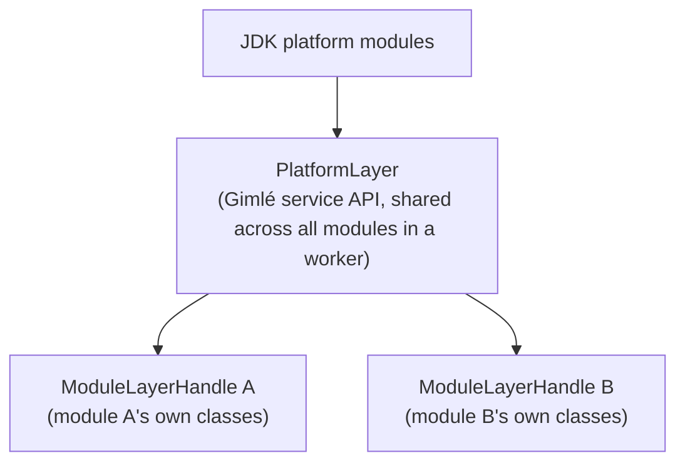

# Module system

The module system (`gimle-module`) is what makes Tier 1's density win possible: every deployed
instance gets its own `ModuleLayer` and classloader, without needing a dedicated JVM per module.

## Layer construction and parenting



`ModuleLayerFactory` builds each instance's `ModuleLayerHandle`, parented on a shared
`PlatformLayer` that holds the JDK and Gimlé's own service API — never on another module's layer.
Hoisting a common library into the platform layer (rather than duplicating it into every module's
own layer) is the actual density lever, and it's a deliberate, measured decision per library, not
a default. `ModuleResolver` checks required-module version ranges before a layer is ever
constructed; `ModuleDescriptorParser`/`ModuleArtifactReader` read the module's `gimle-module.yaml`
and JAR to get there. `ModuleContext`/`SimpleModuleContext` is what a running instance actually
sees: its own service registry lookups, resource handles, and lifecycle-hook callback surface,
scoped to that one instance. Beyond services and lifecycle, it carries the instance's config view
(`config(key)` for a point lookup, `configKeys()` to enumerate everything the agent currently has
delivered — for a module that treats its config as a namespace rather than a fixed set of known
keys, and `onConfigChange(listener)` to be told about a delivery, rotation, or retraction as it
happens instead of polling for it; see
[Multi-tenancy](./multi-tenancy.md) for how the agent keeps that view current, deletions included)
and the downward-API-style `instanceInfo()`: the instance's own placement identity as the
platform sees it (deployment name, replica index, node id, owning tenant), looked up live on every
call so an in-place retarget changes the answer without the module restarting, and empty for a
module the platform never identified (a directly-embedded controller in a test).

## Lifecycle

See [Module lifecycle](../reference/module-lifecycle.md) for the full happy-path state machine
(`INSTALLED → RESOLVED → STARTING → ACTIVE → STOPPING → UNINSTALLED`), its two failure/completion
terminals (`FAILED`, `COMPLETED`), the classes behind them
(`ModuleController`/`ModuleRegistry`/`ModuleState`/`LifecycleEvent`), and hook points
(`ModuleLifecycleHooks`, `LivenessProbe`/`ReadinessProbe`).

### A real hook and probe pair

Not a sketch — this is the actual, complete
`gimle-examples/greeter-provider/src/main/java/com/gimle/examples/greeter/provider/` source that
[Deploy your first module](../tutorials/deploy-your-first-module.md) deploys. `onStart` registers
the fabric service and flips a shared `ready` flag; the readiness probe reads that same flag rather
than duplicating the check, so the instance can never report `ACTIVE` before its service is
actually reachable:

```java title="GreeterProviderHooks.java"
public final class GreeterProviderHooks implements ModuleLifecycleHooks {

  static final AtomicBoolean ready = new AtomicBoolean(false);

  @Override
  public void onStart(ModuleContext ctx) {
    ctx.registerService(Greeter.class, name -> "Hello, " + name + "! (from provider)");
    ready.set(true);
    log.info("greeter-provider registered its Greeter service on the fabric");
  }

  @Override
  public void onStop(ModuleContext ctx) {
    ready.set(false);
  }
}
```

```java title="GreeterReadinessProbe.java"
/** Ready only once {@link GreeterProviderHooks#onStart} has actually registered the service. */
public final class GreeterReadinessProbe implements ReadinessProbe {

  @Override
  public boolean isReady() {
    return GreeterProviderHooks.ready.get();
  }
}
```

The worker's `ProbeLoop` calls `isReady()`/`isAlive()` directly — no HTTP, no sidecar, no
serialization — which is why a probe implementation can be this small: it's an ordinary method
call inside the same JVM, not a network endpoint to stand up. A liveness probe with genuinely
nothing to check can be just as short:

```java title="GreeterLivenessProbe.java"
/** This module has no failure mode of its own to report -- always alive once loaded. */
public final class GreeterLivenessProbe implements LivenessProbe {

  @Override
  public boolean isAlive() {
    return true;
  }
}
```

## Classloader leak detection

OSGi's most notorious failure mode is a disposed bundle whose classloader is retained by a stray
reference somewhere, leaking metaspace on every redeploy. Gimlé treats detecting this as a
first-class feature, not an afterthought:

- After a module is undeployed, `LeakTracker` holds a `PhantomReference` to its layer's classloader.
- If that reference survives a configurable window, a `ModuleLeakDetected` event is raised, naming
  the retaining path via a heap walk.
- `OldObjectSampleCorrelator` correlates JFR old-object-sample events back to the leaking module,
  so the report points at *what* is retaining the classloader, not just *that* something is.

Redeploy-in-a-loop with flat metaspace is a mandatory acceptance property of the module system, not
a nice-to-have — and the escape hatch this buys is real: a module that leaks despite everything can
be moved to [Tier 2](./tiered-isolation.md), where undeploy just kills a JVM instead of depending on
classloader disposal working correctly at all.

## Service registry

`ServiceRegistry`/`SimpleServiceRegistry` is the in-worker side of publish/consume — a module
publishes a service keyed by interface + version, another looks it up through its own
`ModuleContext`. Same-worker lookups resolve directly to a Java object; anything cross-worker or
cross-machine goes through the fabric's own registry instead — see
[Service fabric](./service-fabric.md).
