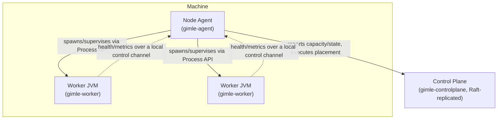

# Node topology

Three Java process roles run on a machine — no other runtime, no containers, no sidecars:

## Node Agent

One JVM per machine (`gimle-agent`). Owns the machine: spawns and supervises worker JVM processes
via the plain `Process` API (`WorkerProcessSupervisor`), assigns each worker's resource limits
(portable JVM flags today — see [Tiered isolation](./tiered-isolation.md)), reports machine
capacity and observed state to the control plane, and executes placement directives it receives.
It **never runs user code**, so a misbehaving module can't crash it — `ControlChannelServer` is the
local channel workers report over (`WorkerConnection` on the agent side).

## Worker JVM

Hosts module instances inside `ModuleLayer`s (`gimle-worker`). Started with limits derived from
its assigned modules' resource requests. Runs `BoundedModuleScheduler` (the bounded virtual-thread
scheduler each instance runs under) and `ProbeLoop` (calls each module's `LivenessProbe`/
`ReadinessProbe` directly — no HTTP, no sidecar). Disposable by design: the agent can
`destroyForcibly` and respawn one without touching anything else on the machine.

## Control Plane

One or more JVMs, Raft-replicated for HA (`gimle-controlplane`). Owns the API server, the state
store, the scheduler, and the reconcilers — see [Control plane](./control-plane.md) for how those
pieces fit together.

## Multi-machine deployment

Nothing here is loopback-only — the `127.0.0.1` addresses in the local-dev walkthrough are
convenience defaults, not an architectural limit:

- **`ApiServer` listens on every network interface**, not just loopback (`new
  InetSocketAddress(port)` — Java's wildcard-bind constructor), so it's reachable from another
  machine on the network with no code change.
- **A node agent's control-plane and gossip addresses are real, configurable network locations.**
  `AgentMain` takes `<controlPlaneBaseUrl>` and `<gossipBindHost:port>` as genuine arguments; the
  `mvn gimle:agent` convenience goal's `gimle.agent.controlPlaneUrl`/`gimle.agent.gossipAddress`
  properties (see [`gimle-maven-plugin` goal reference](../reference/maven-plugin-goals.md)) are
  just where those defaults happen to point for a single-machine local cluster.
- **Membership gossip joins via `seeds`** — a list of other agents' real `host:port` addresses,
  the whole mechanism by which an agent on one machine finds agents on others (see
  [Service fabric](./service-fabric.md)).

:::danger[No authentication anywhere in this path]

A control plane bound to every interface with no auth means anyone who can reach that port can
register as a node or submit manifests. This is the same deliberate-but-unaddressed gap already
called out for the [web console](./web-console.md) — revisit before ever pointing any of this at
a real, untrusted network rather than a single trusted machine or private lab network.

:::

## Three failure domains, three recovery costs

Node failure, worker failure, and module failure are distinct events, reconciled at distinct
costs — this is why the tiered self-healing model exists, not an accident of implementation:

| Failure | Recovery action | Typical cost |
|---|---|---|
| Module | Dispose its `ModuleLayer`, re-instantiate | Milliseconds |
| Worker | `destroyForcibly`, respawn (AppCDS-accelerated) | Sub-second |
| Machine/node | Reschedule its modules onto other machines | Seconds |

Repeated module restarts escalate to a worker restart; repeated worker restarts escalate to
rescheduling elsewhere, with `CrashLoopBackOff`-style backoff at each level — the same escalation
shape Kubernetes uses, implemented directly in Java rather than delegated to a container runtime.
