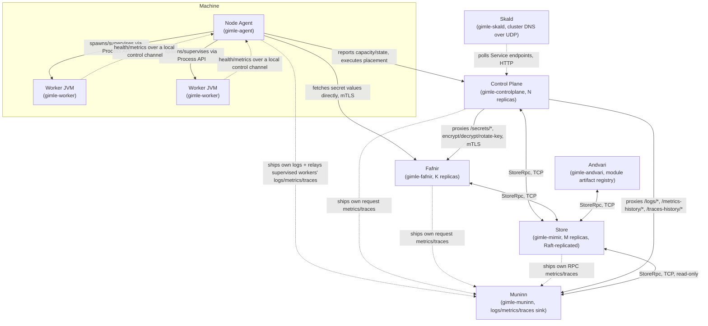

import ZoomableDiagram from '@site/src/components/ZoomableDiagram';

# Node topology

Eight Java process roles run across a cluster — no other runtime, no containers, no sidecars. The
animation below builds the cluster up one process kind at a time; it gets dense once every kind is
present, so use the frame's own zoom controls (or scroll/drag once zoomed, or the fullscreen
button) to read the labels once it settles (source: `diagrams/node-topology-cluster.d2`; the
complete picture alone is at
[`/diagrams/node-topology-cluster-static.svg`](pathname:///diagrams/node-topology-cluster-static.svg)):

<ZoomableDiagram
  src="/diagrams/node-topology-cluster.svg"
  alt="Cluster build-up: a Machine (Node Agent supervising two Worker JVMs) joins a Control Plane and gimle-mimir Store, then Fafnir, then Muninn, then Andvari each connect to the same store and to the node agent"
  width={720}
/>

The control plane, the store, and Fafnir are three independently-scalable process kinds, not
one — the same split Kubernetes draws between `kube-apiserver` and `etcd`, extended one step
further for secret material specifically (see [Control plane](./control-plane.md)); `N`, `M`, and
`K` above need not match. Muninn (below) is a fourth, similarly independent process kind — a
unified sink every other process ships logs/metrics/traces to, rather than each owning its own
export path. Andvari (below) is a fifth: the module artifact registry, the one place module jars
are pushed to and pulled from rather than every node needing them pre-placed on its own
filesystem. Skald (below) is a sixth: cluster DNS, resolving `<service>.<tenant>.svc.gimle.local`
`A` queries for anything that would rather look a Service up by name than poll the control plane's
own `/services/*` API directly — see [Service fabric](./service-fabric.md) for the Service
abstraction Skald resolves against.

The north-south HTTP gateway (`gimle-gateway`) is deliberately *not* a ninth process kind here —
it's an ordinary hosted module running inside a Worker JVM like any other, just one an operator
deploys as a `DaemonSet` onto edge-labeled nodes. See [Service fabric § the gateway
module](./service-fabric.md#the-gateway-module). `gimle-bifrost`, the per-node service proxy, is
likewise not a process kind of its own — it's embedded inside `gimle-agent` (see [Service
fabric](./service-fabric.md) for both).

## Node Agent

One JVM per machine (`gimle-agent`). Owns the machine: spawns and supervises worker JVM processes
via the plain `Process` API (`WorkerProcessSupervisor`), assigns each worker's resource limits
(portable JVM flags today — see [Tiered isolation](./tiered-isolation.md)), reports machine
capacity and observed state to the control plane, and executes placement directives it receives.
It **never runs user code**, so a misbehaving module can't crash it — `ControlChannelServer` is the
local channel workers report over (`WorkerConnection` on the agent side). `AgentLogServer`, its one
always-on HTTP surface, answers `GET /health` unconditionally (no configuration needed) alongside its
log-serving routes — an operator-pollable liveness signal distinct from the opt-in admin fault API.

## Worker JVM

Hosts module instances inside `ModuleLayer`s (`gimle-worker`). Started with limits derived from
its assigned modules' resource requests. Runs `BoundedModuleScheduler` (the bounded virtual-thread
scheduler each instance runs under) and `ProbeLoop` (calls each module's `LivenessProbe`/
`ReadinessProbe` directly — no HTTP, no sidecar). Disposable by design: the agent can
`destroyForcibly` and respawn one without touching anything else on the machine.

### Relaying a hosted module's control-plane reads

A worker JVM has no outbound network identity of its own — only its node agent does (a real mTLS
client certificate minted at bootstrap). Everything else a worker ships outward (logs, metrics,
traces) already goes out over this same relay-through-the-agent shape; `RelayControlPlaneRead`/
`RelayControlPlaneResult` extend it to a narrow, whitelisted read-back into the control plane's own
HTTP API, so a hosted module can call `ModuleContext#relayControlPlaneRead(path)` — e.g. to look up
its own siblings' addresses via `GET /endpoints/{name}` — without the module or its worker ever
holding a certificate of their own. A tenanted module's relayed reads carry its own **workload
identity** (the ServiceAccount analogue, below), so what it may read is governed by RBAC on the
control plane rather than by the agent's whitelist; the whitelist remains only for untenanted
modules, which have no tenant a workload identity could scope to.

The flow: `gimle-worker`'s `ControlPlaneRelay` generates a correlation id, registers a
`CompletableFuture` keyed by it, sends `RelayControlPlaneRead` over the control channel, and blocks
the calling thread (never `WorkerMain`'s own single receive-loop thread — that would deadlock the
worker against itself, since that same thread is what would need to read the eventual response off
the wire) with a bounded timeout. `gimle-agent`'s `AgentMain` is the trust boundary: it independently
re-validates every request before making any real call — a worker (and the hosted module running
inside it) is never trusted to only ask for something already allowed. For a **tenanted** instance,
the agent mints (and caches) a per-`deploymentName#nodeId` workload token from
`POST /workload-tokens` — authorized by the agent's own node identity plus the store's assignment
check on the control-plane side — and attaches it as a `Bearer` credential on the relayed request;
any `GET` path is then forwarded and the control plane's own RBAC decides, with the token
*mandatory*: no token means the relay is refused locally (`502`), so a module can never ride its
agent's broader node identity. Minted tokens are store-backed (only their SHA-256 replicates — see
`WorkloadTokenRecord`), verify on any control-plane replica, expire after an hour, and resolve the
principal `svc:<tenantId>:<deploymentName>` in group `gimle:workloads` — deny-by-default until an
operator binds it a role (e.g. `gimle set rolebinding wb1 --subject user:svc:acme:orders --role
tenant-view:acme`). For an **untenanted** instance the original hard-coded whitelist (exactly
`GET /endpoints/{name}`) still applies unchanged, rejected locally with a synthesized `403`
otherwise. Under Tier 1 density the attributed identity is the connection-owning instance's
deployment — a packed sibling of a different deployment (same tenant, by construction) relays under
the hosting instance's identity, an accepted coarseness. A transport failure reaching the control
plane comes back as a synthesized `502` rather than propagating out of the agent's own read loop.

## Control Plane

One or more JVMs (`gimle-controlplane`). Owns the API server, the scheduler, and the reconcilers,
talking to a separate `gimle-mimir` store cluster over the network rather than embedding a state
store directly — see [Control plane](./control-plane.md) for how those pieces fit together.
`GET /health` (unauthenticated, matching Fafnir/Muninn/Andvari's own `/status`) round-trips a real
read against the `gimle-mimir` cluster it depends on, answering `503` rather than `200` if that
dependency is unreachable — failing closed on a downstream outage rather than only reporting this
process's own liveness.

## Store

One or more JVMs, Raft-replicated for HA (`gimle-mimir`). The etcd-equivalent piece: owns the
Raft-replicated `StateStore` and answers `StoreRpc` requests from every `gimle-controlplane`
replica over its own binary transport. Decoupled from the control plane's own replica count on
purpose — a control-plane process can restart or scale independently of store/Raft membership, and
vice versa. Optionally exposes `GET /health` (this replica's own Raft role — leader/follower, member
count) when started with `--health-port <port>`, the one HTTP surface this process kind has, opt-in
the same way the node agent's admin fault API is.

## Fafnir

One or more stateless JVMs (`gimle-fafnir`) — the dedicated secrets service: owns the encryption
key ring, performs every encrypt/decrypt/rotate-key operation, and answers the versioned
`/secrets/*` API directly (see [Multi-tenancy](./multi-tenancy.md) for the tenant-scoped secret
model). Talks to the same `gimle-mimir` store
cluster over the network via its own `StoreClient`, exactly the way `gimle-controlplane` does — it
persists nothing locally beyond its own key-ring file. `gimle-controlplane` never performs crypto
itself; it proxies `/secrets/*` calls to Fafnir and forwards the calling principal's identity as
an internal claim, but Fafnir still authorizes every request independently against RBAC data it
reads itself, rather than trusting "this arrived from the control plane" as proof of
authorization. `gimle-agent` fetches secret values needed by a deployed module directly from
Fafnir over mTLS — not proxied through the control plane — authorized by the node's own
certificate identity and its current tenant assignments. Fafnir gets its own distinct certificate
identity minted at cluster-bootstrap time, not a borrowed one, so every action it takes is
attributable to its own certificate Subject in the audit log.

## Muninn

One or more stateless JVMs (`gimle-muninn`) — a unified sink for logs, metrics, and traces shipped
from every other process, replacing what would otherwise be a separate exporter path per process
kind. `gimle-agent` ships its own platform log plus every supervised worker's logs, metrics, and
traces (workers have no outbound network identity of their own, so a worker relays its own periodic
metrics snapshot and exported span batches to its agent over their existing control channel, which
the agent then forwards to Muninn byte-for-byte under a new `WORKER` processKind —
`{nodeId}:{workerId}`, see [Observability](./observability.md)); `gimle-controlplane`,
`gimle-fafnir`, `gimle-mimir`, and `gimle-andvari` each ship their own request metrics and traces
directly, since none of the four has a supervising agent. Shipping is entirely optional and best-effort — a
process with no Muninn endpoint configured behaves exactly as it did before Muninn existed (local
log tailing, no metrics/traces export), never blocked or degraded by Muninn being unreachable.

Storage is day-bucketed JSON-lines files under Muninn's own data root, keyed by node/instance for
logs and by process kind + process ID for metrics and traces — deliberately not a new storage
engine, just the same file-per-day shape `gimle-agent`'s own log rotation already uses, extended to
a cluster-wide store. Muninn holds a read-only `StoreClient` against the same `gimle-mimir` cluster
every other process talks to, and re-runs its own independent `Authorizer.authorize(...)` check on
proxied reads rather than trusting an already-forwarded principal claim as proof by itself — the
same defense-in-depth posture Fafnir established for `/secrets/*`.

Retention is age-based and **per signal**, since a central aggregator's three data kinds have very
different value curves: logs are usually the compliance- and investigation-relevant record, while
metrics and traces are far higher-volume and lose most of their worth within a short window.
`-Dgimle.muninn.retentionDays` (default `30`) sets the window every signal inherits, and
`-Dgimle.muninn.logs.retentionDays`, `-Dgimle.muninn.metrics.retentionDays`, and
`-Dgimle.muninn.traces.retentionDays` each override it for one signal. A single sweep pass
(`-Dgimle.muninn.retentionSweepIntervalSeconds`, default hourly) walks the whole data root and ages
each day file against the window of the subtree it sits under — anything outside the three known
signal subtrees falls back to the global window rather than being kept forever.

`gimle-controlplane`'s existing `/logs/*` proxy falls back to Muninn's shipped history whenever a
live agent genuinely can't be reached (a gone node, an unreachable agent) instead of a bare
404/502; `GET /metrics-history/*` and `GET /traces-history/*` are new, Muninn-only read surfaces
with no live-process equivalent — a process's own metrics/traces only ever live in Muninn's shipped
history, never served directly by the process itself the way logs can be. Muninn gets its own
distinct certificate identity minted at cluster-bootstrap time, the same reasoning Fafnir's own
identity has: every ingest/read decision it makes is attributable to its own certificate Subject,
not a borrowed one.

## Andvari

New to distributed systems? [Idempotency and content-addressing](../concepts/idempotency-and-content-addressing.md)
explains why an immutable, content-addressed store makes retries and caching trivially safe.

One or more stateless JVMs (`gimle-andvari`) — the module artifact registry: an immutable,
content-addressed store of module jars behind a push/pull/list HTTP API (`/artifacts/*`). A pushed
coordinate (`moduleId` + `version`) can never be overwritten — an identical re-push is an
idempotent no-op, a differing one is refused outright, so the changed jar must ship as a new
version. That immutability is what makes downstream caching sound: anything that has verified a
coordinate once can trust it by presence alone, because the bytes behind it can never change.
Every stored jar carries its SHA-256 checksum, computed server-side as the upload streams to disk
and returned on every pull (`X-Gimle-Artifact-Sha256`), so a consumer can verify integrity
end-to-end.

Multiple replicas share the same catalog without any consensus protocol: each replica accepts
pushes independently, and a periodic peer-sync tick walks every configured peer's catalog, pulling
in whatever coordinate is missing locally through the identical streamed, digest-verified download
path a client's own push already goes through. That works only because of the immutability
guarantee above — an identical push landing on two different replicas converges to the same bytes,
so there's nothing to reconcile beyond "does this replica have it yet." A replica is started with
`--peer-endpoints host:port,...` naming its peers; every caller of Andvari (the control plane's
proxy, and each node agent's own pull-through cache) can likewise be configured with more than one
`host:port` — `--andvari-endpoint`/`gimle.agent.andvariEndpoint` accept a comma-separated list —
and rotates through them, failing over to the next configured endpoint on an unreachable one.
Andvari has no leader the way `gimle-mimir` does, so every replica is equally eligible to answer a
pull; a push still goes to exactly one endpoint per call (a request body can only be sent once, so
there is no safe way to retry it against a second endpoint), relying on the next peer-sync tick to
propagate it to the rest.

Andvari holds its own `StoreClient` against the same `gimle-mimir` cluster and re-runs its own
independent `Authorizer.authorize(...)` check on every push and delete — the same defense-in-depth
posture Fafnir and Muninn established — and records each such decision in the durable audit log. A
node's certificate identity (`gimle:nodes`) may only ever pull, never push or delete: placing
executable jars in the registry is a supply-chain-level grant reserved for real RBAC-authorized
principals. A node's certificate identity may
furthermore only pull a coordinate its node currently holds an assignment for — the same
assignment-scoping shape Fafnir applies to a node's tenant-secret reads. Andvari gets its own
distinct certificate identity minted at cluster-bootstrap time, for the same attributability
reason Fafnir's and Muninn's identities exist.

The deployment path consumes this surface end to end: a workload manifest may omit `artifactPath`
entirely, in which case `module: {name, version}` alone identifies the artifact — admission
HEAD-checks the coordinate against Andvari (definitively absent rejects the manifest; an
unreachable registry admits it with no recorded digest, and the level-triggered reconcilers
converge once it's back), the control plane pulls the jar through its own local cache when it
needs the module descriptor for scheduling and quota, and each node agent resolves the coordinate
at install time through its own pull-through cache under `{gimle.data.root}/artifact-cache` —
`imagePullPolicy: IfNotPresent` semantics, sound to trust by presence alone precisely because the
store is immutable. The worker never sees the difference: it always receives a concrete local
path, so the worker runtime and agent↔worker protocol are untouched. Operators push through the
control plane's `/artifacts/*` proxy (`gimle artifact push`), which forwards the calling
principal's identity as an internal claim exactly like the `/secrets/*` proxy — an explicit local
`artifactPath` keeps working unchanged as the escape hatch everywhere.

A second, Maven-2-shaped view over the identical store lives under `/repository/**`, so a plain
`mvn deploy`/`mvn install` targeting Andvari as a repository just works: Gimlé module names are
dotted reverse-DNS JPMS names, which map onto Maven coordinates by the obvious rule — the last
segment is the artifactId, everything before it is the groupId — so `com/gimle/examples/greeter/
provider/1.0.0/provider-1.0.0.jar` resolves to the same `(com.gimle.examples.greeter.provider,
1.0.0)` coordinate `/artifacts/*` uses, and a push through either surface lands identically.
`.sha256` is always server-computed from the stored jar and served fresh on every `GET`, never
trusted from an uploaded sidecar; `.pom` and any client-computed checksum sidecar are accepted and
stored opaquely, never parsed; `maven-metadata.xml` is generated on every request from the live
version list, never stored as uploaded, so a stale or hand-edited metadata file can never hide a
real version.

## Skald

One or more JVMs (`gimle-skald`) — Gimlé's cluster DNS: a hand-rolled responder (`SkaldMain`)
that answers `A` and `SRV` queries for `<service>.<tenant>.svc.gimle.local` by resolving them
against the same live endpoint data `gimle-bifrost` resolves against, via
`ControlPlaneServicePoller`/`CachingServiceDirectory` polling the control plane's `/services/*`
API on a fixed interval — Skald never reads `gimle-mimir` directly, the same "goes through the
control plane's own API, not the store" posture every other Service consumer takes. An `A` answer
carries *every* live endpoint address at once (the headless posture — the resolver does its own
selection), and an `SRV` answer carries one record per endpoint with that endpoint's own port,
each targeting a per-endpoint dashed-address hostname
(`10-0-0-5.orders.acme.svc.gimle.local`, the same convention Kubernetes' headless Services use)
that itself resolves via a follow-up `A` query — which is how a DNS-only client learns ports, not
just addresses. It serves both DNS transports on the same
port: UDP for the common case, and the RFC 1035 TCP fallback (two-byte-length-prefixed messages on
a companion `ServerSocket`) — a UDP response that would exceed the unextended 512-byte ceiling is
sent truncated (`TC=1`, no answers), telling the resolver to retry the identical query over TCP,
where the full response always fits. It's the first genuinely new process kind
added since Andvari; unlike every other process kind here, Skald's own client-facing protocol is
DNS, which has no TLS story to opt into the way an HTTP-based process does, so it carries
no plaintext-warning banner and no mTLS mode of its own yet — its polling connection to the control
plane stays plain HTTP for this first slice, matching how a new component in this codebase
typically starts plaintext-only before a transport-security pass lands.

Each per-Service endpoint read carries the tenant that Service was listed under: the control plane
keys a Service by `(tenant, name)`, so a tenant-scoped one asked for by bare name answers 404 —
which this poller reports as "gone", indistinguishable from a Service that really was deleted.

A Service the catalog lists but which currently has no live endpoints — mid-rollout, or scaled to
zero, which the control plane's own `ServiceReconciler` treats as a normal, valid outcome — is
cached as a known-but-empty name, not dropped. Skald answers it `NOERROR` with zero answer records
(the NODATA shape a real authoritative server uses) rather than `NXDOMAIN`, so an operator asking
"why can't my client resolve this service mid-deploy" gets "it exists, it's temporarily empty"
instead of a signal indistinguishable from a typo'd or never-declared name. `NXDOMAIN` is reserved
for exactly that: a name the directory has never heard of.

A poll failure leaves the cache exactly as it was rather than flipping every cached name to
NXDOMAIN over one bad tick, but `CachingServiceDirectory` separately tracks how long it's been
since a poll last actually succeeded and how many polls have failed in a row, both exposed as
Micrometer gauges (`gimle.skald.directory.staleness.seconds`,
`gimle.skald.directory.consecutive.failures`) and, when configured, shipped to Muninn
(`--muninn-endpoint`/`-Dgimle.skald.muninnEndpoint`). Once that staleness passes a threshold —
six poll cycles by default (30 seconds at the default 5-second poll interval), long enough to
absorb a blip or a brief control-plane restart but short enough that real cluster churn has
likely invalidated at least some cached endpoint by then — `SkaldServer` stops trusting the cache
enough to hand out a positive answer: a name it would otherwise resolve gets `SERVFAIL` instead of
a confident (and possibly wrong) address — a known-but-empty name included, since "no endpoints" is
itself a claim about current cluster state — while a name genuinely absent from the cache still
answers `NXDOMAIN` either way. `ControlPlaneServicePoller` also escalates its own failure logging
from `WARN` to `ERROR` once three polls have failed in a row, ahead of the `SERVFAIL` threshold, as
an earlier operator-facing signal that this is no longer a single missed poll.

## Multi-machine deployment

Nothing here is loopback-only — the `127.0.0.1` addresses in the local-dev walkthrough are
convenience defaults, not an architectural limit:

- **`ApiServer` listens on every network interface**, not just loopback (`new
  InetSocketAddress(port)` — Java's wildcard-bind constructor), so it's reachable from another
  machine on the network with no code change.
- **A node agent's control-plane and gossip addresses are real, configurable network locations.**
  `AgentMain` takes `<controlPlaneBaseUrl>` and `<gossipBindHost:port>` as genuine arguments; the
  `mvn gimle:agent` convenience goal's `gimle.agent.controlPlaneUrl`/`gimle.agent.gossipAddress`
  properties (see [`gimle-maven-plugin` goal reference](../reference/maven-plugin-goals.md)) are
  just where those defaults happen to point for a single-machine local cluster.
- **Membership gossip joins via `seeds`** — a list of other agents' real `host:port` addresses,
  the whole mechanism by which an agent on one machine finds agents on others (see
  [Service fabric](./service-fabric.md)).

:::info[Authentication and authorization]

A control plane bound to every interface now requires a real identity and a real permission for
every route — see [Authentication and authorization](./authn-authz.md). A node certificate can only
reach its own self-service endpoints (`register`/`heartbeat`/`assignments`, its own logs); nothing
else, including registering as a *different* node, is possible without an explicit `RoleBinding`.
This only applies in TLS mode (`gimle.transport.protocol=tls`) — plaintext mode remains fully open,
the same "local, trusted process" posture it always had.

:::

## Three failure domains, three recovery costs

New to distributed systems? [Health probes and self-healing](../concepts/health-probes-and-self-healing.md)
walks through the liveness/readiness distinction and the shared backoff behind this ladder.

Node failure, worker failure, and module failure are distinct events, reconciled at distinct
costs — this is why the tiered self-healing model exists, not an accident of implementation:

| Failure | Recovery action | Typical cost |
|---|---|---|
| Module | Dispose its `ModuleLayer`, re-instantiate | Milliseconds |
| Worker | `destroyForcibly`, respawn (AOT-cache-accelerated) | Sub-second |
| Machine/node | Reschedule its modules onto other machines | Seconds |

Repeated module restarts escalate to a worker restart; repeated worker restarts escalate to
rescheduling elsewhere, with `CrashLoopBackOff`-style backoff at each level — the same escalation
shape Kubernetes uses, implemented directly in Java rather than delegated to a container runtime
(source: `diagrams/self-healing-escalation.d2`):

<ZoomableDiagram
  src="/diagrams/self-healing-escalation.svg"
  alt="Self-healing escalation: a failing module is disposed and re-instantiated first; if it keeps failing the worker JVM is destroyed and respawned; if that keeps failing the module is rescheduled onto another machine"
  width={640}
/>
