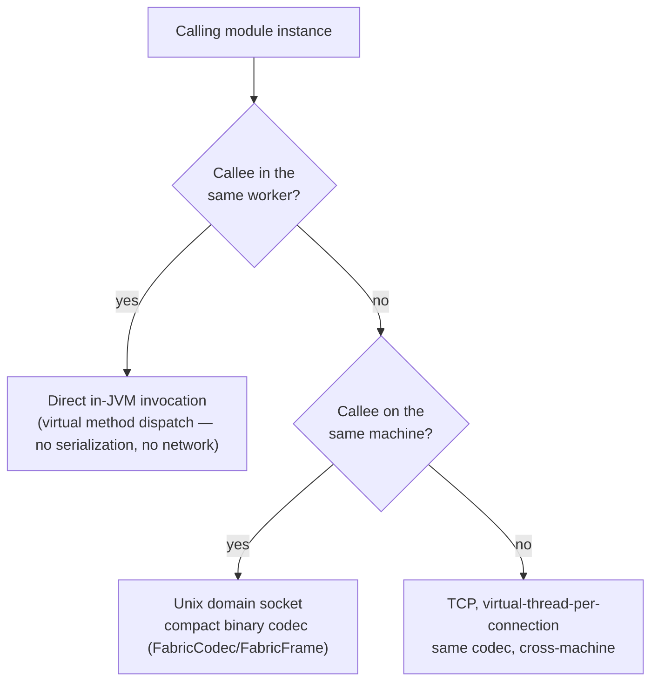

# Service fabric

`gimle-fabric` is how one module instance calls another — modules publish and consume services
through a registry keyed by interface + version, and the fabric picks the cheapest available call
path automatically.

## Three call paths, cheapest first

- **Same-worker** — a direct in-JVM call, resolved through `FabricServiceRegistry`/
  `ServiceRegistry`. Costs a virtual method dispatch. Nothing routed through a network stack can
  match this, by construction.
- **Cross-worker, same machine** — `FabricClient`/`FabricServer` communicate over a Unix domain
  socket (`java.net.UnixDomainSocketAddress`) using `FabricCodec`/`FabricFrame`, a compact binary
  wire format — no loopback TCP overhead.
- **Cross-machine** — the same codec, over TCP, with virtual-thread-per-connection handling on the
  server side.

The real `greeter-provider`/`greeter-consumer` example pair (`gimle-examples/`) exercises the
cross-worker path specifically: both are `TIER_2` (dedicated workers), guaranteeing they never
share a worker, so `greeter-consumer`'s lookup of `greeter-provider`'s `Greeter` service can't take
the same-worker shortcut — it genuinely goes over the wire.

## Service discovery and load balancing

- `ServiceCatalog`/`ServiceCatalogCodec`/`CatalogDelta`/`ServiceEndpoint` track which service
  instances exist where, propagated incrementally (deltas, not full-catalog resends).
- The load balancer prefers locality — healthy same-worker instance first, then same-machine, then
  remote by least-outstanding-requests (`LeastOutstandingRequestsSelector`). Same-machine isn't a
  hard cutoff: once every same-machine candidate is busier (by outstanding-request count) than the
  least-loaded remote one, the remote tier is admitted into selection too, so a single saturated
  same-machine replica spills traffic to idle remote replicas instead of absorbing 100% of it.
- `CircuitBreaker` handles outlier ejection at the registry level, so an unhealthy instance stops
  receiving traffic before a health probe would even declare it dead -- keyed off `FabricClient`
  throwing an `IOException`, which now also covers a peer that accepted the connection and then
  wedged (never wrote a response): `FabricClient.call` bounds connect+write+read together with one
  timeout (`FabricClient.DEFAULT_TIMEOUT`, 5s, or an explicit `Duration` overload), closing the
  underlying channel/socket to unblock the caller and surfacing a `SocketTimeoutException` if it
  elapses. Before this, only an outright refused or reset connection failed fast; a wedged peer
  left a caller hanging indefinitely with nothing to trip the breaker at all.

## Membership: gossip, not the control plane

Failure detection between machines is a SWIM-style gossip protocol running peer-to-peer between
node agents, entirely within `gimle-fabric` (`GossipConfig`/`GossipMember`/`MemberId`/
`MemberState`/`MemberStatus`, `SwimCodec`/`SwimMessage`, `PiggybackExtension` for piggybacking
membership updates on regular traffic) — over UDP, in Java. This runs independently of
[the control plane](./control-plane.md), which is why `gimle-controlplane` has no compile-time
dependency on `gimle-fabric`: a dead node is detected by its peers, not by a central authority on
the critical path.

## Tracing across hops

`TraceContext` propagates distributed-tracing context across every one of the three call paths
above, including in-JVM same-worker hops — so a trace stays complete even when a call never
touches a network stack at all. `ObjectMarshalling` is the shared (de)serialization support the
codecs build on.
