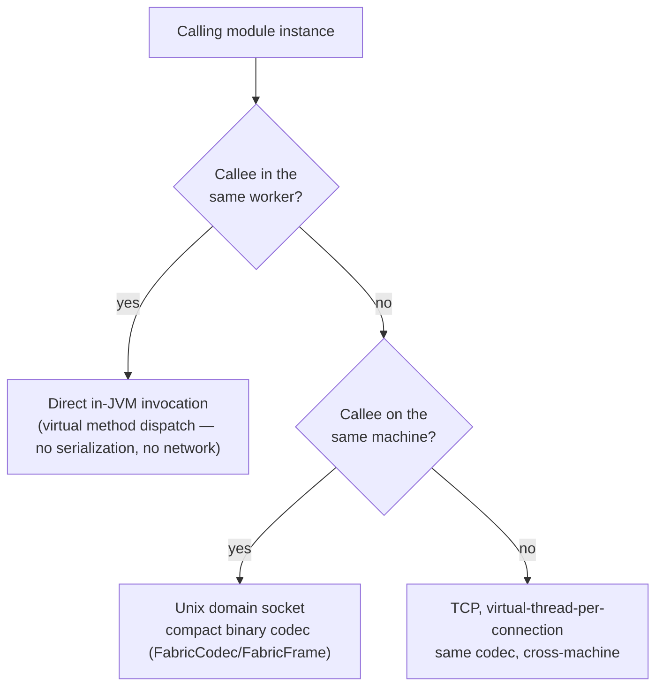

# Service fabric

`gimle-fabric` is how one module instance calls another — modules publish and consume services
through a registry keyed by interface + version, and the fabric picks the cheapest available call
path automatically.

## Three call paths, cheapest first



- **Same-worker** — a direct in-JVM call, resolved through `FabricServiceRegistry`/
  `ServiceRegistry`. Costs a virtual method dispatch. Nothing routed through a network stack can
  match this, by construction.
- **Cross-worker, same machine** — `FabricClient`/`FabricServer` communicate over a Unix domain
  socket (`java.net.UnixDomainSocketAddress`) using `FabricCodec`/`FabricFrame`, a compact binary
  wire format — no loopback TCP overhead.
- **Cross-machine** — the same codec, over TCP, with virtual-thread-per-connection handling on the
  server side.

The real `greeter-provider`/`greeter-consumer` example pair (`gimle-examples/`) exercises the
cross-worker path specifically: both are `TIER_2` (dedicated workers), guaranteeing they never
share a worker, so `greeter-consumer`'s lookup of `greeter-provider`'s `Greeter` service can't take
the same-worker shortcut — it genuinely goes over the wire.

## Service discovery and load balancing

- `ServiceCatalog`/`ServiceCatalogCodec`/`CatalogDelta`/`ServiceEndpoint` track which service
  instances exist where, propagated incrementally (deltas, not full-catalog resends).
- The load balancer prefers locality — healthy same-worker instance first, then same-machine, then
  remote by least-outstanding-requests (`LeastOutstandingRequestsSelector`). Same-machine isn't a
  hard cutoff: once every same-machine candidate is busier (by outstanding-request count) than the
  least-loaded remote one, the remote tier is admitted into selection too, so a single saturated
  same-machine replica spills traffic to idle remote replicas instead of absorbing 100% of it.
- `CircuitBreaker` handles outlier ejection at the registry level, so an unhealthy instance stops
  receiving traffic before a health probe would even declare it dead -- keyed off `FabricClient`
  throwing an `IOException`, which now also covers a peer that accepted the connection and then
  wedged (never wrote a response): `FabricClient.call` bounds connect+write+read together with one
  timeout (`FabricClient.DEFAULT_TIMEOUT`, 5s, or an explicit `Duration` overload), closing the
  underlying channel/socket to unblock the caller and surfacing a `SocketTimeoutException` if it
  elapses. Before this, only an outright refused or reset connection failed fast; a wedged peer
  left a caller hanging indefinitely with nothing to trip the breaker at all.

## Membership: gossip, not the control plane

Failure detection between machines is a SWIM-style gossip protocol running peer-to-peer between
node agents, entirely within `gimle-fabric` (`GossipConfig`/`GossipMember`/`MemberId`/
`MemberState`/`MemberStatus`, `SwimCodec`/`SwimMessage`, `PiggybackExtension` for piggybacking
membership updates on regular traffic) — over UDP, in Java. This runs independently of
[the control plane](./control-plane.md), which is why `gimle-controlplane` has no compile-time
dependency on `gimle-fabric`: a dead node is detected by its peers, not by a central authority on
the critical path.

## Tracing across hops

`TraceContext` propagates distributed-tracing context across every one of the three call paths
above, including in-JVM same-worker hops — so a trace stays complete even when a call never
touches a network stack at all. `ObjectMarshalling` is the shared (de)serialization support the
codecs build on.

## Name-driven invocation: `ServiceRegistry#invokeByName`

Every call path above assumes the caller has a compile-time `Class<T>` for the service it wants —
`lookup(Class<T>)` builds a dynamic `Proxy` around it, or (same-worker) hands back a direct,
already-typed reference. That doesn't fit a caller whose routes name a target service through
*runtime config* instead of Java source — [`gimle-gateway`](#the-gateway-module) is the motivating
case. `ServiceRegistry#invokeByName(interfaceName, majorVersion, methodName, paramTypeNames, args)`
is the name-driven counterpart: it resolves and invokes in one step, using only plain strings —
`interfaceName`/`methodName`/`paramTypeNames` are exactly the fields `FabricFrame.InvokeRequest`
already carries on the wire, so a name-driven caller needs nothing a `Class<T>`-based caller's own
proxy wasn't already reducing itself to internally.

- **`SimpleServiceRegistry`** (and `ServiceRegistry`'s own `default` implementation, which anything
  simpler than `FabricServiceRegistry` inherits for free) is same-worker-only: a plain reflective
  invoke against whatever `lookupByInterfaceName` resolves, ignoring `majorVersion` — this tier
  tracks no per-registration export-version metadata to filter by, the same reason
  `lookupByInterfaceName` itself takes no version parameter.
- **`FabricServiceRegistry`** overrides it with the real cross-tier behavior: the same
  locality-aware/circuit-breaking endpoint selection `lookup(Class<T>)` uses (same-worker →
  same-machine → remote, least-outstanding-requests, the same tenant-scoping check
  `permitsUnderTenantPolicy` already enforces for the `Class<T>`-based path), but additionally able
  to filter same-machine/remote candidates by `majorVersion` — something `lookup(Class<T>)` can
  never do, since a bare `Class` carries no export version to filter by in the first place.
- Returns `Optional.empty()` for an unresolvable route the same way `lookupByInterfaceName` already
  does for "nothing registered" — not an exception — but a resolvable route whose method name or
  parameter types don't actually match throws, same as a wrong-overload call would anywhere else.

`ModuleContext#invokeServiceByName` is the hosted-module-facing entry point onto this.

## The gateway module

`gimle-gateway` is Gimlé's north-south story: an ordinary `TIER_2` hosted module — never a new
process kind — that proxies incoming HTTP requests into the service fabric, closing the gap that
every call path above is otherwise reachable only from *inside* another hosted module. It's
deployed as a `DaemonSet` onto operator-labeled edge nodes (`placement.requiredLabels: [edge]`,
matching `-Dgimle.node.labels=edge` on that node's own `AgentMain`), into the platform's own
reserved `gimle-system` tenant — see [Multi-tenancy and quotas § the reserved `gimle-system`
tenant](./multi-tenancy.md) — so only a `gimle:operators`-group credential can ever submit or
change it.

The gateway supports two route kinds, declared in the same route table. A **fabric route**
resolves and invokes a fabric-published service by name via `ServiceRegistry#invokeByName` (above)
— an external HTTP client hits the gateway, the gateway calls the named service, the result comes
back as the HTTP response. A **vessel route** instead proxies the inbound request, verbatim, to a
live instance of a named deployment: it resolves a `host`/port pair via
`ModuleContext#relayControlPlaneRead("/endpoints/" + deploymentName)` — the narrow, whitelisted
read-back into the control plane's own HTTP API that lets a hosted module answer "where does
`deploymentName` currently run?" despite a worker JVM having no outbound network identity of its
own — and makes a plain outbound HTTP call to it.

Route configuration is a single `ctx.config("gateway.routes")` value (delivered the same tenant-
scoped way any other plain config is — see [Multi-tenancy and quotas](./multi-tenancy.md)), one
route per line, starting with an explicit kind token:

```text
FABRIC <httpPath> <interfaceName> <majorVersion> <methodName> <paramType>
VESSEL <httpPath> <deploymentName> <portName>
```

**`FABRIC` routes.** `paramType` is `NONE` (served on `GET`) or one of
`STRING`/`INT`/`LONG`/`DOUBLE`/`BOOLEAN` (served on `POST`, with the plain-text HTTP request body as
that single argument) — the same v1 restriction this module's own
`GatewayRoute.FabricRoute.ParamType` javadoc states plainly: zero or one simple-typed argument,
never a general JSON-to-POJO mapping. A target method's return type follows the same restriction
(`void` or one simple type); `GatewayDispatcher` serializes whatever the fabric call actually
returns rather than needing a return type declared up front.

**`VESSEL` routes.** `deploymentName` names the workload whose live instances this route proxies
to; `portName` names which of that workload's declared ports to dial (a vessel workload can export
more than one, each under its own env-var name — see `VesselEnvValue.PortAllocation` in
`gimle-core`). Every HTTP method and the full request body pass through unchanged — unlike a fabric
route, a vessel route has no argument shape to coerce or validate, it just forwards. Request/
response *headers* are not forwarded in v1, and there is no path rewriting or prefix stripping: a
vessel route's own `httpPath` is dialed on the target verbatim, exact-path matching only, the same
way fabric routes are looked up. An `/endpoints/{deploymentName}` entry counts as a usable proxy
target only once it carries both a `host` and the specific named port — a deliberately simple stand-
in for real health, since the endpoint list carries no explicit ready/not-ready flag today. Results
are cached per deployment name for a few seconds (`VesselEndpointCache`'s own default TTL) rather
than relayed on every request, refreshed lazily and round-robined across whichever endpoints are
currently usable; a refresh failure serves the still-cached list rather than failing every in-flight
request, and only a deployment with no cached list at all and no reachable/parseable fresh one, or
one with zero currently-usable endpoints, reports a proxying error back to the external caller. TLS
to the vessel instance and real per-instance health-awareness beyond the host/port-present heuristic
are both out of scope for v1.

`ctx.config("gateway.port")` supplies the fixed listen port for either route kind — there is no
platform-level port allocation for modules yet, so an operator is responsible for picking one that
doesn't collide across co-located `DaemonSet` instances, the same posture `greeter-load-generator`'s
own `load.port` config key takes for its own listen port.

See `gimle-gateway/deployment.yaml` for a complete worked example, including the two `/config/
gimle-system/*` API calls a real deployment needs alongside the manifest itself.
