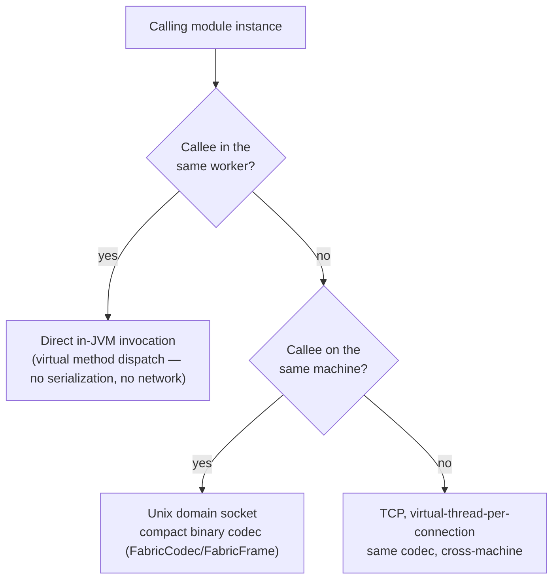

import ZoomableDiagram from '@site/src/components/ZoomableDiagram';

# Service fabric

`gimle-fabric` is how one module instance calls another — modules publish and consume services
through a registry keyed by interface + version, and the fabric picks the cheapest available call
path automatically.

New to distributed systems? [Failure detection and gossip](../concepts/failure-detection-and-gossip.md)
and [Load balancing and resilience](../concepts/load-balancing-and-resilience.md) explain SWIM
gossip and circuit breaking from first principles before this page dives into the classes that
implement them.

## Three call paths, cheapest first



The same decision tree, animated one branch at a time, with the path actually taken picked out in
green (source: `diagrams/service-fabric-call-path.d2`):

<ZoomableDiagram
  src="/diagrams/service-fabric-call-path.svg"
  alt="Fabric call path decision tree: same-worker calls resolve as a direct in-JVM invocation; otherwise same-machine calls use a Unix domain socket; otherwise the call goes over TCP with virtual-thread-per-connection handling"
  width={520}
/>

- **Same-worker** — a direct in-JVM call, resolved through `FabricServiceRegistry`/
  `ServiceRegistry`. Costs a virtual method dispatch. Nothing routed through a network stack can
  match this, by construction.
- **Cross-worker, same machine** — `FabricClient`/`FabricServer` communicate over a Unix domain
  socket (`java.net.UnixDomainSocketAddress`) using `FabricCodec`/`FabricFrame`, a compact binary
  wire format — no loopback TCP overhead.
- **Cross-machine** — the same codec, over TCP, with virtual-thread-per-connection handling on the
  server side.

The real `greeter-provider`/`greeter-consumer` example pair (`gimle-examples/`) exercises the
cross-worker path specifically: both are `TIER_2` (dedicated workers), guaranteeing they never
share a worker, so `greeter-consumer`'s lookup of `greeter-provider`'s `Greeter` service can't take
the same-worker shortcut — it genuinely goes over the wire.

## Service discovery and load balancing

- `ServiceCatalog`/`ServiceCatalogCodec`/`CatalogDelta`/`ServiceEndpoint` track which service
  instances exist where, propagated incrementally (deltas, not full-catalog resends).
- The load balancer prefers locality — healthy same-worker instance first, then same-machine, then
  remote by least-outstanding-requests (`LeastOutstandingRequestsSelector`). Same-machine isn't a
  hard cutoff: once every same-machine candidate is busier (by outstanding-request count) than the
  least-loaded remote one, the remote tier is admitted into selection too, so a single saturated
  same-machine replica spills traffic to idle remote replicas instead of absorbing 100% of it.
- `CircuitBreaker` handles outlier ejection at the registry level, so an unhealthy instance stops
  receiving traffic before a health probe would even declare it dead -- keyed off `FabricClient`
  throwing an `IOException`, which now also covers a peer that accepted the connection and then
  wedged (never wrote a response): `FabricClient.call` bounds connect+write+read together with one
  timeout (`FabricClient.DEFAULT_TIMEOUT`, 5s, or an explicit `Duration` overload), closing the
  underlying channel/socket to unblock the caller and surfacing a `SocketTimeoutException` if it
  elapses. Before this, only an outright refused or reset connection failed fast; a wedged peer
  left a caller hanging indefinitely with nothing to trip the breaker at all.

## The Service abstraction: a stable name in front of a Deployment

Everything above is about a *fabric-published service* — an interface one module exports and
another looks up by `Class<T>` or by name. `ServiceSpec` (`gimle-mimir`) is a different, though
related, thing: the ClusterIP analogue named in the platform's own network-model design, a
control-plane-declared stable name (`name`, `deploymentNames`, `port`/`targetPort`) in front of the
live instances backing one or more `DeploymentSpec`/DaemonSet workloads, selected by workload name
rather than a label-expression system. `gimle-controlplane`'s `ServiceReconciler` is level-triggered
like every other reconciler in this codebase — each tick recomputes a Service's full endpoint list
from scratch off the current store snapshot rather than diffing against the last tick, so an empty
store, a mid-rollout store, and a fully-converged store all take the same code path. `ApiServer`
exposes `POST`/`GET`/`DELETE /services` and `GET /services/{name}/endpoints` (returning
`{"name","port","targetPort","sessionAffinity","endpoints":[{"host","port","nodeId"}]}`),
RBAC-gated via `ResourceKind.SERVICE`.

Two `ServiceSpec` shapes exist. The selector shape above fronts in-cluster instances. Declaring
`externalName` instead (the ExternalName analogue — `gimle set service billing --external-name
billing.example.com --port 443`) makes the Service resolve to that external hostname at
`targetPort` with no in-cluster backing at all — useful while migrating a dependency into the
cluster: callers keep the stable in-cluster name while the real host lives elsewhere. The two are
exclusive; an ExternalName Service names no deployments. `GET /services/{name}/endpoints` answers
the external host as the sole endpoint (no `nodeId`), so `gimle-bifrost` forwards to it with no
special casing, and `gimle-skald` answers an `A` query for the Service with a `CNAME` to the
external name — the caller's own resolver finishes the resolution, exactly Kubernetes' own
ExternalName contract. `sessionAffinity: true` asks the forwarding proxy layer to pin each caller
address to one backend (see Bifrost below); it deliberately has no effect on DNS answers or the
fabric's own in-process load balancing.

A `NetworkPolicySpec` record (same package) is declared alongside `ServiceSpec` as the NetworkPolicy
analogue, relayed to every worker (`NetworkPolicyRelay` → `ControlMessage.NetworkPoliciesUpdated` →
`FabricServer.updateNetworkPolicies`) and enforced at the listener in both directions.
**Ingress**: rules owned by the target's tenant gate who may call in
(`allowedCallerTenantIds`, deny-by-default once a restriction exists), scoped optionally to named
deployments (`deploymentNames`) and to named exported service interfaces (`serviceInterfaceNames`).
**Egress**: rules owned by the *caller's* tenant gate who that tenant may call out to
(`allowedCalleeTenantIds`), enforced at the callee deliberately — the callee is the one enforcement
point a misbehaving caller cannot skip — for caller-tenant-wide rules (a caller-deployment-scoped
egress rule names an identity the wire doesn't carry, so it can only ever be proven to apply at the
caller). Independently of `NetworkPolicySpec`, `FabricServer.dispatch` also re-checks a target's own
`ServiceExport.allowedTenantIds` against the caller's wire-carried tenant identity before invoking
it — closing the bypass where a caller dials the raw catalog address directly instead of going
through the caller-side filter. Both are the same "forwarded claim, independently re-checked at the
far end" posture Fafnir/Muninn/Andvari each apply to identity, applied to cross-tenant fabric
traffic.

### `gimle-bifrost`: the per-node service proxy

`gimle-agent` gained a per-node Service proxy, package `com.gimle.agent.bifrost` — the kube-proxy
analogue, off by default (`-Dgimle.agent.bifrostEnabled=true`). `BifrostProxy` is level-triggered
the same way `ServiceReconciler` is: on a fixed poll interval it recomputes the desired listener set
from whatever a `ServiceSource` reports right now, binding a stable loopback-alias address
(`LoopbackAddressAllocator`) for each currently-known Service and forwarding accepted connections
to that Service's live endpoints, closing listeners for Services that disappeared and opening new
ones for Services that appeared — a missed or failed poll self-heals on the next one rather than
leaving stale listeners behind. It's embedded inside `gimle-agent`, not a new process kind.
`gimle-skald` (see [Node topology](./node-topology.md#skald)) resolves the same Service/endpoint
data by name over DNS instead of by loopback address, for callers outside the fabric entirely.

Endpoint selection is locality-first: each endpoint the control plane answers with carries the
`nodeId` its backing instance runs on, and a listener round-robins over the subset on its own node
whenever any is live, falling back to the full set otherwise — the same locality posture the
fabric's own same-worker → same-machine → remote ladder takes, collapsed to the two rungs a byte
relay can distinguish. A Service declaring `sessionAffinity: true` (the `sessionAffinity: ClientIP`
analogue) trades that for pinning: a consistent hash of the caller's source address over a stably
sorted endpoint set keeps each caller on one backend across connections, for as long as that
backend stays live.

Off-node exposure — the NodePort analogue — is a second opt-in on top
(`-Dgimle.agent.bifrostExposeServices=true`): instead of a per-service loopback ClusterIP, each
listener wildcard-binds at its Service's own declared port, making the Service dialable from off
the node at `<nodeHost>:<servicePort>`. The tradeoff is NodePort's own: one port namespace for the
whole node, so two Services declaring the same port can't both be exposed — the second bind fails
and is logged, and everything else (forwarding, fail-closed under a NetworkPolicy) behaves
identically to the loopback mode.

A third opt-in, `-Dgimle.agent.bifrostTlsEnabled=true` (requires the cluster transport itself to be
TLS), is the identity-verifying mode: every listener terminates TLS with the agent's own node
certificate and demands a cluster-CA-signed client certificate. That gives Bifrost the one thing a
plaintext byte relay can never have — a verified caller identity — so a `NetworkPolicySpec`
restricting a Service is enforced against the caller certificate's `O=gimle:tenant:<id>` membership
group (minted via `gimle cert request --purpose tenant`, see
[Authentication & authorization](./authn-authz.md)) instead of failing the whole listener closed. In
plaintext mode the fail-closed posture is unchanged: an applicable policy refuses every connection,
since proxying unverifiable traffic would silently bypass a policy the tenant explicitly opted
into.

## Membership: gossip, not the control plane

Failure detection between machines is a SWIM-style gossip protocol running peer-to-peer between
node agents, entirely within `gimle-fabric` (`GossipConfig`/`GossipMember`/`MemberId`/
`MemberState`/`MemberStatus`, `SwimCodec`/`SwimMessage`, `PiggybackExtension` for piggybacking
membership updates on regular traffic) — over UDP, in Java. This runs independently of
[the control plane](./control-plane.md), which is why `gimle-controlplane` has no compile-time
dependency on `gimle-fabric`: a dead node is detected by its peers, not by a central authority on
the critical path.

## Tracing across hops

`TraceContext` propagates distributed-tracing context across every one of the three call paths
above, including in-JVM same-worker hops — so a trace stays complete even when a call never
touches a network stack at all. `ObjectMarshalling` is the shared (de)serialization support the
codecs build on.

## Name-driven invocation: `ServiceRegistry#invokeByName`

Every call path above assumes the caller has a compile-time `Class<T>` for the service it wants —
`lookup(Class<T>)` builds a dynamic `Proxy` around it, or (same-worker) hands back a direct,
already-typed reference. That doesn't fit a caller whose routes name a target service through
*runtime config* instead of Java source — [`gimle-gateway`](#the-gateway-module) is the motivating
case. `ServiceRegistry#invokeByName(interfaceName, majorVersion, methodName, paramTypeNames, args)`
is the name-driven counterpart: it resolves and invokes in one step, using only plain strings —
`interfaceName`/`methodName`/`paramTypeNames` are exactly the fields `FabricFrame.InvokeRequest`
already carries on the wire, so a name-driven caller needs nothing a `Class<T>`-based caller's own
proxy wasn't already reducing itself to internally.

- **`SimpleServiceRegistry`** (and `ServiceRegistry`'s own `default` implementation, which anything
  simpler than `FabricServiceRegistry` inherits for free) is same-worker-only: a plain reflective
  invoke against whatever `lookupByInterfaceName` resolves, ignoring `majorVersion` — this tier
  tracks no per-registration export-version metadata to filter by, the same reason
  `lookupByInterfaceName` itself takes no version parameter.
- **`FabricServiceRegistry`** overrides it with the real cross-tier behavior: the same
  locality-aware/circuit-breaking endpoint selection `lookup(Class<T>)` uses (same-worker →
  same-machine → remote, least-outstanding-requests, the same tenant-scoping check
  `permitsUnderTenantPolicy` already enforces for the `Class<T>`-based path), but additionally able
  to filter same-machine/remote candidates by a caller-supplied `majorVersion` — something
  `lookup(Class<T>)` can never do, since a bare `Class` carries no export version for a caller to
  supply in the first place. `lookup(Class<T>)` instead narrows by version on its own: it selects the
  highest `Version` among the candidates `endpointsForInterface` returns that currently has an
  available (non-breaker-excluded) endpoint, falling back to the next highest only when the top one
  has none — the cross-worker counterpart of `SimpleServiceRegistry#selectEntry`'s same-worker
  cutover, so a hot redeploy's old and new version, registered under the same interface at once, is
  never blended within one lookup at either tier.
- Returns `Optional.empty()` for an unresolvable route the same way `lookupByInterfaceName` already
  does for "nothing registered" — not an exception — but a resolvable route whose method name or
  parameter types don't actually match throws, same as a wrong-overload call would anywhere else.

`ModuleContext#invokeServiceByName` is the hosted-module-facing entry point onto this.

## The gateway module

`gimle-gateway` is Gimlé's north-south story: an ordinary `TIER_2` hosted module — never a new
process kind — that proxies incoming HTTP requests into the service fabric, closing the gap that
every call path above is otherwise reachable only from *inside* another hosted module. It's
deployed as a `DaemonSet` onto operator-labeled edge nodes (`placement.requiredLabels: [edge]`,
matching `-Dgimle.node.labels=edge` on that node's own `AgentMain`), into the platform's own
reserved `gimle-system` tenant — see [Multi-tenancy and quotas § the reserved `gimle-system`
tenant](./multi-tenancy.md) — so only a `gimle:operators`-group credential can ever submit or
change it.

The gateway supports three route kinds, declared in the same route table, each optionally
constrained to a specific virtual host. A **fabric route** resolves and invokes a fabric-published
service by name via `ServiceRegistry#invokeByName` (above) — an external HTTP client hits the
gateway, the gateway calls the named service, the result comes back as the HTTP response. A
**vessel route** instead proxies the inbound request to a live instance of a named deployment: it
resolves a `host`/port pair via `ModuleContext
#relayControlPlaneRead("/endpoints/" + deploymentName)` — the narrow, whitelisted read-back into the
control plane's own HTTP API that lets a hosted module answer "where does `deploymentName`
currently run?" despite a worker JVM having no outbound network identity of its own — and makes a
plain outbound HTTP call to it. A **service route** proxies instead to a control-plane-declared
[`Service`](#the-service-abstraction-a-stable-name-in-front-of-a-deployment) by name — the same
shape as a vessel route, but resolving against a Service's own fronted endpoint set (which can span
more than one Deployment) rather than a single deployment's own endpoints directly. A vessel or
service route can additionally be declared as a *prefix* route (see below) rather than an exact
one; either way, the proxy call it makes is always "verbatim" in one specific sense — the request's
full, untouched inbound path forwards onward unchanged, never rewritten or prefix-stripped, the
same as Kubernetes Ingress's own default `pathType: Prefix` behavior (not a `rewrite-target` rule).
A fabric route has no such notion — it invokes one named method, ignoring the inbound path beyond
the one it's registered under — so it stays exact-path-only; see below.

Every route may optionally be constrained to a hostname: a route with a `HOST <hostname>` prefix
only matches a request whose `Host` header matches that hostname, and a route with no `HOST` prefix
matches any host — the same additive, fully backward-compatible extension to the existing
exact-path matching that lets an existing route table keep working unchanged after upgrading. Host
matching is orthogonal to path matching: a route can be host-constrained and prefix-matched at the
same time. Two routes sharing the same `httpPath`, the same host constraint (including two
host-unconstrained routes), and the same exact-vs-prefix mode is a config error caught at parse
time, the same as a malformed line; a host-constrained route and a host-unconstrained route may
share a path, with the more specific, host-constrained one taking precedence for a matching `Host`
header, and an exact route and a prefix route may likewise share a base path (an exact match on a
collection's own root served one way, everything nested under it proxied another way).

Path matching itself picks the most specific declared route for an inbound request: an exact
literal match always wins outright, and among prefix routes the *longest* matching prefix wins
(the same longest-prefix-match rule an nginx `location` block or a Kubernetes Ingress rule set
uses) — never "first registered wins." A prefix route is declared with a trailing `/*` on its
`httpPath` (`/api/orders/*`, or bare `/*` for a catch-all matching every path) — the same spelling
a Kubernetes Ingress path or an nginx `location` prefix uses — and matches its own base path plus
everything nested under it by path segment (`/api/orders/*` matches `/api/orders` and
`/api/orders/42`, but not `/api/orders2`).

Route configuration is a single `ctx.config("gateway.routes")` value (delivered the same tenant-
scoped way any other plain config is — see [Multi-tenancy and quotas](./multi-tenancy.md)), one
route per line, starting with an optional `HOST` prefix and then an explicit kind token. `GatewayHooks`
re-reads this value on a fixed background interval for as long as an instance runs, not just once at
startup: a change reaches an already-running instance the same way any other config update does
(`ConfigRelay` re-delivers it, the worker's shared config map is overwritten, and the next read
observes it), and `GatewayHooks` diffs the new route set against what it already applied — adding an
`HttpServer` context for a genuinely new path, removing one for a path no longer present, and
swapping in a rebuilt `GatewayDispatcher` for everything else — without ever rebinding the listener
itself. This matters specifically because the gateway is deployed as a `DaemonSet` across every
edge-labeled node for real multi-instance HA behind one external entry point, and `DaemonSet`
instances restart independently (crash, node maintenance, a manual bounce): without this, a route
table baked in once at each instance's own startup meant different edge nodes behind the same load
balancer could silently serve different route tables for as long as their next restart happened not
to coincide. A malformed update is rejected and logged, keeping whatever route table already served
the last successful parse.

```text
[HOST <hostname>] FABRIC <httpPath> <interfaceName> <majorVersion> <methodName> <paramType>
[HOST <hostname>] VESSEL <httpPath[/*]> <deploymentName> <portName>
[HOST <hostname>] SERVICE <httpPath[/*]> <serviceName>
```

**`FABRIC` routes.** `paramType` is `NONE` (served on `GET`) or one of
`STRING`/`INT`/`LONG`/`DOUBLE`/`BOOLEAN` (served on `POST`, with the plain-text HTTP request body as
that single argument) — the same v1 restriction this module's own
`GatewayRoute.FabricRoute.ParamType` javadoc states plainly: zero or one simple-typed argument,
never a general JSON-to-POJO mapping. A target method's return type follows the same restriction
(`void` or one simple type); `GatewayDispatcher` serializes whatever the fabric call actually
returns rather than needing a return type declared up front. A `FABRIC` route's `httpPath` may never
carry a `/*` suffix — rejected at parse time — since this route kind is permanently exact-path-only:
it names one specific method call, not a resource subtree, and the dispatcher never reads the
inbound path beyond the one the route is registered under, so a path segment past a would-be prefix
would carry no meaning.

**`VESSEL` routes.** `deploymentName` names the workload whose live instances this route proxies
to; `portName` names which of that workload's declared ports to dial (a vessel workload can export
more than one, each under its own env-var name — see `VesselEnvValue.PortAllocation` in
`gimle-core`). Every HTTP method and the full request body pass through unchanged — unlike a fabric
route, a vessel route has no argument shape to coerce or validate, it just forwards. Request/
response *headers* are not forwarded in v1. A trailing `/*` on `httpPath` declares a prefix route
(matching its base path and everything nested under it); either way the request is dialed on the
target with its full, untouched inbound path — never a stripped-prefix rewrite. An
`/endpoints/{deploymentName}` entry counts as a usable proxy target only once it carries both a
`host` and the specific named port — a deliberately simple stand-in for real health, since the
endpoint list carries no explicit ready/not-ready flag today. Results are cached per deployment name
for a few seconds (`VesselEndpointCache`'s own default TTL) rather than relayed on every request,
refreshed lazily and round-robined across whichever endpoints are currently usable; a refresh
failure serves the still-cached list rather than failing every in-flight request, and only a
deployment with no cached list at all and no reachable/parseable fresh one, or one with zero
currently-usable endpoints, reports a proxying error back to the external caller. TLS to the vessel
instance and real per-instance health-awareness beyond the host/port-present heuristic are both out
of scope for v1.

**`SERVICE` routes.** `serviceName` names the control-plane-declared
[`Service`](#the-service-abstraction-a-stable-name-in-front-of-a-deployment) this route proxies to,
resolved via `ModuleContext#relayControlPlaneRead("/services/" + serviceName + "/endpoints")` and
round-robined by `ServiceEndpointCache` on the same TTL-cache, refresh-lazily, serve-stale-on-failure
posture `VesselEndpointCache` already established for vessel routes — the two caches share that
shape deliberately rather than one wrapping the other, since a Service's endpoint entries carry
their own fixed `host`/`port` directly rather than a map of named ports the way a vessel workload's
own declared ports do. Otherwise a service route behaves exactly like a vessel route: full request/
response passthrough, no header forwarding, the same `/*`-suffix prefix-route option, and the full
inbound `httpPath` forwarded verbatim either way.

`ctx.config("gateway.port")` supplies the fixed listen port for any route kind — there is no
platform-level port allocation for modules yet, so an operator is responsible for picking one that
doesn't collide across co-located `DaemonSet` instances, the same posture `greeter-load-generator`'s
own `load.port` config key takes for its own listen port.

**TLS termination.** The gateway's own listener is plaintext by default and terminates TLS when the
same cluster-wide `-Dgimle.transport.protocol=tls` switch (plus `gimle.tls.certFile`/`keyFile`/
`caFile`) every other TLS-capable listener here reads is set — `GatewayHooks` binds an `HttpsServer`
with `wantClientAuth` rather than `needClientAuth`, since a north-south caller from outside the
cluster has no cluster-issued client certificate to present. This is termination, not a relay: the
gateway still speaks plain HTTP to whatever fabric/vessel/service target a route resolves to.

Because routing is by `Host`, one certificate is not enough: a client verifies what it is served
against the hostname *it* dialled, so with a single certificate every routed hostname outside that
certificate's SAN fails TLS before its otherwise-functional route is ever consulted. An optional
`ctx.config("gateway.tlsCertificates")` value binds hostnames to their own key pairs, one
`<hostname> <certFile> <keyFile>` per line, and a custom `X509ExtendedKeyManager` picks among them
per connection from the client's SNI extension. A client sending no SNI, and one naming a hostname
with no binding, both get the cluster-wide certificate — so configuring nothing is exactly the
single-certificate listener that already existed. Selection never *rejects* a connection (no
`SNIMatcher` is installed): an unrecognized hostname is still served by a host-unconstrained route,
and failing its handshake closed would take that fallback routing down with it. Bindings carry no
CA of their own; trust stays cluster-wide, and only the presented identity varies per virtual host.

See `gimle-gateway/deployment.yaml` for a complete worked example, including the two `/config/
gimle-system/*` API calls a real deployment needs alongside the manifest itself.
