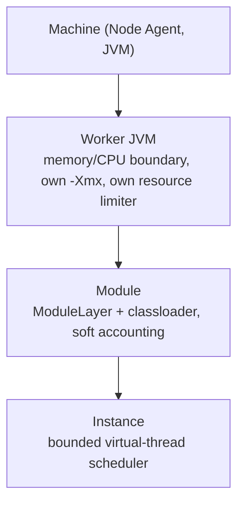

# Tiered isolation

The central design claim of Gimlé is container-grade isolation and classloader-grade density in
one system, selected per workload via the module manifest:

| Tier | Placement | Guarantee | Deploy cost |
|---|---|---|---|
| **Tier 1** | Module in a shared worker JVM | Classloader-level isolation, soft JFR-based accounting | Millisecond deploys — the density win |
| **Tier 2** | Module in a dedicated worker JVM | Hard `-Xmx`/CPU ceiling, independent crash domain | Sub-second deploy (AppCDS) — Kubernetes-equivalent guarantee, available per module |
| **Tier 3** | Worker JVM in a Linux namespace (FFM `unshare`/`setns`) | Kernel-level isolation, for hostile-neighbour scenarios | Not yet implemented |

## What's actually enforced today

**Platform independence first, platform-specific enforcement later** — a deliberate design
choice, not a gap. Tier 1/2 limits are enforced entirely through the portable `ResourceLimiter`
interface (`gimle-os`) and its only current implementation, `PortableJvmFlagsResourceLimiter`:
`-Xmx` / `ActiveProcessorCount`, identical on Linux/macOS/Windows, zero OS-specific code.

:::note[Two things are explicitly deferred, not oversights]

- **Kernel-level resource enforcement** (cgroup v2 on Linux, via plain `java.nio.file` I/O against
  `/sys/fs/cgroup` — no containerd/runc equivalent needed) is a second `ResourceLimiter`
  implementation that hasn't been built yet.
- **Tier 3 isolation** (FFM downcalls to `unshare`/`setns`) is unimplemented on every platform
  today. Requesting it fails outright with `GimleIsolationException` rather than silently
  downgrading to a weaker tier — "not built yet," not "your platform doesn't support it."

:::

## Why this matters when reading the code

Don't expect to find cgroup or FFM-namespace code anywhere in `gimle-os` — it isn't there yet, on
purpose. The portable JVM-flags path is the whole story for resource enforcement today. See
[Module lifecycle](../reference/module-lifecycle.md) for how a module moves through a worker once
placed, and [Node topology](./node-topology.md) for how Node Agent, Worker JVM, and Control Plane
relate above this diagram.
