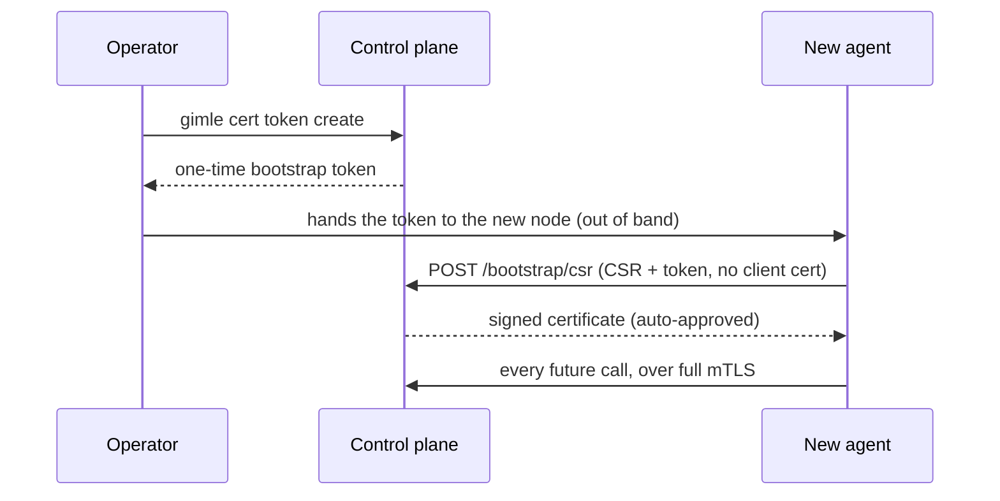

# Transport security

`gimle.transport.protocol=tls` (default `plaintext`) turns on mutual TLS across every
network-exposed transport in the cluster — a single, cluster-wide switch, not a per-component one.
Full design: `claudedocs/tls-transport-security-design.md`.

## Per-transport mapping

| Transport | TLS mechanism |
|---|---|
| Control-plane API (`ApiServer`) | `com.sun.net.httpserver.HttpsServer`/`HttpsConfigurator` |
| Raft peer RPC | `SSLServerSocket`/`SSLSocket` in place of the plaintext `ServerSocketChannel`/`SocketChannel` |
| Fabric cross-machine | Same `SSLSocket`/`SSLServerSocket` swap — never applied to the Unix-domain-socket same-machine path, which never leaves the kernel |
| Gossip membership | DTLS (`SSLEngine` in datagram mode) — UDP needs DTLS's own handshake/retransmission handling, not plain TLS |

Every one of these does real mTLS: both sides present a certificate, both sides verify it against
the shared cluster CA. There's no server-only mode.

## The CA: `gimle-pki`

The JDK has no public API for *issuing* X.509 certificates (only for loading already-issued ones),
so certificate generation/signing lives in its own module, `gimle-pki`, backed by Bouncy Castle
(`bcpkix-jdk18on`) — confirmed to use only public JDK crypto APIs underneath, not JDK-internal
classes. `CertificateAuthority` is the one signing code path shared by initial cluster bootstrap, a
node joining, a newly-approved operator, and rotation; `CertificateSigningRequests` builds the CSR
side. Only `gimle-controlplane` (signs), `gimle-agent`, and `gimle-cli` (both generate their own
CSRs) depend on it — `gimle-worker` never does, since a worker JVM inherits its cert material from
the agent that spawned it rather than bootstrapping its own.

`mvn gimle:tls-init` generates a fresh cluster CA, the control plane's own leaf certificate, and the
first human operator's leaf certificate in one shot (`com.gimle.pki.PkiBootstrapMain`).

## Joining a running cluster

A brand-new agent has no certificate and no way to authenticate itself — the same
chicken-and-egg problem Kubernetes' bootstrap-token/CSR flow solves. `POST /bootstrap/csr` is the
one endpoint in the system reachable without a client certificate, for exactly this reason. The
bootstrap token is single-use and short-lived, tracked in-memory on the control-plane node that
issued it (not Raft-replicated — the same reasoning heartbeats aren't).

A new human operator goes through the identical endpoint with `purpose=OPERATOR_CLIENT` instead —
but that purpose is **never** auto-approved; it sits pending until an existing operator runs
`gimle cert approve <request-id>`. `gimle cert status <request-id>` polls for the result.

## Rotation

Every component holding a certificate checks its own expiry and proactively renews at a
randomized point in the last 20–30% of its validity window (avoiding a thundering herd if many
certs were issued at once) — the agent and control plane do this automatically in the background;
`gimle-cli` only warns and leaves the explicit `gimle cert renew` call to the operator. A rotation
request reuses `POST /bootstrap/csr`, authenticated by the caller's own still-valid certificate
instead of a token — safe to auto-approve because the requested CSR Subject must exactly match the
authenticating certificate's Subject, so it can only extend trust already established, never mint a
different identity.

Picking up a rotated certificate on `ApiServer`'s own listening socket means stopping and rebuilding
the `HttpsServer` in-process (`ApiServer#reloadTlsMaterial`) — the JDK caches an `HttpsConfigurator`'s
`SSLContext` once, with no supported way to swap it into an already-running server. Raft peer RPC's
and Fabric cross-machine's own listening sockets don't get this treatment yet; a cert expiring while
either is running is a known, accepted gap until a process restart.

## CLI surface

See the [CLI reference](../reference/cli-reference.md)'s `cert` verbs: `token create`, `request`,
`status`, `approve`, `renew`.
