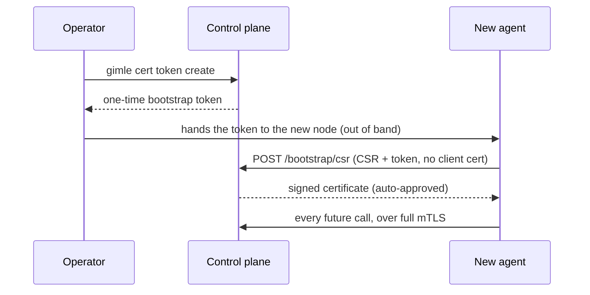

# Transport security

`gimle.transport.protocol=tls` (default `plaintext`) turns on mutual TLS across every
network-exposed transport in the cluster — a single, cluster-wide switch, not a per-component one,
since a cluster running a mix of TLS and plaintext transports would leave an operator unable to
reason about the system's actual trust boundary from the config alone.

## Per-transport mapping

| Transport | TLS mechanism |
|---|---|
| Control-plane API (`ApiServer`) | `com.sun.net.httpserver.HttpsServer`/`HttpsConfigurator` |
| Store client RPC (`gimle-mimir`'s `StoreTransport`, what `ApiServer`'s `StoreClient` connects to) | `SSLServerSocket`/`SSLSocket`, the same swap Raft peer RPC uses |
| Raft peer RPC | `SSLServerSocket`/`SSLSocket` in place of the plaintext `ServerSocketChannel`/`SocketChannel` |
| Fabric cross-machine | Same `SSLSocket`/`SSLServerSocket` swap — never applied to the Unix-domain-socket same-machine path, which never leaves the kernel |
| Gossip membership | DTLS (`SSLEngine` in datagram mode) — UDP needs DTLS's own handshake/retransmission handling, not plain TLS |

Every one of these does real mTLS: both sides present a certificate, both sides verify it against
the shared cluster CA. There's no server-only mode.

## The CA: `gimle-pki`

The JDK has no public API for *issuing* X.509 certificates (only for loading already-issued ones),
so certificate generation/signing lives in its own module, `gimle-pki`, backed by Bouncy Castle
(`bcpkix-jdk18on`) — confirmed to use only public JDK crypto APIs underneath, not JDK-internal
classes. `CertificateAuthority` is the one signing code path shared by initial cluster bootstrap, a
node joining, a newly-approved operator, and rotation; `CertificateSigningRequests` builds the CSR
side. `gimle-controlplane` (signs, at `/bootstrap/csr`), `gimle-mimir`, `gimle-agent`, and
`gimle-cli` (the latter three generate their own CSRs, via the shared `OwnCertificateRotator` for
rotation) depend on it — `gimle-worker` never does, since a worker JVM inherits its cert material
from the agent that spawned it rather than bootstrapping its own. `gimle-mimir` submits its own
rotation CSRs to a reachable `gimle-controlplane` replica's `/bootstrap/csr` rather than its own
(it has no HTTP surface of its own) — CA custody stays on the API-server side even after the
etcd-store-extraction split, mirroring how Kubernetes' own CSR API lives on `kube-apiserver`, not
`etcd`.

`mvn gimle:tls-init` generates a fresh cluster CA, the control plane's own leaf certificate, and the
first human operator's leaf certificate in one shot (`com.gimle.pki.PkiBootstrapMain`). It also
mints the one-time bootstrap console password — see [Bootstrap (day 0)](./authn-authz.md#bootstrap-day-0)
for where that password is allowed to go, and why a non-interactive run must name a file for it
rather than printing it into a build log.

## Joining a running cluster

A brand-new agent has no certificate and no way to authenticate itself — the same
chicken-and-egg problem Kubernetes' bootstrap-token/CSR flow solves. `POST /bootstrap/csr` is the
one endpoint in the system reachable without a client certificate, for exactly this reason. The
bootstrap token is single-use and short-lived, tracked in-memory on the control-plane node that
issued it (not Raft-replicated — the same reasoning heartbeats aren't).

Being the one unauthenticated route, and the most expensive one per request (a PKCS#10 parse and
signature verify, then an RSA signing for an auto-approved join), it is also the one route with a
real request-rate limit rather than only the failure-backoff throttling `/auth/login` gets. Two
in-memory token buckets are charged before the request body is even read — one keyed by remote
address, one shared across all callers — and an over-budget submission gets a `429` with
`Retry-After` and no CSR work done at all. Both default well above any rate a real bring-up
reaches, since a whole fleet may join at once (all of it from one address, behind a NAT or on one
machine) and a joining agent treats a rejection as fatal rather than retrying:

| Property | Default | Meaning |
|---|---|---|
| `gimle.controlplane.csr.burstPerAddress` | `200` | Submissions one remote address may spend at once. |
| `gimle.controlplane.csr.refillMillisPerAddress` | `1000` | How often that address earns one more. |
| `gimle.controlplane.csr.burst` | `1000` | Submissions every caller together may spend at once. |
| `gimle.controlplane.csr.refillMillis` | `50` | How often the shared budget earns one more. |

Per-replica and in-memory, like every other throttle here: a distributed attacker can spread
attempts across control-plane replicas, but each replica still bounds what it will answer.

Signing authority is opt-in per control-plane node: `-Dgimle.tls.caKeyFile` (the same `gimle.tls.*`
namespace as the `certFile`/`keyFile`/`caFile` trio it's configured alongside) points at the
cluster CA's own private key, and only a node started with it registers `/bootstrap/csr` and
`/bootstrap/tokens` at all — on every other node those paths simply 404. The control plane logs at
startup whether CSR signing is enabled and which property controls it, so a misconfigured node says
so instead of silently dropping the routes.

A new human operator goes through the identical endpoint with `purpose=OPERATOR_CLIENT` instead —
but that purpose is **never** auto-approved; it sits pending until an existing operator runs
`gimle cert approve <request-id>`. `gimle cert status <request-id>` polls for the result.

## Rotation

Every component holding a certificate checks its own expiry and proactively renews at a
randomized point in the last 20–30% of its validity window (avoiding a thundering herd if many
certs were issued at once) — the agent and control plane do this automatically in the background;
`gimle-cli` only warns and leaves the explicit `gimle cert renew` call to the operator. A rotation
request reuses `POST /bootstrap/csr`, authenticated by the caller's own still-valid certificate
instead of a token — safe to auto-approve because the requested CSR Subject must exactly match the
authenticating certificate's Subject, so it can only extend trust already established, never mint a
different identity.

Every network-exposed transport picks up a rotated certificate without a process restart.
`ApiServer` stops and rebuilds its `HttpsServer` in-process (`ApiServer#reloadTlsMaterial`) — the
JDK caches an `HttpsConfigurator`'s `SSLContext` once, with no supported way to swap it into an
already-running server. Raft peer RPC and fabric's cross-machine listener follow the same
close-and-rebind shape (`RaftTransport#reloadTlsMaterial`, `FabricServer#reloadTlsMaterial`), each
triggered off the same rotation event that refreshes `ApiServer`. Gossip's DTLS needs no socket
rebind at all — `GossipMember` holds its `SSLContext` in an `AtomicReference`, swapped in for every
DTLS session created afterward, both inbound and outbound.

A worker JVM is the one case that can't trigger its own reload: it carries no `gimle-pki` dependency
and never initiates a rotation itself, so `WorkerMain` runs a small `FabricServerTlsWatcher` that
polls its certificate file's modification time and reloads `FabricServer` once it notices the
agent-managed file changed underneath it. In every case, a connection attempted in the brief
close-to-rebind window fails and should be retried by the caller; already-established connections
are unaffected.

## CLI surface

See the [CLI reference](../reference/cli-reference.md)'s `cert` verbs: `token create`, `request`,
`status`, `approve`, `renew`.
