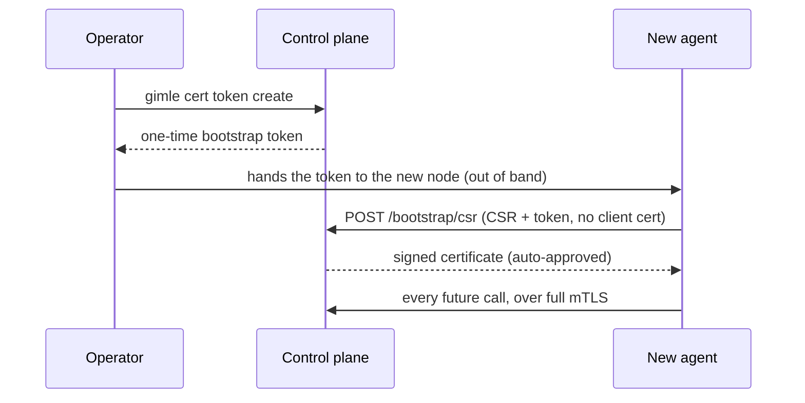

# Transport security

`gimle.transport.protocol=tls` (default `plaintext`) turns on mutual TLS across every
network-exposed transport in the cluster — a single, cluster-wide switch, not a per-component one,
since a cluster running a mix of TLS and plaintext transports would leave an operator unable to
reason about the system's actual trust boundary from the config alone.

## Per-transport mapping

| Transport | TLS mechanism |
|---|---|
| Control-plane API (`ApiServer`) | `com.sun.net.httpserver.HttpsServer`/`HttpsConfigurator` |
| Store client RPC (`gimle-mimir`'s `StoreTransport`, what `ApiServer`'s `StoreClient` connects to) | `SSLServerSocket`/`SSLSocket`, the same swap Raft peer RPC uses |
| Raft peer RPC | `SSLServerSocket`/`SSLSocket` in place of the plaintext `ServerSocketChannel`/`SocketChannel` |
| Fabric cross-machine | Same `SSLSocket`/`SSLServerSocket` swap — never applied to the Unix-domain-socket same-machine path, which never leaves the kernel |
| Gossip membership | DTLS (`SSLEngine` in datagram mode) — UDP needs DTLS's own handshake/retransmission handling, not plain TLS |

Every one of these does real mTLS: both sides present a certificate, both sides verify it against
the shared cluster CA. There's no server-only mode.

## The CA: `gimle-pki`

The JDK has no public API for *issuing* X.509 certificates (only for loading already-issued ones),
so certificate generation/signing lives in its own module, `gimle-pki`, backed by Bouncy Castle
(`bcpkix-jdk18on`) — confirmed to use only public JDK crypto APIs underneath, not JDK-internal
classes. `CertificateAuthority` is the one signing code path shared by initial cluster bootstrap, a
node joining, a newly-approved operator, and rotation; `CertificateSigningRequests` builds the CSR
side. `gimle-controlplane` (signs, at `/bootstrap/csr`), `gimle-mimir`, `gimle-agent`, and
`gimle-cli` (the latter three generate their own CSRs, via the shared `OwnCertificateRotator` for
rotation) depend on it — `gimle-worker` never does: a worker JVM presents a certificate the agent
that spawned it obtained on its behalf (see [Per-worker certificates](#per-worker-certificates)),
never generating a CSR of its own. `gimle-mimir` submits its own rotation CSRs to a reachable
`gimle-controlplane` replica's `/bootstrap/csr` rather than its own (it has no HTTP surface of its
own) — CA custody stays on the API-server side even after the etcd-store-extraction split,
mirroring how Kubernetes' own CSR API lives on `kube-apiserver`, not `etcd`.

### One leaf per role and hostname

`hilmir pki init` mints a separate leaf for every (role, hostname) pair — `controlplane-`, `store-`,
`fafnir-`, `muninn-` and `andvari-`, each named `<role>-<hostname>.crt/.key` — so every process's
identity is attributable to its own certificate Subject rather than one borrowed from another role.
Only the control-plane leaf carries a group (`O=gimle:controlplane`, which its own artifact pulls
need); the rest carry a bare `CN=<hostname>`, because they authorize nothing on group membership.

The store is included here for the same reason as the rest: presenting the control plane's leaf
would make a store replica indistinguishable on the wire from the very process that authenticates
to it, and would hand it that role's grants for free.

### Per-worker certificates

A worker JVM presents its own leaf certificate on the fabric's cross-machine mTLS hops, not the
node certificate of the agent that spawned it. Before first spawning an instance, `gimle-agent`
generates a key pair and submits a `WORKER_CLIENT` CSR (`CN=<nodeId>:<instanceKey>`) to
`/bootstrap/csr` over its own node identity. The control plane signs it only when the caller is a
`gimle:nodes` certificate, the requested CN is prefixed by that node's own id (so one node can never
mint a certificate that reads as another node's worker), and the requested tenant is one the node
currently holds an instance assignment for — the same level-triggered store check Fafnir makes
before letting a node read a tenant's secrets — stamping `O=gimle:workers` plus
`O=gimle:tenant:<id>` (no tenant group at all for an untenanted deployment) and, deliberately,
never `gimle:nodes`: a worker's key material is reachable by the hosted-module code it runs, so it
holds a worker's identity, not the node's. The material lands under a `workers/<instanceKey>/`
directory beside the agent's own certificate and reaches the worker as its `gimle.tls.certFile`/
`keyFile` (only the CA file is the shared one); a Tier 1 density-packed worker hosting several
instances of one tenant presents one certificate. This is what lets a receiving `FabricServer` read
the calling worker's tenant off the verified peer certificate rather than off a claim written into
the request — see [Service fabric](./service-fabric.md). Renewal is a fresh issuance under the
same subject on the agent's tick, not the same-subject rotation branch the agent's own certificate
uses: that branch authenticates by the certificate being rotated, and a worker never talks to the
control plane itself. Every decision, refusals included, lands in the durable audit trail under the
node's own principal.

`mvn gimle:tls-init` generates a fresh cluster CA, the control plane's own leaf certificate, and the
first human operator's leaf certificate in one shot (`com.gimle.pki.PkiBootstrapMain`). It also
mints the one-time bootstrap console password — see [Bootstrap (day 0)](./authn-authz.md#bootstrap-day-0)
for where that password is allowed to go, and why a non-interactive run must name a file for it
rather than printing it into a build log.

## Joining a running cluster

A brand-new agent has no certificate and no way to authenticate itself — the same
chicken-and-egg problem Kubernetes' bootstrap-token/CSR flow solves. `POST /bootstrap/csr` is the
one endpoint in the system reachable without a client certificate, for exactly this reason. The
bootstrap token is single-use and short-lived, tracked in-memory on the control-plane node that
issued it (not Raft-replicated — the same reasoning heartbeats aren't).

### Where a node's own identity is written

The material a node bootstraps for itself lands in that node's own identity directory —
`gimle.agent.identityDir`, defaulting to a `tls` directory under the node's own `gimle.data.root` —
as `node-<nodeId>.crt`/`node-<nodeId>.key`, with each spawned worker's own certificate beside it
under `workers/`. Deliberately **not** the directory holding the shared cluster CA material
`gimle.tls.caFile` points into: that directory is identical on every node, holds only material a
node reads, and is correctly mounted read-only in a least-privilege deployment — which a node must
not have to give up to obtain an identity of its own. Once written, the agent re-points its own
`gimle.tls.certFile`/`keyFile` at what it actually wrote, so rotation and every mTLS client it
builds resolve the same files. An agent launched already pointing at a certificate and key that
both exist keeps them untouched and bootstraps nothing — that is an operator-provisioned identity.
If the identity directory cannot be written, startup fails naming the directory and the two
properties that move it, rather than surfacing a bare filesystem error.

### What a node's leaf certificate is named

A node's CSR requests, as Subject Alternative Names, the DNS name the machine calls itself, the
host half of its own gossip address (its topology hostname), `localhost`, and — last — its current
IP address. A node is reached by name, so a leaf carrying only the address the interface happened
to hold at bootstrap time matches nothing after the node restarts onto a new one; the address is
still requested so a peer dialing the node by bare IP literal keeps verifying, since only an
`iPAddress` SAN entry ever matches an IP-dialed handshake and only a `dNSName` entry a name-dialed
one. A wildcard bind address (`0.0.0.0`, `::`) names no reachable peer and is never requested.

Being the one unauthenticated route, and the most expensive one per request (a PKCS#10 parse and
signature verify, then an RSA signing for an auto-approved join), it is also the one route with a
real request-rate limit rather than only the failure-backoff throttling `/auth/login` gets. Two
in-memory token buckets are charged before the request body is even read — one keyed by remote
address, one shared across all callers — and an over-budget submission gets a `429` with
`Retry-After` and no CSR work done at all. Both default well above any rate a real bring-up
reaches, since a whole fleet may join at once (all of it from one address, behind a NAT or on one
machine) and a joining agent treats a rejection as fatal rather than retrying:

| Property | Default | Meaning |
|---|---|---|
| `gimle.controlplane.csr.burstPerAddress` | `200` | Submissions one remote address may spend at once. |
| `gimle.controlplane.csr.refillMillisPerAddress` | `1000` | How often that address earns one more. |
| `gimle.controlplane.csr.burst` | `1000` | Submissions every caller together may spend at once. |
| `gimle.controlplane.csr.refillMillis` | `50` | How often the shared budget earns one more. |

Per-replica and in-memory, like every other throttle here: a distributed attacker can spread
attempts across control-plane replicas, but each replica still bounds what it will answer.

Signing authority is opt-in per control-plane node: `-Dgimle.tls.caKeyFile` (the same `gimle.tls.*`
namespace as the `certFile`/`keyFile`/`caFile` trio it's configured alongside) points at the
cluster CA's own private key, and only a node started with it registers `/bootstrap/csr` and
`/bootstrap/tokens` at all — on every other node those paths simply 404. The control plane logs at
startup whether CSR signing is enabled and which property controls it, so a misconfigured node says
so instead of silently dropping the routes.

A new human operator goes through the identical endpoint with `purpose=OPERATOR_CLIENT` instead —
but that purpose is **never** auto-approved; it sits pending until an existing operator runs
`gimle cert approve <request-id>`. `gimle cert status <request-id>` polls for the result.

## Rotation

Every component holding a certificate checks its own expiry and proactively renews at a
randomized point in the last 20–30% of its validity window (avoiding a thundering herd if many
certs were issued at once) — the agent and control plane do this automatically in the background;
`gimle-cli` only warns and leaves the explicit `gimle cert renew` call to the operator. A rotation
request reuses `POST /bootstrap/csr`, authenticated by the caller's own still-valid certificate
instead of a token — safe to auto-approve because the requested CSR Subject must exactly match the
authenticating certificate's Subject, so it can only extend trust already established, never mint a
different identity.

Every network-exposed transport picks up a rotated certificate without a process restart.
`ApiServer` stops and rebuilds its `HttpsServer` in-process (`ApiServer#reloadTlsMaterial`) — the
JDK caches an `HttpsConfigurator`'s `SSLContext` once, with no supported way to swap it into an
already-running server. Raft peer RPC and fabric's cross-machine listener follow the same
close-and-rebind shape (`RaftTransport#reloadTlsMaterial`, `FabricServer#reloadTlsMaterial`), each
triggered off the same rotation event that refreshes `ApiServer`. Gossip's DTLS needs no socket
rebind at all — `GossipMember` holds its `SSLContext` in an `AtomicReference`, swapped in for every
DTLS session created afterward, both inbound and outbound.

A worker JVM is the one case that can't trigger its own reload: it carries no `gimle-pki` dependency
and never initiates a renewal itself, so `WorkerMain` runs a small `FabricServerTlsWatcher` that
polls its certificate file's modification time and reloads `FabricServer` once it notices the agent
rewrote its per-worker certificate underneath it (the agent writes the key before the certificate,
so the watcher can never pair a fresh certificate with a stale key). In every case, a connection attempted in the brief
close-to-rebind window fails and should be retried by the caller; already-established connections
are unaffected.

### When rotation fails

A rotation check that fails leaves the still-valid certificate in place and retries on the next
tick, which is correct — and used to be invisible, which was not: nothing but a single `WARN` line
distinguished "renewal has been broken for a week" from a healthy cluster, and the first real
symptom would have been an expiry outage. Every check now produces a result rather than a swallowed
failure, tracked by `CertificateRotationMonitor` (`gimle-pki`) and surfaced three ways: two
alertable gauges (`gimle.certificate.rotation.consecutive.failures` and
`gimle.certificate.remaining.seconds`) plus a per-outcome counter, an escalating log line that names
the error, the streak length, the expiry of the certificate still in use and the runway left on it,
and a durable `AuditEvent` at the start and escalation point of a streak and on every completed
rotation. See [Observability](./observability.md#certificate-rotation-health) for the meter names
and how to alert on them.

The retry itself has to survive the failure, which is a separate property from reporting it. Each
process's rotation ticker is a `scheduleAtFixedRate` task, and that contract cancels a repeating
task permanently the first time one execution throws — so a single transient failure would silently
end renewal for the rest of the process's life, with the certificate expiring on schedule some days
later. Every process kind that renews its own certificate (`gimle-controlplane`, `gimle-mimir`,
`gimle-fafnir`, `gimle-muninn`, `gimle-andvari`, `gimle-agent`) therefore runs each check behind its
own exception barrier: reading the TLS settings, contacting the CSR endpoint, and rebuilding the
listener afterwards all fail into a `WARN` line and the next tick, never out of the task. A
misconfiguration no retry can fix — a missing required flag, an unusable data directory — still
fails fast at startup instead, before the ticker is scheduled.

## CLI surface

See the [CLI reference](../reference/cli-reference.md)'s `cert` verbs: `token create`, `request`,
`status`, `approve`, `renew`.
