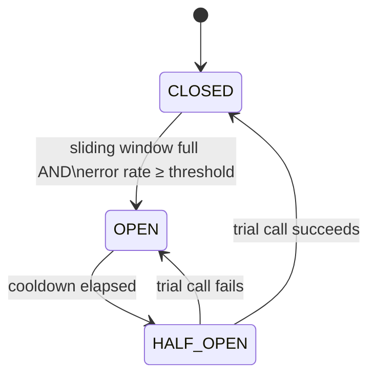

# Load balancing and resilience

You've got several healthy replicas of a service. A caller needs to invoke one. Which one — and
what happens when one of them starts failing? This page covers two ideas that work together in
`gimle-fabric`: picking the *least loaded* candidate, and refusing to keep calling a candidate
that's clearly broken.

## Least outstanding requests, not round robin

A tempting first answer is round robin: send request 1 to replica A, request 2 to B, request 3 to
C, repeat. It's simple, but it assumes every request costs the same and every replica processes
requests at the same speed — neither is true in practice. A replica that's slightly slower (a GC
pause, a noisy neighbor on the same machine) accumulates a backlog under round robin, because it
keeps getting handed new work at the same rate as everyone else regardless of how much it's already
holding.

`LeastOutstandingRequestsSelector` tracks, per candidate, how many calls are **currently in
flight** — incremented in `begin()` right before a call goes out, decremented in `end()` once it
returns — and picks whichever candidate has the fewest. Ties (the common case when everything's
healthy and fast) are broken with a shared round-robin cursor, so a tied set still gets spread
evenly rather than always picking the first candidate in the list. The effect: a replica that falls
behind naturally receives less new work until it catches back up, with no separate mechanism
watching for that condition — it falls out of "least loaded" purely because its own in-flight count
climbed.

## Locality first, then load

Before load balancing even runs, Gimlé narrows the field by **locality** — see [Service
fabric](../architecture/service-fabric.md) for the full same-worker → same-machine → remote
decision tree. The reasoning: a same-machine call over a Unix domain socket is cheaper than one
that leaves the machine, so it's worth preferring *unless* every same-machine candidate is already
more loaded than the least-loaded remote one — at which point the remote tier is opened up too, so
one hot local replica can't monopolize traffic while idle remote replicas sit unused. Only after
that locality decision narrows the candidate pool does least-outstanding selection run within it.

## Circuit breaking: stop calling what's clearly broken

Retrying a failing call sounds harmless in isolation, but at scale it's how outages cascade: a
struggling replica gets *more* pressure from retries at the exact moment it needs less, and a
caller burning time on doomed calls can't spend that time on a healthy replica instead. A **circuit
breaker** exists to short-circuit that spiral.

Gimlé's `CircuitBreaker` is a small state machine with three states:

- **CLOSED** — the normal state, calls go through. Each outcome (success/failure) is recorded in a
  fixed-size sliding window. Only once that window is *full* and the failure fraction reaches
  `errorRateThreshold` does the breaker trip — a single bad call, or even several early on, can't
  trip it prematurely.
- **OPEN** — calls are refused immediately, no attempt made, for a `cooldown` period. Each
  *consecutive* re-open doubles the effective cooldown (capped at 16× the base) — the same
  exponential-backoff shape Envoy's own outlier detection uses, so a caller whose retry cadence
  happens to match a fixed cooldown can't keep re-admitting a still-broken endpoint on almost every
  attempt.
- **HALF_OPEN** — once the cooldown elapses, exactly *one* trial call is let through (concurrent
  callers are refused until it resolves) to test the water. Success closes the breaker and resets
  the backoff; failure reopens it immediately, without waiting to refill the window again.

## What breaks without this

Picture three replicas, one of them silently failing every call (say, its database connection pool
is exhausted). Without a circuit breaker, least-outstanding-requests selection would still route it
a fair share of traffic — "least loaded" doesn't know a candidate is *broken*, only that it isn't
currently holding many in-flight calls (failing fast can even make it look artificially available).
Every one of those routed calls burns a timeout before failing, wasting caller time that could have
gone to a healthy replica, and the broken replica never gets a chance to recover under the load.

With the breaker in place, load balancing's candidate list itself becomes breaker-aware:
`isExcluded()` treats an `OPEN` breaker's endpoint as maximally loaded when comparing locality
tiers, and endpoint selection filters ejected candidates out entirely. There's one more guard worth
knowing: if breaker trips ever ejected *more than half* the candidate pool at once (a real,
cluster-wide problem, not one bad replica), the breaker's exclusion is overridden and every
candidate is re-admitted — refusing to route to *anyone* would be a worse outcome than routing to a
degraded majority. That panic-mode floor is what stops "protect against one bad replica" from
turning into "take the whole service down" during a real widespread incident.

## Seeing it happen

A breaker that works perfectly is indistinguishable, from the outside, from an endpoint that was
never a candidate: traffic simply stops going there. So every per-endpoint transition is both logged
(`WARN` on open, `INFO` on half-open and close, naming the interface and the `nodeId/workerId`
endpoint) and published as Micrometer meters in the worker's own registry — a
`gimle.fabric.circuitbreaker.state` gauge (`0` CLOSED, `1` HALF_OPEN, `2` OPEN) plus a
`gimle.fabric.circuitbreaker.transitions` counter tagged by the state entered. Those ride the
existing worker → agent → [Muninn](../architecture/observability.md) shipping path, so "is a breaker
the reason traffic isn't reaching instance X?" is a query, not a guess.

## Retrying without duplicating

Circuit breaking decides *where not to send* a call. Retrying decides whether a failed call gets a
second chance at all, and the fabric splits that question in two by how far the request got:

- **The connection was never established** (`FabricConnectException`). The target provably never saw
  the request, so nothing can be duplicated by trying again — the call fails over to a *different*
  endpoint through the same selection path, whatever the invoked method does. Retrying against the
  endpoint that just refused would only re-learn what it already told the caller.
- **The request was written and the outcome is unknown** (any other `IOException`, the overall
  deadline included — one timeout bounds connect, write and read together, so which phase it
  interrupted isn't knowable). The target may have executed it and the answer been lost. Only a
  method whose author annotated it `@Idempotent` (`com.gimle.module.lifecycle`) is retried here;
  anything else surfaces the failure, because silently re-running a mutation is worse than reporting
  an uncertain one.

Attempts are bounded (three endpoints, so worst-case latency is a small multiple of the per-attempt
timeout rather than proportional to how many stale endpoints the catalog happens to hold), and every
attempt of one logical call carries the *same* `correlationId`. That last part is what makes the
second case safe in practice rather than merely declared: `FabricServer` keeps a bounded,
time-windowed table of correlation ids it has already answered, so a retry of a request the target
did in fact execute gets that first answer replayed — error answers included, since a target that
threw has already run — instead of executing a second time. A duplicate arriving while the original
is still in flight waits for it rather than racing it. The window is finite, which is exactly why
`@Idempotent` remains a declaration by the method's author: a retry arriving after it expires really
does execute again.
