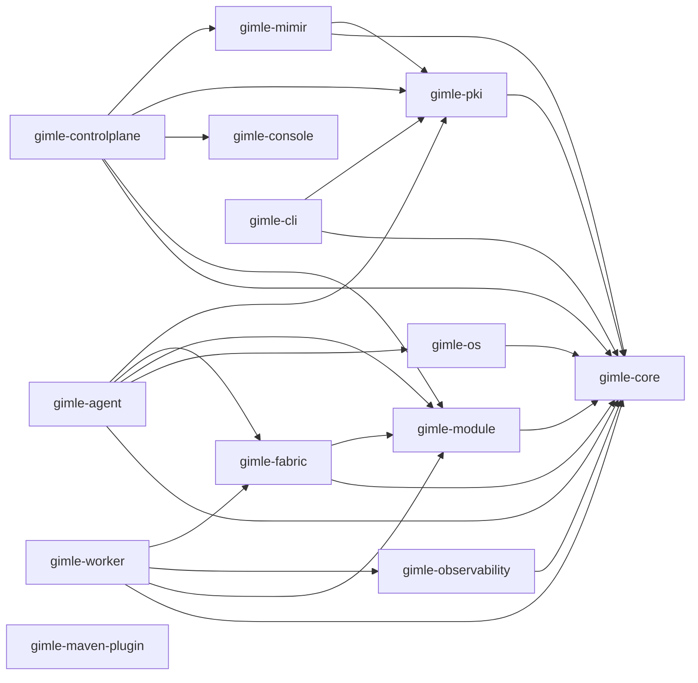

# Project structure

Gimlé is a multi-module Maven build. Each module below is production code — the platform itself,
not tests or samples. (`gimle-examples/*`, `gimle-smoke-tests`, and `gimle-holmgang` exist in the
repo too, but are sample/test-only and deliberately left out of this map.)

## Dependency graph

Arrows are real compile-time `<dependency>` declarations, not a guess — traced directly from each
module's `pom.xml`:

Two things worth noticing in that graph, not just the boxes:

- **`gimle-controlplane` depends on neither `gimle-fabric` nor `gimle-os`.** The control plane
  schedules and reconciles declarative state — it doesn't enforce resource limits (that's the
  agent's and worker's job, via `gimle-os`) and it doesn't participate in the service fabric's data
  plane or membership gossip (that's `gimle-fabric`, running peer-to-peer between node agents,
  deliberately off the control plane's critical path — see [Service fabric](../architecture/service-fabric.md)).
- **`gimle-mimir` is the Raft-replicated state store as its own module/process** (the etcd
  equivalent), depended on by `gimle-controlplane` rather than embedded in it — the dependency
  points from the API-server side toward the store, never the other way, so the store never needs
  to know anything about HTTP, scheduling, or reconciliation. See
  [Control plane](../architecture/control-plane.md).
- **`gimle-maven-plugin` and `gimle-console` depend on no other Gimlé module.** The former only
  needs the Maven Plugin API; the latter is an independent Bun/React project with no Java
  dependencies at all — `gimle-controlplane` depends on it (to embed and serve its built output),
  not the other way around.
- **`gimle-worker` doesn't depend on `gimle-pki`, even though it participates in TLS.** Certificate
  *generation*/*signing* is `gimle-pki`'s job (needed only by `gimle-controlplane`, `gimle-agent`,
  `gimle-cli`); a worker JVM only ever *loads* already-issued material inherited from the agent that
  spawned it, pure public JDK API — see [Transport security](../architecture/transport-security.md).

## Module roles

| Module | Role |
|---|---|
| `gimle-core` | Shared domain types, unchecked exception hierarchy, logging configuration. Depends on nothing else in the platform — every other module depends on it. |
| `gimle-module` | Module descriptor model (`gimle-module.yaml` parsing), `ModuleLayer` construction, the lifecycle state machine, classloader leak detection. See [Module system](../architecture/module-system.md). |
| `gimle-os` | Resource limiting (`ResourceLimiter`); the portable JVM-flags implementation today, kernel-level cgroup v2 deferred. See [Tiered isolation](../architecture/tiered-isolation.md). |
| `gimle-observability` | Micrometer metrics, OpenTelemetry tracing, JFR-backed per-module allocation/CPU accounting, the structured event log. |
| `gimle-worker` | Hosts module instances inside `ModuleLayer`s, runs the bounded virtual-thread scheduler and probe loop, reports health/metrics to its agent. |
| `gimle-agent` | One per machine: supervises worker JVM processes (`WorkerProcessSupervisor`), assigns resource limits, reports capacity, executes placement directives. Never runs user code. |
| `gimle-mimir` | The Raft-replicated state store as its own process (the etcd equivalent) — `StateStore`, `RaftNode`, and the client-facing `StoreRpc`/`StoreClient` protocol `gimle-controlplane` talks over the network. See [Control plane](../architecture/control-plane.md). |
| `gimle-controlplane` | API server, scheduler, reconcilers — talks to a `gimle-mimir` store cluster via `StoreClient` rather than embedding a state store. Serves the bundled web console. See [Control plane](../architecture/control-plane.md). |
| `gimle-fabric` | Service registry, same-worker/same-machine/cross-machine invocation, load balancing, circuit breaking, and the SWIM-style gossip membership protocol between node agents. See [Service fabric](../architecture/service-fabric.md). |
| `gimle-pki` | Certificate authority and CSR generation/signing for `gimle.transport.protocol=tls`, via Bouncy Castle (the JDK has no public API for certificate *issuance*). See [Transport security](../architecture/transport-security.md). |
| `gimle-cli` | Control-plane HTTP client and the `gimle` command-line tool (`get`/`apply`/`delete`/`set`/`logs`/`cert`). |
| `gimle-console` | The web console SPA (Bun/Vite/React/TanStack Router) — no Java, embedded into `gimle-controlplane`'s own jar and served from there. |
| `gimle-maven-plugin` | `spring-boot:run`-style developer-experience goals (`mvn gimle:store`, `mvn gimle:controlplane`, `mvn gimle:agent`, `mvn gimle:deploy`, `mvn gimle:tls-init`, `mvn gimle:docs`) — dev tooling, not part of the running platform. |
| `gimle-docs` | This documentation site (Docusaurus/Bun) — reactor-gated behind the `docs` Maven profile. |
