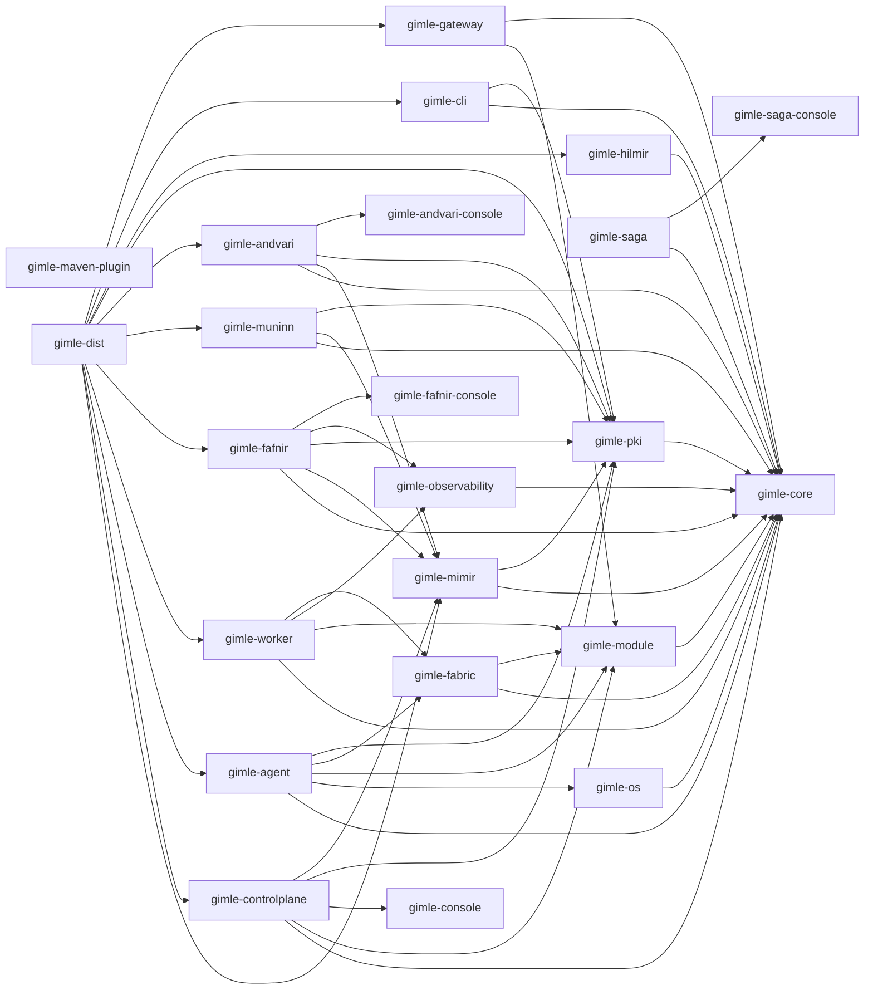

# Project structure

Gimlé is a multi-module Maven build. Each module below is production code — the platform itself,
not tests or samples. (`gimle-examples/*`, `gimle-smoke-tests`, and `gimle-holmgang` exist in the
repo too, but are sample/test-only and deliberately left out of this map.)

## Dependency graph

Arrows are real compile-time `<dependency>` declarations, not a guess — traced directly from each
module's `pom.xml`:

Two things worth noticing in that graph, not just the boxes:

- **`gimle-controlplane` depends on neither `gimle-fabric` nor `gimle-os`.** The control plane
  schedules and reconciles declarative state — it doesn't enforce resource limits (that's the
  agent's and worker's job, via `gimle-os`) and it doesn't participate in the service fabric's data
  plane or membership gossip (that's `gimle-fabric`, running peer-to-peer between node agents,
  deliberately off the control plane's critical path — see [Service fabric](../architecture/service-fabric.md)).
- **`gimle-mimir` is the Raft-replicated state store as its own module/process** (the etcd
  equivalent), depended on by `gimle-controlplane` rather than embedded in it — the dependency
  points from the API-server side toward the store, never the other way, so the store never needs
  to know anything about HTTP, scheduling, or reconciliation. See
  [Control plane](../architecture/control-plane.md).
- **`gimle-maven-plugin` and `gimle-console` depend on no other Gimlé module.** The former only
  needs the Maven Plugin API; the latter is an independent Bun/React project with no Java
  dependencies at all — `gimle-controlplane` depends on it (to embed and serve its built output),
  not the other way around.
- **`gimle-worker` doesn't depend on `gimle-pki`, even though it participates in TLS.** Certificate
  *generation*/*signing* is `gimle-pki`'s job (needed only by `gimle-controlplane`, `gimle-agent`,
  `gimle-cli`); a worker JVM only ever *loads* already-issued material inherited from the agent that
  spawned it, pure public JDK API — see [Transport security](../architecture/transport-security.md).
- **`gimle-gateway` depends only on `gimle-module` and `gimle-core`, never `gimle-fabric`.** It's a
  hosted module like any other, calling the fabric purely through
  `ModuleContext#invokeServiceByName` (`gimle-module`'s own contract) rather than linking against
  `gimle-fabric` directly — the same reason `greeter-provider`/`greeter-consumer` never depend on
  `gimle-fabric` either. The `gimle-core` dependency exists only for `com.gimle.core.protocol.Json`,
  to parse a vessel route's `GET /endpoints/{name}` response the same way the rest of the platform
  parses JSON, both `provided`-scope like `gimle-module` for the same boot-only-platform-layer
  reason (see `ModuleLayerFactory`'s own javadoc in `gimle-module`). See [Service fabric § the
  gateway module](../architecture/service-fabric.md#the-gateway-module).
- **`gimle-dist` is the one module with no code of its own that still depends on almost
  everything.** Its `<dependency>` list exists purely so `maven-assembly-plugin` has a resolved jar
  graph to package into the distribution tarballs — it's the mirror image of `gimle-maven-plugin`
  (zero Gimlé dependencies, since it only needs the Maven Plugin API) at the other extreme of the
  graph. See [Distribution archives](../reference/distribution.md).

## Module roles

| Module | Role |
|---|---|
| `gimle-core` | Shared domain types, unchecked exception hierarchy, logging configuration. Depends on nothing else in the platform — every other module depends on it. |
| `gimle-module` | Module descriptor model (`gimle-module.yaml` parsing), `ModuleLayer` construction, the lifecycle state machine, classloader leak detection. See [Module system](../architecture/module-system.md). |
| `gimle-os` | Resource limiting (`ResourceLimiter`); the portable JVM-flags implementation today, kernel-level cgroup v2 deferred. See [Tiered isolation](../architecture/tiered-isolation.md). |
| `gimle-observability` | Micrometer metrics, OpenTelemetry tracing, JFR-backed per-module allocation/CPU accounting, the structured event log. |
| `gimle-worker` | Hosts module instances inside `ModuleLayer`s, runs the bounded virtual-thread scheduler and probe loop, reports health/metrics to its agent. |
| `gimle-agent` | One per machine: supervises worker JVM processes (`WorkerProcessSupervisor`), assigns resource limits, reports capacity, executes placement directives. Never runs user code. |
| `gimle-mimir` | The Raft-replicated state store as its own process (the etcd equivalent) — `StateStore`, `RaftNode`, and the client-facing `StoreRpc`/`StoreClient` protocol `gimle-controlplane` talks over the network. See [Control plane](../architecture/control-plane.md). |
| `gimle-fafnir` | The secrets vault as its own process: the encryption key ring, every encrypt/decrypt/rotate-key operation, the versioned `/secrets/*` API, and its own independent RBAC re-check on every request. See [Node topology](../architecture/node-topology.md). |
| `gimle-fafnir-console` | Fafnir's own web console SPA — same no-Java Bun/Vite pattern as `gimle-console`, embedded into `gimle-fafnir`'s jar and served from there. |
| `gimle-muninn` | The observability sink as its own process: day-bucketed logs/metrics/traces ingest and read APIs, retention sweep, and its own independent RBAC re-check on reads. See [Node topology](../architecture/node-topology.md). |
| `gimle-andvari` | The module artifact registry as its own process: an immutable, content-addressed store of module jars behind a push/pull/list HTTP API (`/artifacts/*`), with its own independent RBAC re-check on pushes and deletes. See [Node topology](../architecture/node-topology.md). |
| `gimle-andvari-console` | Andvari's own web console SPA — same no-Java Bun/Vite pattern as `gimle-console`/`gimle-fafnir-console`, embedded into `gimle-andvari`'s jar and served from there. |
| `gimle-controlplane` | API server, scheduler, reconcilers — talks to a `gimle-mimir` store cluster via `StoreClient` rather than embedding a state store. Serves the bundled web console. See [Control plane](../architecture/control-plane.md). |
| `gimle-fabric` | Service registry, same-worker/same-machine/cross-machine invocation, load balancing, circuit breaking, and the SWIM-style gossip membership protocol between node agents. See [Service fabric](../architecture/service-fabric.md). |
| `gimle-gateway` | The north-south HTTP gateway — a real, deployable `TIER_2` hosted module (not a new process kind), proxying inbound HTTP requests either into the service fabric via `ModuleContext#invokeServiceByName` (a FABRIC route) or straight through to a live vessel deployment instance resolved via `ModuleContext#relayControlPlaneRead` (a VESSEL route). Deployed as a `DaemonSet` onto edge-labeled nodes inside the reserved `gimle-system` tenant. See [Service fabric § the gateway module](../architecture/service-fabric.md#the-gateway-module). |
| `gimle-pki` | Certificate authority and CSR generation/signing for `gimle.transport.protocol=tls`, via Bouncy Castle (the JDK has no public API for certificate *issuance*). See [Transport security](../architecture/transport-security.md). |
| `gimle-cli` | Control-plane HTTP client and the `gimle` command-line tool (`get`/`apply`/`delete`/`set`/`logs`/`cert`). |
| `gimle-hilmir` | Multi-machine cluster bootstrap (declarative topology → real processes: `validate`/`plan`/`up`/`down`/`status`/`pki init`) plus a Helm-equivalent release lifecycle over a `Bundle` manifest kind (`deploy`/`upgrade`/`rollback`/`undeploy`/`releases`/`release-status`), talking to the control plane over its own small HTTP client rather than depending on `gimle-cli`. See [`gimle-hilmir` reference](../reference/hilmir-reference.md). |
| `gimle-console` | The web console SPA (Bun/Vite/React/TanStack Router) — no Java, embedded into `gimle-controlplane`'s own jar and served from there. |
| `gimle-saga` | The test-report server (`SagaMain`) — a standalone local development tool, not a cluster process kind: ingests `SagaEvent` NDJSON streams (or imports Surefire XML), stores each run as an append-only event file plus derived metadata, maintains a cross-run flake ledger, and serves runs/live event tails/flaky scoreboard/per-test history over a JSON HTTP API with the bundled console at `/console`. Deliberately unauthenticated and loopback-bound by default. |
| `gimle-saga-console` | Saga's own web console SPA — same no-Java Bun/Vite pattern as the other consoles, embedded into `gimle-saga`'s jar and served from there. |
| `gimle-maven-plugin` | `spring-boot:run`-style developer-experience goals (`mvn gimle:store`, `mvn gimle:fafnir`, `mvn gimle:muninn`, `mvn gimle:andvari`, `mvn gimle:controlplane`, `mvn gimle:agent`, `mvn gimle:bootstrap`, `mvn gimle:deploy`, `mvn gimle:publish`, `mvn gimle:tls-init`, `mvn gimle:docs`) — dev tooling, not part of the running platform. |
| `gimle-dist` | Packages the platform's already-built jars into three audience-specific distribution tarballs (a cluster-machine platform archive, a standalone CLI archive, a standalone `gimle-hilmir` archive) via `maven-assembly-plugin`, each with a checksum file and a CycloneDX SBOM. No Java sources — assembly descriptors and two shell wrapper scripts only. See [Distribution archives](../reference/distribution.md). |
| `gimle-docs` | This documentation site (Docusaurus/Bun) — reactor-gated behind the `docs` Maven profile. |
