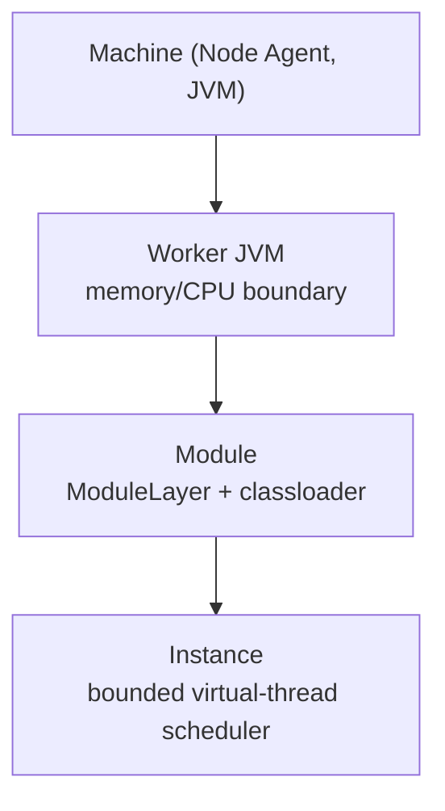

```text
                        A_______
                        |______<
                        ||
                  ______||_______
                  \##############\
                   \##############\
                   |               |
                   |               |
                   |###############|
                   |###############|
                   |               |
 VK                |               |
                   |###############|
                  /###############/          @@
          /\     /_______________/          (  C
 (@\     ( ")   /\\  /\\||/\\  /\\  /\\    / /'
   \\_   (\_)  ( "))( ")|( "))( "))( "))  / /
    \```--/----/(o)-/(o)-/(o)-/(o)-/(o)--' /
~~~~~~~~~/ ~~~/~~~~/~~~~/~~~~/~~~~/~~~~~~~~~~~~~~~~~
    - - '  ( ' )( ' )( ' )( ' )( ' )
```

<p align="center"><em>Viking ship — asciiart.eu, people/occupations/vikings</em></p>

Gimlé is a fully-Java application platform that combines Karaf/OSGi-style dynamic module
lifecycle with Kubernetes-style declarative orchestration — self-healing, scaling, load
balancing, service discovery, observability — implemented entirely on the JVM. No containers, no
external orchestrator, no non-Java runtime dependencies.

## What Gimlé is not

- **Not OSGi-compliant.** No Felix/Equinox — Gimlé uses JPMS `ModuleLayer` instead.
- **Not Kubernetes-API-compatible.** No CRDs, no `kubectl`, no OCI images.
- **Not a general untrusted-workload runtime.**
- **Not built on Spring Boot, Quarkus, Netty, or an existing service mesh.** The module system,
  supervisor, control plane, and service fabric are the point of the project, not glue over
  existing frameworks.

## Where to go next

- New to the codebase? Start with [Getting started](./tutorials/getting-started.md).
- New to distributed systems generally? [Concepts](./concepts/consensus-and-replication.md) covers
  consensus, gossip-based failure detection, health probes and self-healing, level-triggered
  reconciliation, load balancing and circuit breaking, idempotency and content-addressing, and CAP
  theorem tradeoffs — each explained from first principles, then traced straight into the exact
  Gimlé class and line that implements it (with real code excerpts, animated diagrams, and — for
  the first two — a short narrated video) — before the Architecture section below dives into
  Gimlé's own components.
- Want the mental model first? Read [Tiered isolation](./architecture/tiered-isolation.md) —
  the central architectural idea everything else builds on.
- Looking for a specific class or interface? See the [API Reference](pathname:///javadoc/)
  (generated Javadoc).
- Writing a module of your own? [Module lifecycle](./reference/module-lifecycle.md) covers the
  state machine every module instance goes through.

## Core architecture, in one picture



Eight Java process roles run across a cluster: the **Node Agent** (one per machine, owns worker
process lifecycle), the **Worker JVM** (hosts module instances), the **Control Plane** (API
server, scheduler, reconcilers), the **Store** (Raft-replicated state, its own process —
mirroring how Kubernetes separates `etcd` from `kube-apiserver`), **Fafnir** (the secrets
service, its own process — a dedicated encrypt/decrypt/rotate-key authority the control plane
proxies to rather than performing crypto itself), **Muninn** (the logs/metrics/traces sink,
its own process — every other process ships to it rather than each owning a separate export
path), **Andvari** (the module artifact registry, its own process — an immutable,
content-addressed store of module jars behind a push/pull API), and **Skald** (cluster DNS,
its own process — a hand-rolled UDP responder answering `A` queries for
`<service>.<tenant>.svc.gimle.local`, polling the control plane's `/services/*` API the same
way `gimle-bifrost` does rather than reading `gimle-mimir` directly). See [Node
topology](./architecture/node-topology.md) for how they relate.
