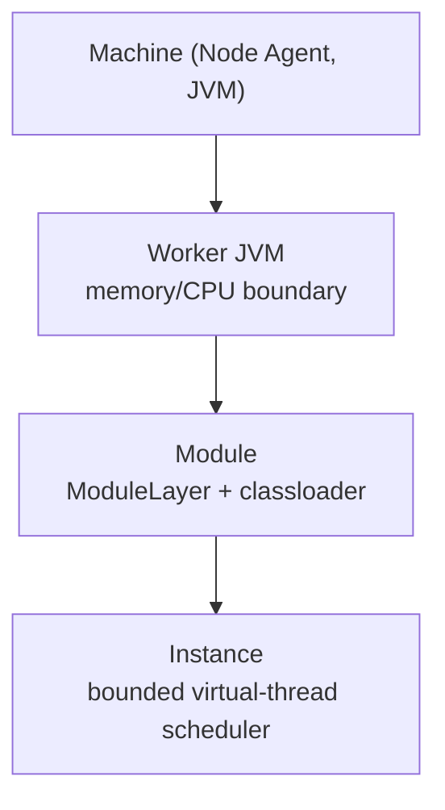

Gimlé is a fully-Java application platform that combines Karaf/OSGi-style dynamic module
lifecycle with Kubernetes-style declarative orchestration — self-healing, scaling, load
balancing, service discovery, observability — implemented entirely on the JVM. No containers, no
external orchestrator, no non-Java runtime dependencies.

## What Gimlé is not

- **Not OSGi-compliant.** No Felix/Equinox — Gimlé uses JPMS `ModuleLayer` instead.
- **Not Kubernetes-API-compatible.** No CRDs, no `kubectl`, no OCI images.
- **Not a general untrusted-workload runtime.**
- **Not built on Spring Boot, Quarkus, Netty, or an existing service mesh.** The module system,
  supervisor, control plane, and service fabric are the point of the project, not glue over
  existing frameworks.

## Where to go next

- New to the codebase? Start with [Getting started](./tutorials/getting-started.md).
- Want the mental model first? Read [Tiered isolation](./architecture/tiered-isolation.md) —
  the central architectural idea everything else builds on.
- Looking for a specific class or interface? See the [API Reference](pathname:///javadoc/)
  (generated Javadoc).
- Writing a module of your own? [Module lifecycle](./reference/module-lifecycle.md) covers the
  state machine every module instance goes through.

## Core architecture, in one picture

Three Java process roles run on a machine: the **Node Agent** (one per machine, owns worker
process lifecycle), the **Worker JVM** (hosts module instances), and the **Control Plane**
(Raft-replicated API server, state store, scheduler, reconcilers). See
[Node topology](./architecture/node-topology.md) for how they relate.

