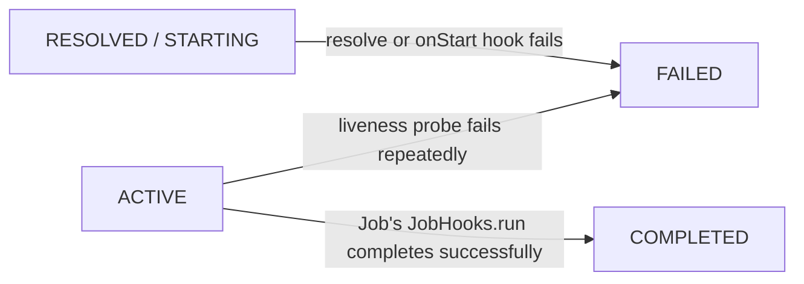

import ZoomableDiagram from '@site/src/components/ZoomableDiagram';

# Module lifecycle

Every module instance moves through the same states, deliberately OSGi-like. `ModuleState` in
`gimle-module` actually declares eight values — the six below on the happy path, plus two
terminals reached only on failure or (for a Job-kind module) successful completion, covered in
[Failure and completion terminals](#failure-and-completion-terminals). The animation below builds
the happy-path chain up one transition at a time, with the event that triggers each transition on
the edge (source: `diagrams/module-lifecycle.d2`; a non-animated version showing the complete
chain at once is at
[`/diagrams/module-lifecycle-static.svg`](pathname:///diagrams/module-lifecycle-static.svg)). Use
the frame's own zoom controls (or scroll/drag once zoomed) if the labels are hard to read at the
default size:

<ZoomableDiagram
  src="/diagrams/module-lifecycle.svg"
  alt="Module lifecycle happy path built up step by step: INSTALLED, then RESOLVED once dependencies are satisfied, STARTING while the ModuleLayer is built and hooks run, ACTIVE when the readiness probe passes, STOPPING while draining, and UNINSTALLED after the layer is disposed"
  width={320}
/>

- **INSTALLED** — the artifact (JAR + `gimle-module.yaml`) has been accepted but its dependencies
  haven't been resolved yet.
- **RESOLVED** — required-module version ranges and exported services have been checked; the
  module is ready to be assigned a `ModuleLayer`.
- **STARTING** — the module's own `ModuleLayer`/classloader is being constructed, parented on a
  shared platform layer (JDK + Gimlé service API), and its lifecycle hooks are running.
- **ACTIVE** — the module is serving traffic/work.
- **STOPPING** — the module is draining before disposal.
- **UNINSTALLED** — the module's layer has been disposed. A `PhantomReference` to the disposed
  layer's loader is held; if it survives a configurable window, a leak is reported with the
  retaining path via heap walk.

## Failure and completion terminals

Two more states exist beyond the happy path above, both reached only from `RESOLVED`/`STARTING`
or `ACTIVE` — never part of an ordinary deploy:

- **FAILED** — "a pragmatic addition beyond the spec's five named states," in `ModuleState`'s own
  javadoc: the terminal for a resolve or `onStart` hook failure. There's no in-worker retry out of
  it, but it isn't a dead end either — the worker emits a `TransitionFailed` event on this
  transition and reports `alive=false` for the instance on its next heartbeat.
  [`HealthReconciler`](../architecture/control-plane.md) picks that up and, subject to its own
  backoff-gated budget, reschedules the instance to a *different* node — the cluster tier of
  [self-healing](../architecture/node-topology.md#three-failure-domains-three-recovery-costs), not
  the in-worker restart tier `ACTIVE`'s own liveness-probe failures use. That's deliberate: a hook
  failure usually means a bad artifact or a misconfigured dependency, which retrying on the same
  node can't fix — only a different placement (or an operator re-resolving/uninstalling the
  deployment) can.
- **COMPLETED** — the run-to-completion counterpart to `FAILED`, reached only from `ACTIVE` via
  `ModuleController#complete` when a Job-kind module's `JobHooks.run(...)` finishes successfully.
  Unlike every other terminal here it needs no drain — a Job never serves external requests, so its
  `inFlightCount()` is always zero — and unlike `FAILED` it must be reported as `alive=true` on the
  worker's heartbeat: a successfully finished Job is not a crash to restart.

## Hook points

A module supplies lifecycle hooks (`onInstall`/`onStart`/`onStop`/`onUninstall`) and health probes
(`LivenessProbe`/`ReadinessProbe`) called directly by the worker — no HTTP, no sidecar. Hook
execution is MDC-tagged, so a hook's own synchronous logging is correctly categorized as that
instance's own application output.

## Hot redeploy

Installing a new version doesn't replace the old one in place: the new version is installed
alongside it, traffic is drained from the old one, and only then is the old `ModuleLayer`
disposed. This is what makes classloader leak detection first-class rather than an afterthought —
redeploy-in-a-loop with flat metaspace is a mandatory acceptance property of the module system, not
just a nice-to-have.

:::tip[Escape hatch for a stubborn leak]

A module that leaks anyway can be moved to
[Tier 2](../architecture/tiered-isolation.md), where undeploy just kills a JVM instead of relying
on classloader disposal at all.

:::

A Deployment/StatefulSet/DaemonSet also keeps a bounded history (10 revisions) of every admitted
module version it has run — recorded only when the module coordinate actually changes, not on a
plain replica-count or placement edit. `gimle deployment revisions <name>` lists that history, and
`gimle deployment rollback <name> [--to-revision N]` restores an earlier one — forward-only, the
same drain-then-dispose mechanics above apply to the rollback exactly as they would to any other
`apply`, since a rollback is just another admitted spec pointing at an older module version.
StatefulSet and DaemonSet accept the identical two verbs. Deleting a Deployment/StatefulSet/DaemonSet
clears its revision history along with it: a later `apply` that reuses the same name starts a brand
new history at revision 1 rather than inheriting the deleted workload's revisions, and its own old
revision numbers are no longer valid `--to-revision` targets. The same delete drops every instance
event timeline recorded under that name, so a recreated workload's `gimle events` output
starts empty rather than opening with the deleted workload's lifecycle history. See the
[CLI reference](./cli-reference.md) for the full flag shape.
