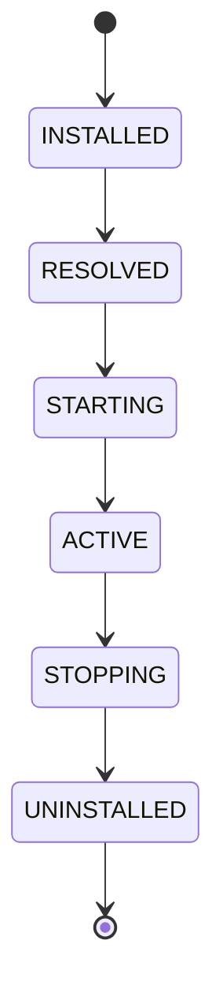

# Module lifecycle

Every module instance moves through the same states, deliberately OSGi-like:

- **INSTALLED** — the artifact (JAR + `gimle-module.yaml`) has been accepted but its dependencies
  haven't been resolved yet.
- **RESOLVED** — required-module version ranges and exported services have been checked; the
  module is ready to be assigned a `ModuleLayer`.
- **STARTING** — the module's own `ModuleLayer`/classloader is being constructed, parented on a
  shared platform layer (JDK + Gimlé service API), and its lifecycle hooks are running.
- **ACTIVE** — the module is serving traffic/work.
- **STOPPING** — the module is draining before disposal.
- **UNINSTALLED** — the module's layer has been disposed. A `PhantomReference` to the disposed
  layer's loader is held; if it survives a configurable window, a leak is reported with the
  retaining path via heap walk.

## Hook points

A module supplies lifecycle hooks (`onInstall`/`onStart`/`onStop`/`onUninstall`) and health probes
(`LivenessProbe`/`ReadinessProbe`) called directly by the worker — no HTTP, no sidecar. Hook
execution is MDC-tagged, so a hook's own synchronous logging is correctly categorized as that
instance's own application output.

## Hot redeploy

Installing a new version doesn't replace the old one in place: the new version is installed
alongside it, traffic is drained from the old one, and only then is the old `ModuleLayer`
disposed. This is what makes classloader leak detection first-class rather than an afterthought —
redeploy-in-a-loop with flat metaspace is a mandatory acceptance property of the module system, not
just a nice-to-have.

:::tip[Escape hatch for a stubborn leak]

A module that leaks anyway can be moved to
[Tier 2](../architecture/tiered-isolation.md), where undeploy just kills a JVM instead of relying
on classloader disposal at all.

:::
