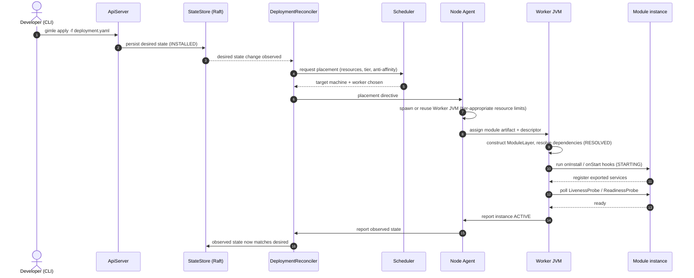

# Deploy your first module

Built around the real `gimle-examples/greeter-provider` and `greeter-consumer` pair — a genuine
cross-worker fabric service call, not a toy example. Both are `TIER_2` (dedicated worker each),
so the lookup between them can't take the same-worker shortcut; it genuinely goes over the wire.
See [Service fabric](../architecture/service-fabric.md) for why that guarantee matters here.

## What happens when you deploy a module

Every module goes through the same sequence, whether it's `greeter-provider` or your own:



Steps 9–13 are the [module lifecycle](../reference/module-lifecycle.md) state machine playing out
inside one worker; steps 4–5 are the [control plane](../architecture/control-plane.md)'s scheduler
and reconciler; step 7 is the [node topology](../architecture/node-topology.md)'s agent deciding
whether an existing shared worker will do or a new one is needed, per
[tiered isolation](../architecture/tiered-isolation.md).

## 1. Deploy `greeter-provider`

With [a local cluster running](./local-dev-cluster.md):

```bash
mvn gimle:deploy -Dgimle.deploy.file=gimle-examples/greeter-provider/deployment.yaml
```

Its manifest (`gimle-examples/greeter-provider/src/main/resources/META-INF/gimle/gimle-module.yaml`)
declares `isolation.tier: TIER_2`, exports the `com.gimle.examples.greeter.Greeter` service, and
wires real lifecycle hooks and health probes — `GreeterProviderHooks` registers the service on
`onStart`; `GreeterLivenessProbe`/`GreeterReadinessProbe` are real checks, not stubs.

## 2. Deploy `greeter-consumer`

```bash
mvn gimle:deploy -Dgimle.deploy.file=gimle-examples/greeter-consumer/deployment.yaml
```

Its own `onStart` hook looks up `greeter-provider`'s `Greeter` service over the fabric and calls
it — on a background virtual thread, not inline, since `onStart` runs on the same control-channel
receive loop that delivers the service-catalog updates the lookup depends on.

## 3. Verify

```bash
gimle get deployments
gimle logs greeter-consumer-deployment
```

Both deployments should reach `ACTIVE`, and the consumer's own log should show the real greeting
it got back from the provider — proof the call actually crossed the wire between two separate
worker JVMs, not a same-worker shortcut.
